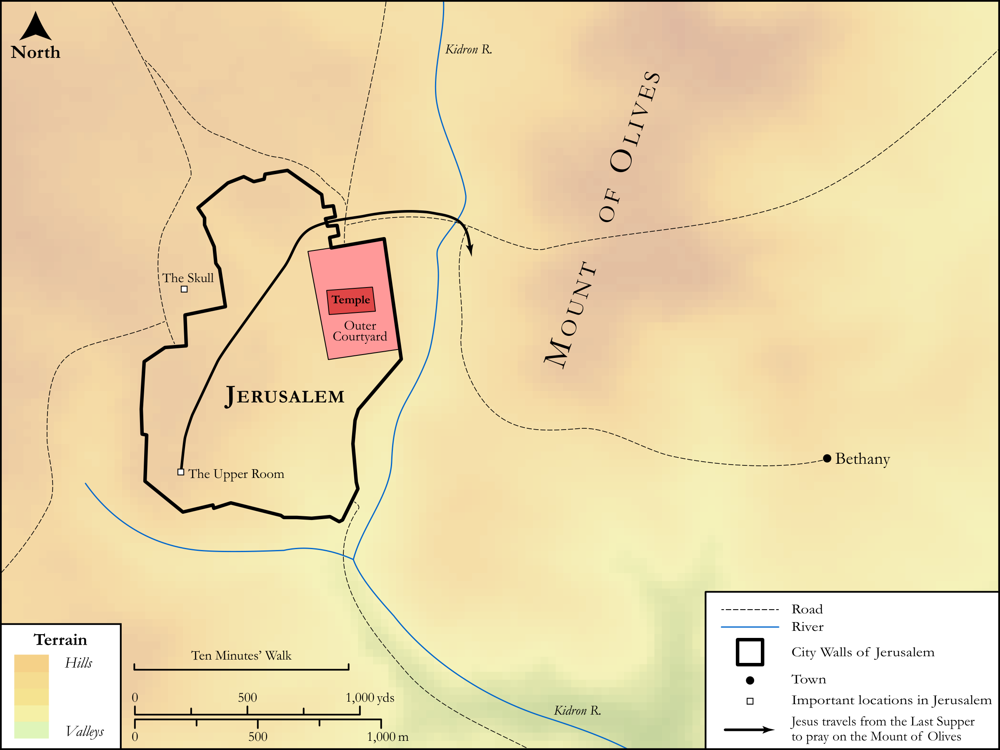

# Biblica Open Bible Maps

## License Information

Biblica Open Bible Maps, © 2023–2025 Biblica, Inc. This work is licensed under Creative Commons Attribution-ShareAlike 4.0 International (<a href="https://creativecommons.org/licenses/by-sa/4.0/">https://creativecommons.org/licenses/by-sa/4.0/</a>). More Information: <a href="https://docs.google.com/document/d/1Pp44yZ0Zdnd59vJHTrt2rPYq0SppfX5rZbPBt6mz37U/edit?tab=t.0#heading=h.oev9aj1ksvk2">https://docs.google.com/document/d/1Pp44yZ0Zdnd59vJHTrt2rPYq0SppfX5rZbPBt6mz37U/edit?tab=t.0#heading=h.oev9aj1ksvk2</a>

--------------------------------

## SRV Luke: Luke 22:39–46, Luke 24:36–52 (id: NT230)

### Image Content

[link](images/NT230.png)

Original: [SRV Luke: Luke 22:39\-46, Luke 24:36\-52](https://drive.google.com/open?id=1fwellMSGYfJM5pmkr4MGnI1B061KGLsI&usp=drive_copy)

* **Associated Passages:** Luke 22:1-71

* **Associated ACAI Concepts:** Peter (ID: `person:Peter`); Passover (ID: `keyterm:Passover`); Jesus (ID: `person:Jesus.2`); Pray (ID: `keyterm:Pray`); LORD (ID: `deity:Lord`); Kingdom (ID: `keyterm:Kingdom`); Judas (ID: `person:Judas.2`); Be a Disciple (ID: `keyterm:Disciple`); Serve (ID: `keyterm:Serve`); Believe (ID: `keyterm:Believe`); Satan (ID: `deity:Satan`); Religious Officials (ID: `group:ReligiousOfficials`); Put to the Test (ID: `keyterm:PutToTheTest`); Authority (ID: `keyterm:Authority.2`); Priests (ID: `group:GenericPriests`); Ask for (ID: `keyterm:AskFor`); Elders (ID: `group:GenericElders`); Ability (ID: `keyterm:Ability`); Sheep (ID: `fauna:Lamb`); House (ID: `realia:House`); Rooster (ID: `fauna:Rooster`); Peter's Second Accuser (ID: `person:SecondAccuserOfPeter`); Disaster (ID: `keyterm:Disaster`); A Servant (ID: `person:GenericServant`); Body (ID: `keyterm:Body.3`); Lawless (ID: `keyterm:Lawless`); Israel (ID: `person:Israel`); A Group of Disciples (ID: `group:GenericDisciples`); Blaspheme (ID: `keyterm:Blaspheme`); Offering (ID: `keyterm:Offering`)
