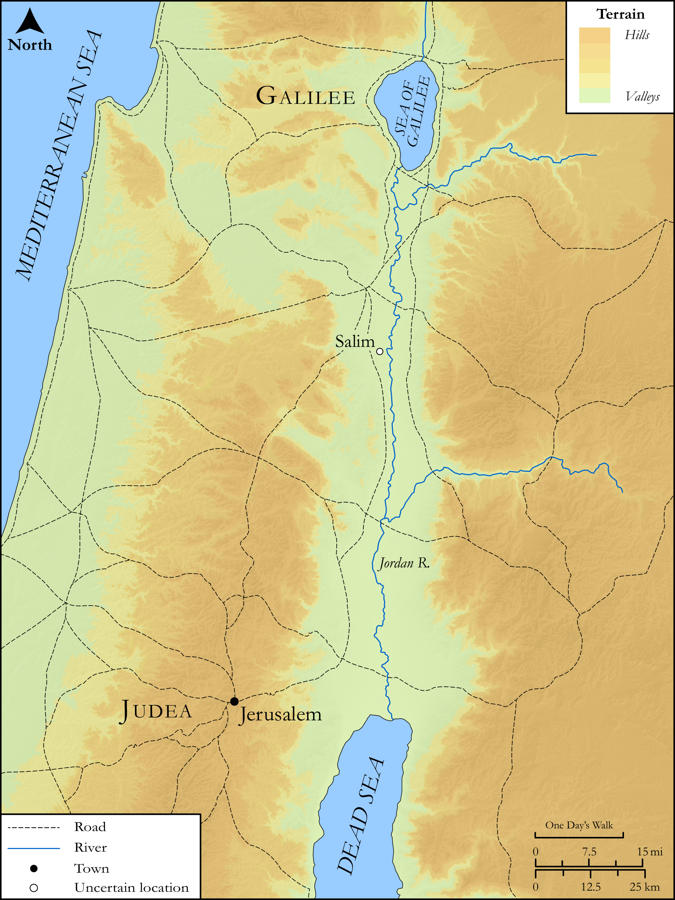

# Biblica Open Bible Maps

## License Information

Biblica Open Bible Maps, © 2023–2025 Biblica, Inc. This work is licensed under Creative Commons Attribution-ShareAlike 4.0 International (<a href="https://creativecommons.org/licenses/by-sa/4.0/">https://creativecommons.org/licenses/by-sa/4.0/</a>). More Information: <a href="https://docs.google.com/document/d/1Pp44yZ0Zdnd59vJHTrt2rPYq0SppfX5rZbPBt6mz37U/edit?tab=t.0#heading=h.oev9aj1ksvk2">https://docs.google.com/document/d/1Pp44yZ0Zdnd59vJHTrt2rPYq0SppfX5rZbPBt6mz37U/edit?tab=t.0#heading=h.oev9aj1ksvk2</a>

--------------------------------

## SRV John: John 3:22–35 (id: NT255)

### Image Content

[link](images/NT255.png)

Original: [SRV John: John 3:22\-35](https://drive.google.com/open?id=1qeqfJgQYsFyDO_R798aLuGrmoAhvKoAv&usp=drive_copy)

* **Associated Passages:** John 3:1-36

* **Associated ACAI Concepts:** LORD (ID: `deity:Lord`); Believe (ID: `keyterm:Believe`); John (ID: `person:John`); Jesus (ID: `person:Jesus.2`); Bear Witness (ID: `keyterm:BearWitness`); Holy Spirit (ID: `deity:HolySpirit`); Nicodemus (ID: `person:Nicodemus`); Always (ID: `keyterm:Always`); Love (ID: `keyterm:Love`); Sky (ID: `keyterm:Heaven`); Surely! (ID: `keyterm:Surely`); Baptism (ID: `keyterm:Baptism`); Life (ID: `keyterm:Life`); Jews (ID: `group:Jews`); Ability (ID: `keyterm:Ability`); Decided (ID: `keyterm:Decided`); Kingdom (ID: `keyterm:Kingdom`); Name (ID: `keyterm:Name`); Be a Disciple (ID: `keyterm:Disciple`); Heavenly (ID: `keyterm:Heavenly`); Spirit (ID: `keyterm:Spirit.2`); Judeans (ID: `group:Judea`); Salim (ID: `place:Salim`); Aenon (ID: `place:Aenon`); Judea (ID: `place:Judea`); Judgment (ID: `keyterm:Judgment`); Body (ID: `keyterm:Body.3`); Israel (ID: `person:Israel`); True (ID: `keyterm:True`); Salvation (ID: `keyterm:Salvation`); Word (ID: `keyterm:Word`); Truth (ID: `keyterm:Truth`); Cause of Joy (ID: `keyterm:CauseOfJoy`); Symbol (ID: `keyterm:Example`); Moses (ID: `person:Moses`); Pharisees (ID: `group:Pharisee`); Court Case (ID: `keyterm:CourtCase`); Jordan River (ID: `place:Jordan`); To Cleanse (ID: `keyterm:Cleanse.2`); Prison (ID: `realia:Prison`); Snake (ID: `fauna:Snake`)
