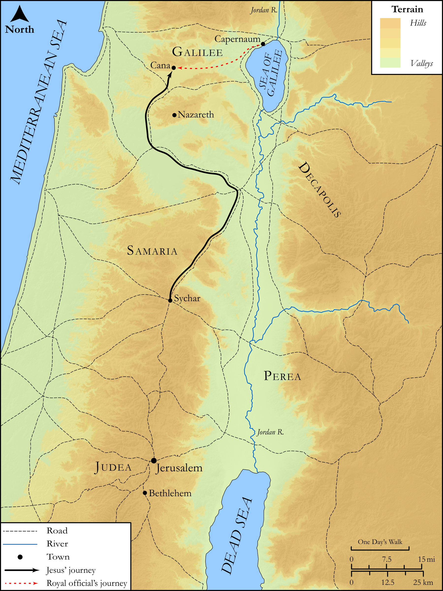

# Biblica Open Bible Maps

## License Information

Biblica Open Bible Maps, © 2023–2025 Biblica, Inc. This work is licensed under Creative Commons Attribution-ShareAlike 4.0 International (<a href="https://creativecommons.org/licenses/by-sa/4.0/">https://creativecommons.org/licenses/by-sa/4.0/</a>). More Information: <a href="https://docs.google.com/document/d/1Pp44yZ0Zdnd59vJHTrt2rPYq0SppfX5rZbPBt6mz37U/edit?tab=t.0#heading=h.oev9aj1ksvk2">https://docs.google.com/document/d/1Pp44yZ0Zdnd59vJHTrt2rPYq0SppfX5rZbPBt6mz37U/edit?tab=t.0#heading=h.oev9aj1ksvk2</a>

--------------------------------

## SRV John: John 4:43–54 (id: NT259)

### Image Content

[link](images/NT259.png)

Original: [SRV John: John 4:43\-54](https://drive.google.com/open?id=1p74i8jd7ykTpBUjsNV2obDqIeI1J-sYL&usp=drive_copy)

* **Associated Passages:** John 4:1-54

* **Associated ACAI Concepts:** Jesus (ID: `person:Jesus.2`); Believe (ID: `keyterm:Believe`); Life (ID: `keyterm:Life`); Galilee (ID: `place:Galilee`); Be a Disciple (ID: `keyterm:Disciple`); Samaria (ID: `place:Samaria`); Bow Down (ID: `keyterm:BowDown`); LORD (ID: `deity:Lord`); True (ID: `keyterm:True`); A Woman (ID: `person:GenericFemale`); Jerusalem (ID: `place:Jerusalem`); Samaritans (ID: `group:Samaritan`); Judea (ID: `place:Judea`); Israel (ID: `person:Israel`); Ask for (ID: `keyterm:AskFor`); Spirit (ID: `keyterm:Spirit.2`); Always (ID: `keyterm:Always`); Truth (ID: `keyterm:Truth`); Symbol (ID: `keyterm:Example`); Baptism (ID: `keyterm:Baptism`); Bear Witness (ID: `keyterm:BearWitness`); Jews (ID: `group:Jews`); Galileans (ID: `group:Galilee`); Cana (ID: `place:Cana`); Sychar (ID: `place:Sychar`); A Person (ID: `person:GenericPerson`); A Group of Disciples (ID: `group:GenericDisciples`); Portent (ID: `keyterm:Portent`); John (ID: `person:John`); Salvation (ID: `keyterm:Salvation`)
