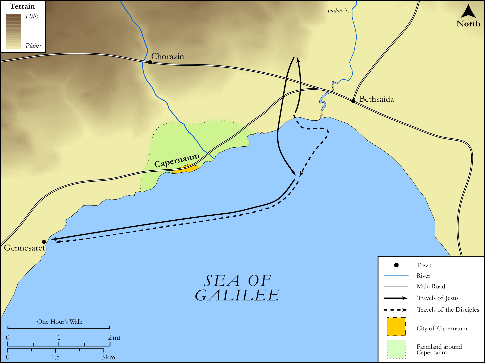

# Biblica Open Bible Maps

## License Information

Biblica Open Bible Maps, © 2023–2025 Biblica, Inc. This work is licensed under Creative Commons Attribution-ShareAlike 4.0 International (<a href="https://creativecommons.org/licenses/by-sa/4.0/">https://creativecommons.org/licenses/by-sa/4.0/</a>). More Information: <a href="https://docs.google.com/document/d/1Pp44yZ0Zdnd59vJHTrt2rPYq0SppfX5rZbPBt6mz37U/edit?tab=t.0#heading=h.oev9aj1ksvk2">https://docs.google.com/document/d/1Pp44yZ0Zdnd59vJHTrt2rPYq0SppfX5rZbPBt6mz37U/edit?tab=t.0#heading=h.oev9aj1ksvk2</a>

--------------------------------

## SRV John: John 6:16–20 (id: NT260)

### Image Content

[link](images/NT260.png)

Original: [SRV John: John 6:16\-20](https://drive.google.com/open?id=1lmo6yqoZcjiD0qEE2qydAk-zarTugUxo&usp=drive_copy)

* **Associated Passages:** Matthew 14:1-36

* **Associated ACAI Concepts:** Jesus (ID: `person:Jesus.2`); John (ID: `person:John`); Be a Disciple (ID: `keyterm:Disciple`); Ship (ID: `realia:Ship`); Fear (ID: `keyterm:Fear`); Herod Antipas (ID: `person:Herod.2`); Herodias (ID: `person:Herodias`); Salvation (ID: `keyterm:Salvation`); Baptist (ID: `keyterm:Baptist`); Oath (ID: `keyterm:Oath`); Peter (ID: `person:Peter`); Fish (ID: `fauna:Fish`); Prison (ID: `realia:Prison`); Philip (ID: `person:Philip.2`); Gennesaret (ID: `place:Gennesaret`); Having Little Faith (ID: `keyterm:HavingLittleFaith`); Cheer Up (ID: `keyterm:CheerUp`); Daughter of Herodias (ID: `person:DaughterOfHerodias`); Plate (ID: `realia:Plate.2`); Pray (ID: `keyterm:Pray`); Bow Down (ID: `keyterm:BowDown`); Affection (ID: `keyterm:Affection`); True (ID: `keyterm:True`); Sky (ID: `keyterm:Heaven`); Serve (ID: `keyterm:Serve`); Bless (ID: `keyterm:Bless`); Ask for (ID: `keyterm:AskFor`); Be Lawful (ID: `keyterm:Lawful`); Resurrection (ID: `keyterm:Resurrection`); Ability (ID: `keyterm:Ability`); Basket (ID: `realia:Basket`); Tassel (ID: `realia:Tassel`); Grass (ID: `flora:Grass`); Stade (ID: `realia:Stade`); Cloak (ID: `realia:Cloak`)
