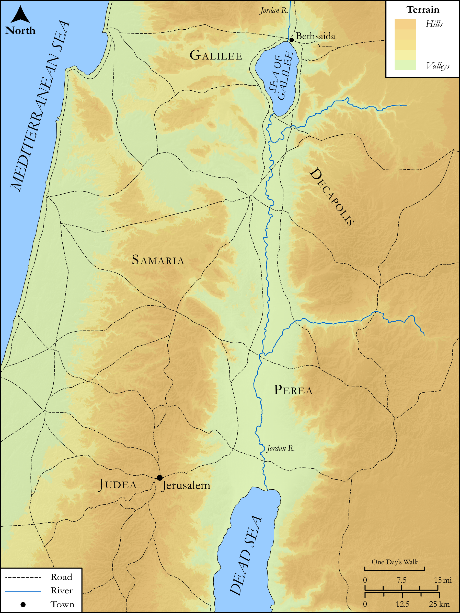

# Biblica Open Bible Maps

## License Information

Biblica Open Bible Maps, © 2023–2025 Biblica, Inc. This work is licensed under Creative Commons Attribution-ShareAlike 4.0 International (<a href="https://creativecommons.org/licenses/by-sa/4.0/">https://creativecommons.org/licenses/by-sa/4.0/</a>). More Information: <a href="https://docs.google.com/document/d/1Pp44yZ0Zdnd59vJHTrt2rPYq0SppfX5rZbPBt6mz37U/edit?tab=t.0#heading=h.oev9aj1ksvk2">https://docs.google.com/document/d/1Pp44yZ0Zdnd59vJHTrt2rPYq0SppfX5rZbPBt6mz37U/edit?tab=t.0#heading=h.oev9aj1ksvk2</a>

--------------------------------

## SRV John: John 7:45–53, John 12:20–35 (id: NT266)

### Image Content

[link](images/NT266.png)

Original: [SRV John: John 7:45\-53, John 12:20\-35](https://drive.google.com/open?id=1J0XojajhqasMOhhWTXVv7J5TINIQp4zP&usp=drive_copy)

* **Associated Passages:** John 7:1-53

* **Associated ACAI Concepts:** Jesus (ID: `person:Jesus.2`); Jews (ID: `group:Jews`); Believe (ID: `keyterm:Believe`); A Group of People (ID: `group:GenericGroup`); Galilee (ID: `place:Galilee`); True (ID: `keyterm:True`); Law (ID: `keyterm:Law`); Pharisees (ID: `group:Pharisee`); Moses (ID: `person:Moses`); Judea (ID: `place:Judea`); Sabbath (ID: `keyterm:Sabbath`); Circumcision (ID: `keyterm:Circumcision`); Decided (ID: `keyterm:Decided`); Written (ID: `keyterm:Scripture`); Glory (ID: `keyterm:Glory`); Ability (ID: `keyterm:Ability`); Temple (ID: `realia:Temple`); Unjust Deed (ID: `keyterm:UnjustDeed`); Nicodemus (ID: `person:Nicodemus`); Bethlehem (ID: `place:Bethlehem`); Be (Or Show Oneself) Just (ID: `keyterm:Just`); Relatives (ID: `group:Relatives`); Jerusalem (ID: `place:Jerusalem`); Affection (ID: `keyterm:Affection`); LORD (ID: `deity:Lord`); Religious Officials (ID: `group:ReligiousOfficials`); Demons (ID: `deity:Demons`); Javan (ID: `person:Javan`); Good (ID: `keyterm:Good`); Greeks (ID: `group:Greek`)
