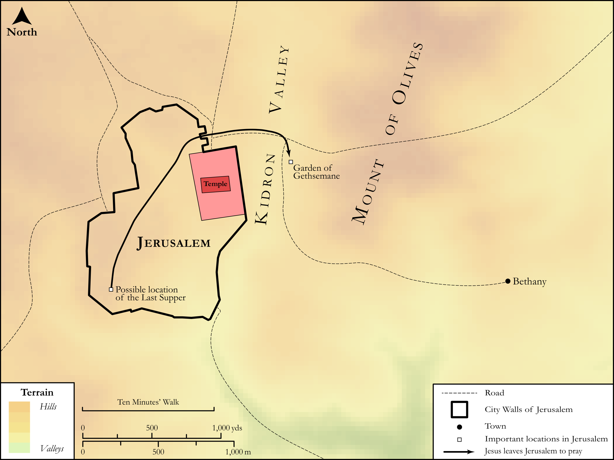

# Biblica Open Bible Maps

## License Information

Biblica Open Bible Maps, © 2023–2025 Biblica, Inc. This work is licensed under Creative Commons Attribution-ShareAlike 4.0 International (<a href="https://creativecommons.org/licenses/by-sa/4.0/">https://creativecommons.org/licenses/by-sa/4.0/</a>). More Information: <a href="https://docs.google.com/document/d/1Pp44yZ0Zdnd59vJHTrt2rPYq0SppfX5rZbPBt6mz37U/edit?tab=t.0#heading=h.oev9aj1ksvk2">https://docs.google.com/document/d/1Pp44yZ0Zdnd59vJHTrt2rPYq0SppfX5rZbPBt6mz37U/edit?tab=t.0#heading=h.oev9aj1ksvk2</a>

--------------------------------

## SRV John: John 18:1–13 (id: NT272)

### Image Content

[link](images/NT272.png)

Original: [SRV John: John 18:1\-13](https://drive.google.com/open?id=1kqvLzCtbSdGO1BSM7OnNg6qUNmOkth0j&usp=drive_copy)

* **Associated Passages:** John 18:1-40

* **Associated ACAI Concepts:** Jesus (ID: `person:Jesus.2`); Peter (ID: `person:Peter`); Jews (ID: `group:Jews`); Be a Disciple (ID: `keyterm:Disciple`); Pilate (ID: `person:Pilate`); Caiaphas (ID: `person:Caiaphas`); Judas (ID: `person:Judas.2`); Ability (ID: `keyterm:Ability`); Annas (ID: `person:Annas`); A Servant (ID: `person:GenericServant`); Nazareth (ID: `place:Nazareth`); Passover (ID: `keyterm:Passover`); Truth (ID: `keyterm:Truth`); Bear Witness (ID: `keyterm:BearWitness`); Ask for (ID: `keyterm:AskFor`); To Cause to Happen (ID: `keyterm:Happen`); Military Members (ID: `group:MilitaryMembers`); Malchus (ID: `person:Malchus`); Be Lawful (ID: `keyterm:Lawful`); Palace (ID: `realia:Palace`); Barabbas (ID: `person:Barabbas`); LORD (ID: `deity:Lord`); Defilement (ID: `keyterm:Defilement`); Public Officials (ID: `group:GenericOfficials`); Kidron (ID: `place:Kidron`); Decided (ID: `keyterm:Decided`); Name (ID: `keyterm:Name`); Kingdom (ID: `keyterm:Kingdom`); Law (ID: `keyterm:Law`); Pharisees (ID: `group:Pharisee`); Torch (ID: `realia:Torch`); Sheath (ID: `realia:Sheath`); Lantern (ID: `realia:Lantern`); Courtyard (ID: `realia:Courtyard`); Temple (ID: `realia:Temple`); Synagogue (ID: `realia:Synagogue`); Rooster (ID: `fauna:Rooster`); Door (ID: `realia:Door`)
