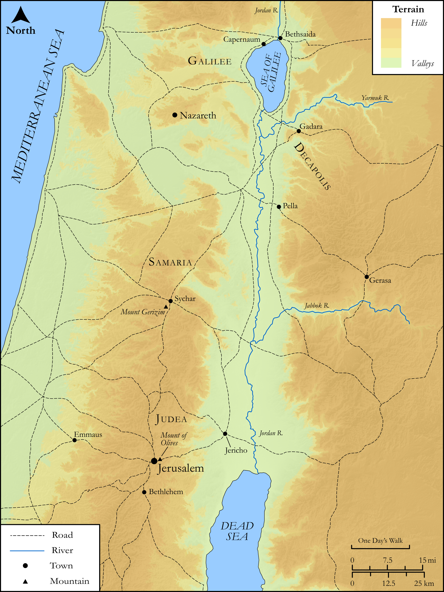

# Biblica Open Bible Maps

## License Information

Biblica Open Bible Maps, © 2023–2025 Biblica, Inc. This work is licensed under Creative Commons Attribution-ShareAlike 4.0 International (<a href="https://creativecommons.org/licenses/by-sa/4.0/">https://creativecommons.org/licenses/by-sa/4.0/</a>). More Information: <a href="https://docs.google.com/document/d/1Pp44yZ0Zdnd59vJHTrt2rPYq0SppfX5rZbPBt6mz37U/edit?tab=t.0#heading=h.oev9aj1ksvk2">https://docs.google.com/document/d/1Pp44yZ0Zdnd59vJHTrt2rPYq0SppfX5rZbPBt6mz37U/edit?tab=t.0#heading=h.oev9aj1ksvk2</a>

--------------------------------

## SRV John: John 19:17–29 (id: NT273)

### Image Content

[link](images/NT273.png)

Original: [SRV John: John 19:17\-29](https://drive.google.com/open?id=1i-EIaIVbWp--uiQ5zqioW3lW8FTA_OQj&usp=drive_copy)

* **Associated Passages:** John 19:1-42

* **Associated ACAI Concepts:** Jesus (ID: `person:Jesus.2`); Pilate (ID: `person:Pilate`); Jews (ID: `group:Jews`); Cross (ID: `realia:Cross`); Written (ID: `keyterm:Scripture`); Body (ID: `keyterm:Body.3`); Be a Disciple (ID: `keyterm:Disciple`); Tiberius (ID: `person:Tiberius`); Authority (ID: `keyterm:Authority.2`); Fear (ID: `keyterm:Fear`); Ask for (ID: `keyterm:AskFor`); To Cause to Happen (ID: `keyterm:Happen`); Ability (ID: `keyterm:Ability`); Aloes (ID: `realia:Aloes`); Nicodemus (ID: `person:Nicodemus`); Joseph (ID: `person:Joseph.6`); Grave (ID: `realia:Grave`); Sour Wine (ID: `realia:SourWine`); Nazareth (ID: `place:Nazareth`); Golgotha (ID: `place:Golgotha`); Gabbatha (ID: `place:Gabbatha`); Mary (ID: `person:Mary.4`); Arimathea (ID: `place:Arimathea`); Cleopas (ID: `person:Cleopas`); Brier (ID: `flora:Brier`); Boxthorn (ID: `flora:Boxthorn`); Crown (ID: `realia:Crown`); Clothing (ID: `realia:Clothing`); Crown (ID: `realia:Crown.2`); Cloak (ID: `realia:Cloak`); Acacia (ID: `flora:Acacia`); Sabbath (ID: `keyterm:Sabbath`); Mary Magdalene (ID: `person:Marymagdalene`); Spirit (ID: `keyterm:Spirit.2`); True (ID: `keyterm:True`); Passover (ID: `keyterm:Passover`); Obligated (ID: `keyterm:Ought`); Love (ID: `keyterm:Love`); Priests (ID: `group:GenericPriests`); To Sin (ID: `keyterm:Sin`); Bear Witness (ID: `keyterm:BearWitness`); Blood (ID: `keyterm:Blood`); Law (ID: `keyterm:Law`); Hyssop (ID: `flora:Hyssop`); Myrrh (ID: `realia:Myrrh`); Spear (ID: `realia:Spear`); Aloes (ID: `flora:Aloes`); Pound (ID: `realia:Pound`); Lot (ID: `realia:Lot`); Palace (ID: `realia:Palace`); Tunic (ID: `realia:Tunic.2`); Linen (ID: `realia:Linen`); Judgment Seat (ID: `realia:JudgmentSeat`); Myrrh (ID: `flora:Myrrh`)
