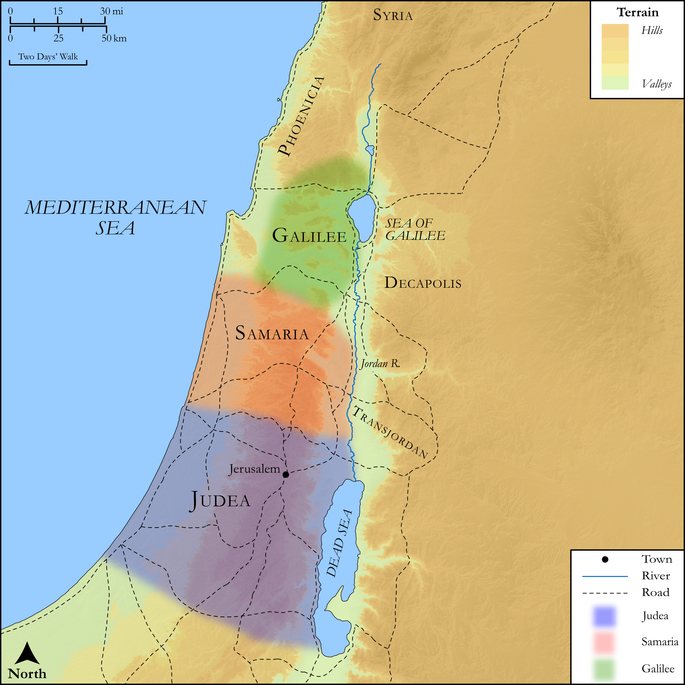

# Biblica Open Bible Maps

## License Information

Biblica Open Bible Maps, © 2023–2025 Biblica, Inc. This work is licensed under Creative Commons Attribution-ShareAlike 4.0 International (<a href="https://creativecommons.org/licenses/by-sa/4.0/">https://creativecommons.org/licenses/by-sa/4.0/</a>). More Information: <a href="https://docs.google.com/document/d/1Pp44yZ0Zdnd59vJHTrt2rPYq0SppfX5rZbPBt6mz37U/edit?tab=t.0#heading=h.oev9aj1ksvk2">https://docs.google.com/document/d/1Pp44yZ0Zdnd59vJHTrt2rPYq0SppfX5rZbPBt6mz37U/edit?tab=t.0#heading=h.oev9aj1ksvk2</a>

--------------------------------

## SRV Acts: Acts 1:6–10 (id: NT302)

### Image Content

[link](images/NT302.png)

Original: [SRV Acts: Acts 1:6\-10](https://drive.google.com/open?id=1My84HH0u2MbT5KwaLCLkr0k6SJnYN_a1&usp=drive_copy)

* **Associated Passages:** Acts 1:1-26

* **Associated ACAI Concepts:** Jesus (ID: `person:Jesus.2`); Holy Spirit (ID: `deity:HolySpirit`); Jerusalem (ID: `place:Jerusalem`); LORD (ID: `deity:Lord`); Matthias (ID: `person:Matthias`); Pray (ID: `keyterm:Pray`); Sky (ID: `keyterm:Heaven`); Witness (ID: `keyterm:Witness`); John (ID: `person:John`); Judas (ID: `person:Judas.2`); Serve (ID: `keyterm:Serve`); Baptism (ID: `keyterm:Baptism`); Peter (ID: `person:Peter`); Kingdom (ID: `keyterm:Kingdom`); Ability (ID: `keyterm:Ability`); Chosen (ID: `keyterm:Chosen`); Judea (ID: `place:Judea`); Mary (ID: `person:Mary`); Promise (ID: `keyterm:Promise`); Akeldama (ID: `place:Akeldama`); Joseph (ID: `person:Joseph.9`); Andrew (ID: `person:Andrew`); Alphaeus (ID: `person:Alphaeus`); Simon (ID: `person:Simon.2`); Bartholomew (ID: `person:Bartholomew`); Galileans (ID: `group:Galilee`); Mount of Olives (ID: `place:OlivesMount`); Thomas (ID: `person:Thomas`); James (ID: `person:James.2`); Theophilus (ID: `person:Theophilus`); Unjust Deed (ID: `keyterm:UnjustDeed`); Israel (ID: `person:Israel`); Knower of Hearts (ID: `keyterm:KnowerOfHearts`); Position of Responsibility (ID: `keyterm:PositionOfResponsibility`); Written (ID: `keyterm:Scripture`); David (ID: `person:David`); John (ID: `person:John.2`); Authority (ID: `keyterm:Authority.2`); Sabbath Journey (ID: `keyterm:HalfAMile`); Name (ID: `keyterm:Name`); James (ID: `person:James`); Ask for (ID: `keyterm:AskFor`); Judas (ID: `person:Judas`); Resurrection (ID: `keyterm:Resurrection`); Blood (ID: `keyterm:Blood`); Life (ID: `keyterm:Life`); Matthew (ID: `person:Matthew`); Philip (ID: `person:Philip`); Galilee (ID: `place:Galilee`); To Cause to Happen (ID: `keyterm:Happen`); Samaria (ID: `place:Samaria`); To Command (ID: `keyterm:Command`); Upstairs Room (ID: `realia:UpstairsRoom`); Lot (ID: `realia:Lot`); Half a Mile (ID: `realia:HalfAMile`); Clothing (ID: `realia:Clothing`); Olive Tree (ID: `flora:OliveTree`)
