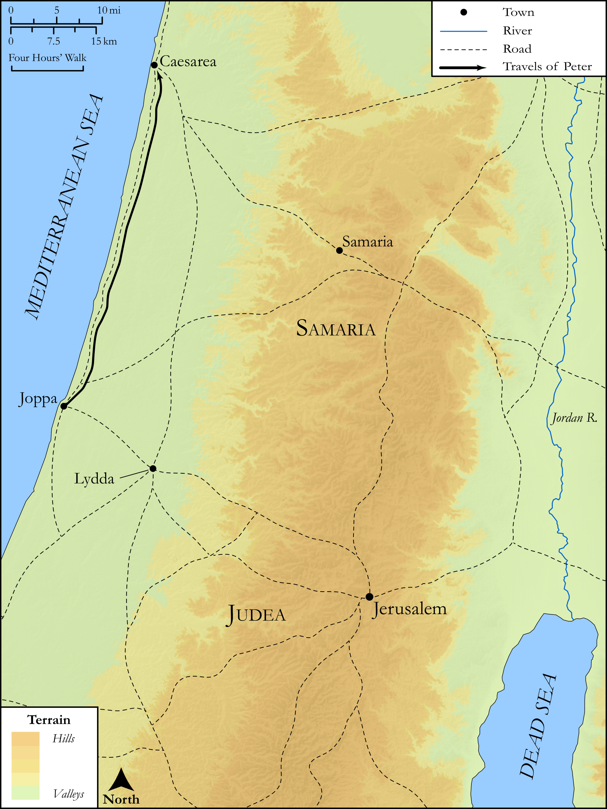

# Biblica Open Bible Maps

## License Information

Biblica Open Bible Maps, © 2023–2025 Biblica, Inc. This work is licensed under Creative Commons Attribution-ShareAlike 4.0 International (<a href="https://creativecommons.org/licenses/by-sa/4.0/">https://creativecommons.org/licenses/by-sa/4.0/</a>). More Information: <a href="https://docs.google.com/document/d/1Pp44yZ0Zdnd59vJHTrt2rPYq0SppfX5rZbPBt6mz37U/edit?tab=t.0#heading=h.oev9aj1ksvk2">https://docs.google.com/document/d/1Pp44yZ0Zdnd59vJHTrt2rPYq0SppfX5rZbPBt6mz37U/edit?tab=t.0#heading=h.oev9aj1ksvk2</a>

--------------------------------

## SRV Acts: Acts 10:23b-32 (id: NT320)

### Image Content

[link](images/NT320.png)

Original: [SRV Acts: Acts 10:23b\-32](https://drive.google.com/open?id=1dxprPupV4hBf5uTaduLXPRjAQL13eK06&usp=drive_copy)

* **Associated Passages:** Acts 10:1-48

* **Associated ACAI Concepts:** LORD (ID: `deity:Lord`); Peter (ID: `person:Peter`); Cornelius (ID: `person:Cornelius`); Holy Spirit (ID: `deity:HolySpirit`); Pray (ID: `keyterm:Pray`); Joppa (ID: `place:Joppa`); An Angel (ID: `deity:Angel`); House (ID: `realia:House`); Simon (ID: `person:Simon.9`); Defilement (ID: `keyterm:Defilement`); Word (ID: `keyterm:Word`); Sky (ID: `keyterm:Heaven`); Fear (ID: `keyterm:Fear`); Baptism (ID: `keyterm:Baptism`); Name (ID: `keyterm:Name`); Jews (ID: `group:Jews`); Bear Witness (ID: `keyterm:BearWitness`); Caesarea (ID: `place:Caesarea`); Be (Or Show Oneself) Just (ID: `keyterm:Just`); Proclaim (ID: `keyterm:Proclaim`); Witness (ID: `keyterm:Witness`); Jesus (ID: `person:Jesus.2`); Ask for (ID: `keyterm:AskFor`); Temple (ID: `realia:Temple`); Italians (ID: `group:Italy`); Declare (ID: `keyterm:Declare`); Anointed (ID: `keyterm:Anointed`); Judea (ID: `place:Judea`); Jerusalem (ID: `place:Jerusalem`); Believe (ID: `keyterm:Believe`); Italy (ID: `place:Italy`); Bow Down (ID: `keyterm:BowDown`); Disgusting (ID: `keyterm:Disgusting`); Israel (ID: `person:Israel`); Discern (ID: `keyterm:Discern`); Circumcision (ID: `keyterm:Circumcision`); Faithfulness (ID: `keyterm:Faithfulness`); Nazareth (ID: `place:Nazareth`); John (ID: `person:John`); Gentiles (ID: `group:Gentile`); Good News (ID: `keyterm:GoodNews`); Truth (ID: `keyterm:Truth`); To Sin (ID: `keyterm:Sin`); Forgive (ID: `keyterm:Forgive`); Men (ID: `group:GenericMales`); Make Peace (ID: `keyterm:Peace`); Resurrection (ID: `keyterm:Resurrection`); Life (ID: `keyterm:Life`); Holy (ID: `keyterm:Holy`); Galilee (ID: `place:Galilee`); Ability (ID: `keyterm:Ability`); To Cleanse (ID: `keyterm:Cleanse.2`); Leather (ID: `realia:Leather`); Housetop (ID: `realia:Housetop`); Linen Cloth (ID: `realia:LinenCloth`); Lizard (ID: `fauna:Lizard`); Creeping Animal (ID: `fauna:CreepingAnimal`); Cross (ID: `realia:Cross`); Monitor (ID: `fauna:Iguana`); Chameleon (ID: `fauna:Chameleon`); Clothing (ID: `realia:Clothing`); Snake (ID: `fauna:Snake`)
