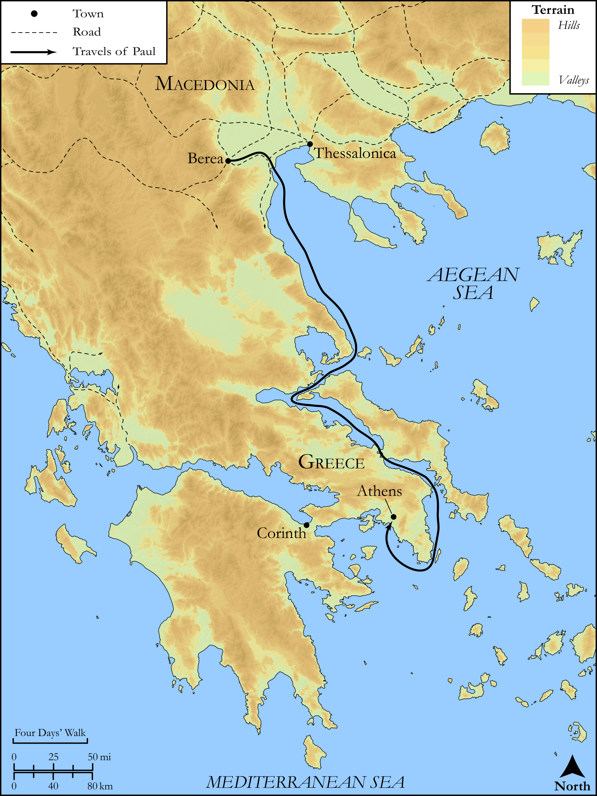

# Biblica Open Bible Maps

## License Information

Biblica Open Bible Maps, © 2023–2025 Biblica, Inc. This work is licensed under Creative Commons Attribution-ShareAlike 4.0 International (<a href="https://creativecommons.org/licenses/by-sa/4.0/">https://creativecommons.org/licenses/by-sa/4.0/</a>). More Information: <a href="https://docs.google.com/document/d/1Pp44yZ0Zdnd59vJHTrt2rPYq0SppfX5rZbPBt6mz37U/edit?tab=t.0#heading=h.oev9aj1ksvk2">https://docs.google.com/document/d/1Pp44yZ0Zdnd59vJHTrt2rPYq0SppfX5rZbPBt6mz37U/edit?tab=t.0#heading=h.oev9aj1ksvk2</a>

--------------------------------

## SRV Acts: Acts 17:10–14 (id: NT341)

### Image Content

[link](images/NT341.png)

Original: [SRV Acts: Acts 17:10\-14](https://drive.google.com/open?id=1Vn2nhHm7S9rviWbP4seD9EAMSsPuiN9R&usp=drive_copy)

* **Associated Passages:** Acts 17:1-34

* **Associated ACAI Concepts:** Paul (ID: `person:Paul`); LORD (ID: `deity:Lord`); Jews (ID: `group:Jews`); Jason (ID: `person:Jason`); Athens (ID: `place:Athens`); Silas (ID: `person:Silas`); Areopagus (ID: `place:Areopagus`); Thessalonica (ID: `place:Thessalonica`); Worship (ID: `keyterm:Worship`); Jesus (ID: `person:Jesus.2`); Ability (ID: `keyterm:Ability`); Written (ID: `keyterm:Scripture`); Greeks (ID: `group:Greek`); Berea (ID: `place:Berea`); Synagogue (ID: `realia:Synagogue`); Timothy (ID: `person:Timothy`); Believe (ID: `keyterm:Believe`); Javan (ID: `person:Javan`); Resurrection (ID: `keyterm:Resurrection`); Life (ID: `keyterm:Life`); Damaris (ID: `person:Damaris`); Discern (ID: `keyterm:Discern`); Apollonia (ID: `place:Apollonia`); Stoics (ID: `group:Stoic`); Areopagites (ID: `group:Areopagus`); Decided (ID: `keyterm:Decided`); Athenians (ID: `group:Athens`); Divine (ID: `keyterm:Divine`); Amphipolis (ID: `place:Amphipolis`); Epicureans (ID: `group:Epicurean`); Dionysius (ID: `person:Dionysius`); Image (ID: `realia:Image`); Repent (ID: `keyterm:Repent`); Commandment (ID: `keyterm:Commandment`); Claudius (ID: `person:Claudius`); Sabbath (ID: `keyterm:Sabbath`); Object of Worship (ID: `keyterm:ObjectOfWorship`); Demons (ID: `deity:Demons`); Spirit (ID: `keyterm:Spirit.2`); Bring to the Attention Of (ID: `keyterm:BringToTheAttentionOf`); Proof (ID: `keyterm:Proof`); Obligated (ID: `keyterm:Ought`); Sky (ID: `keyterm:Heaven`); Be (Or Show Oneself) Just (ID: `keyterm:Just`); Good News (ID: `keyterm:GoodNews`); Serve (ID: `keyterm:Serve`); Name (ID: `keyterm:Name`); Persuade (ID: `keyterm:Persuade`); Stone Altar (ID: `realia:StoneAltar`); House (ID: `realia:House`); Temple (ID: `realia:Temple`)
