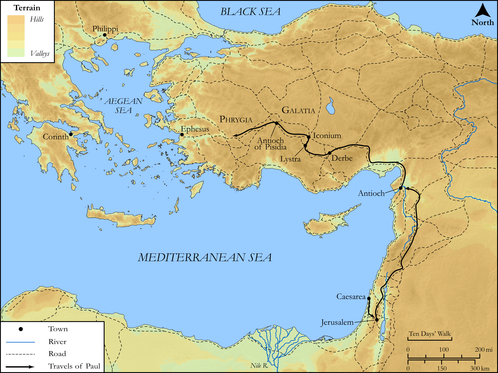

# Biblica Open Bible Maps

## License Information

Biblica Open Bible Maps, © 2023–2025 Biblica, Inc. This work is licensed under Creative Commons Attribution-ShareAlike 4.0 International (<a href="https://creativecommons.org/licenses/by-sa/4.0/">https://creativecommons.org/licenses/by-sa/4.0/</a>). More Information: <a href="https://docs.google.com/document/d/1Pp44yZ0Zdnd59vJHTrt2rPYq0SppfX5rZbPBt6mz37U/edit?tab=t.0#heading=h.oev9aj1ksvk2">https://docs.google.com/document/d/1Pp44yZ0Zdnd59vJHTrt2rPYq0SppfX5rZbPBt6mz37U/edit?tab=t.0#heading=h.oev9aj1ksvk2</a>

--------------------------------

## SRV Acts: Acts 18:18–22 (id: NT346)

### Image Content

[link](images/NT346.png)

Original: [SRV Acts: Acts 18:18\-22](https://drive.google.com/open?id=1Rk6Wp9-JeFrn7B_QkwoSADbOCrUwj3Mg&usp=drive_copy)

* **Associated Passages:** Acts 18:1-28

* **Associated ACAI Concepts:** Jews (ID: `group:Jews`); LORD (ID: `deity:Lord`); Paul (ID: `person:Paul`); Synagogue (ID: `realia:Synagogue`); Name (ID: `keyterm:Name`); Gallio (ID: `person:Gallio`); Aquila (ID: `person:Aquila`); Priscilla (ID: `person:Priscilla`); Ephesus (ID: `place:Ephesus`); Jesus (ID: `person:Jesus.2`); Judgment Seat (ID: `realia:JudgmentSeat`); Worship (ID: `keyterm:Worship`); Achaia (ID: `place:Achaia`); Corinth (ID: `place:Corinth`); Believe (ID: `keyterm:Believe`); Written (ID: `keyterm:Scripture`); Baptism (ID: `keyterm:Baptism`); Law (ID: `keyterm:Law`); Be a Disciple (ID: `keyterm:Disciple`); The Way (ID: `keyterm:TheWay`); Alexandria (ID: `place:Alexandria`); Alexandrians (ID: `group:Alexandria`); Claudius (ID: `person:Claudius`); Apollos (ID: `person:Apollos`); Corinthians (ID: `group:Corinth`); Pontus (ID: `group:Pontus`); Crispus (ID: `person:Crispus`); Sosthenes (ID: `person:Sosthenes`); Pontus (ID: `place:Pontus`); Phrygia (ID: `place:Phrygia`); Rome (ID: `place:Rome`); Galatia (ID: `place:Galatia`); Cenchreae (ID: `place:Cenchreae`); Justus (ID: `person:Justus.2`); Timothy (ID: `person:Timothy`); Church (ID: `keyterm:Church`); Italy (ID: `place:Italy`); Sabbath (ID: `keyterm:Sabbath`); Blaspheme (ID: `keyterm:Blaspheme`); Declare (ID: `keyterm:Declare`); Caesarea (ID: `place:Caesarea`); Favor (ID: `keyterm:Favor`); Athens (ID: `place:Athens`); Spirit (ID: `keyterm:Spirit.2`); John (ID: `person:John`); Javan (ID: `person:Javan`); Vow (ID: `keyterm:Vow`); Gentiles (ID: `group:Gentile`); Greeks (ID: `group:Greek`); Silas (ID: `person:Silas`); Fear (ID: `keyterm:Fear`); Clean (ID: `keyterm:Clean`); Blood (ID: `keyterm:Blood`); Ask for (ID: `keyterm:AskFor`); Unrighteous Act (ID: `keyterm:UnrighteousAct`); Persuade (ID: `keyterm:Persuade`); Macedonia (ID: `place:Macedonia`); Antioch (ID: `place:Antioch`); House (ID: `realia:House`); Tent (ID: `realia:Tent`); Clothing (ID: `realia:Clothing`)
