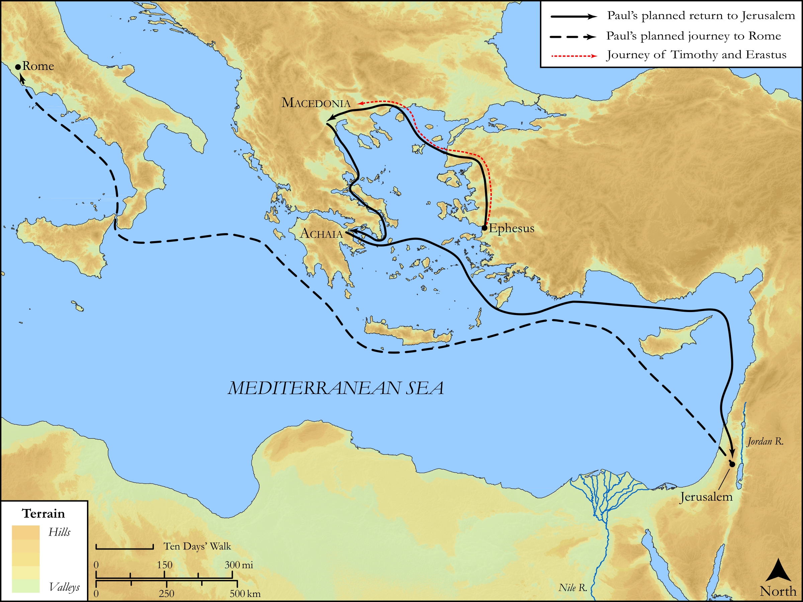

# Biblica Open Bible Maps

## License Information

Biblica Open Bible Maps, © 2023–2025 Biblica, Inc. This work is licensed under Creative Commons Attribution-ShareAlike 4.0 International (<a href="https://creativecommons.org/licenses/by-sa/4.0/">https://creativecommons.org/licenses/by-sa/4.0/</a>). More Information: <a href="https://docs.google.com/document/d/1Pp44yZ0Zdnd59vJHTrt2rPYq0SppfX5rZbPBt6mz37U/edit?tab=t.0#heading=h.oev9aj1ksvk2">https://docs.google.com/document/d/1Pp44yZ0Zdnd59vJHTrt2rPYq0SppfX5rZbPBt6mz37U/edit?tab=t.0#heading=h.oev9aj1ksvk2</a>

--------------------------------

## SRV Acts: Acts 19:21–40 (id: NT350)

### Image Content

[link](images/NT350.png)

Original: [SRV Acts: Acts 19:21\-40](https://drive.google.com/open?id=12ZaageDNC1nrgLEvdm4Rlffjo6oXXNTU&usp=drive_copy)

* **Associated Passages:** Acts 19:1-40

* **Associated ACAI Concepts:** Paul (ID: `person:Paul`); Ephesus (ID: `place:Ephesus`); Jews (ID: `group:Jews`); Artemis (ID: `deity:Artemis`); Jesus (ID: `person:Jesus.2`); Asia (ID: `place:Asia`); LORD (ID: `deity:Lord`); Name (ID: `keyterm:Name`); Ephesians (ID: `group:Ephesus`); Macedonia (ID: `place:Macedonia`); Believe (ID: `keyterm:Believe`); Baptism (ID: `keyterm:Baptism`); Be a Disciple (ID: `keyterm:Disciple`); Demetrius (ID: `person:Demetrius`); John (ID: `person:John`); Javan (ID: `person:Javan`); Greeks (ID: `group:Greek`); Authority (ID: `keyterm:Authority.2`); The Way (ID: `keyterm:TheWay`); Holy Spirit (ID: `deity:HolySpirit`); Persuade (ID: `keyterm:Persuade`); Ability (ID: `keyterm:Ability`); Theater (ID: `realia:Theater`); Erastus (ID: `person:Erastus`); Aristarchus (ID: `person:Aristarchus`); Achaia (ID: `place:Achaia`); Demons (ID: `deity:Demons`); Tyrannus (ID: `person:Tyrannus`); Alexander (ID: `person:Alexander.3`); Sceva (ID: `person:Sceva`); Gaius (ID: `person:Gaius`); Temple (ID: `realia:Temple`); Timothy (ID: `person:Timothy`); Jerusalem (ID: `place:Jerusalem`); Repent (ID: `keyterm:Repent`); Apollos (ID: `person:Apollos`); Worship (ID: `keyterm:Worship`); Blaspheme (ID: `keyterm:Blaspheme`); Spirit (ID: `keyterm:Spirit.2`); Corinth (ID: `place:Corinth`); Set Free (ID: `keyterm:SetFree`); Proclaim (ID: `keyterm:Proclaim`); Serve (ID: `keyterm:Serve`); Fear (ID: `keyterm:Fear`); Public Official (ID: `person:GenericOfficial`); Kingdom (ID: `keyterm:Kingdom`); Speak as a Prophet (ID: `keyterm:Speak`); Magic (ID: `keyterm:Magic`); Ask for (ID: `keyterm:AskFor`); Rome (ID: `place:Rome`); Be Lawful (ID: `keyterm:Lawful`); Lecture Hall (ID: `realia:LectureHall`); Band of Cloth (ID: `realia:BandOfCloth`); Apron (ID: `realia:Apron`); Replica Temple (ID: `realia:ReplicaTemple`); House (ID: `realia:House`); Synagogue (ID: `realia:Synagogue`); Scroll (ID: `realia:Scroll`)
