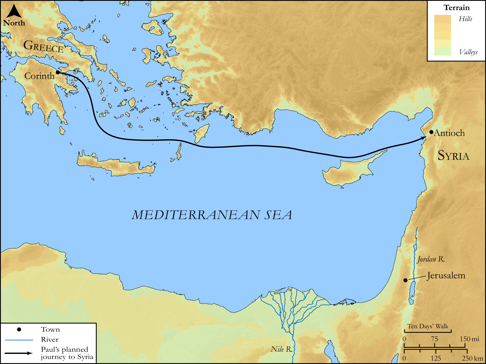

# Biblica Open Bible Maps

## License Information

Biblica Open Bible Maps, © 2023–2025 Biblica, Inc. This work is licensed under Creative Commons Attribution-ShareAlike 4.0 International (<a href="https://creativecommons.org/licenses/by-sa/4.0/">https://creativecommons.org/licenses/by-sa/4.0/</a>). More Information: <a href="https://docs.google.com/document/d/1Pp44yZ0Zdnd59vJHTrt2rPYq0SppfX5rZbPBt6mz37U/edit?tab=t.0#heading=h.oev9aj1ksvk2">https://docs.google.com/document/d/1Pp44yZ0Zdnd59vJHTrt2rPYq0SppfX5rZbPBt6mz37U/edit?tab=t.0#heading=h.oev9aj1ksvk2</a>

--------------------------------

## SRV Acts: Acts 20:1–5 (id: NT353)

### Image Content

[link](images/NT353.png)

Original: [SRV Acts: Acts 20:1\-5](https://drive.google.com/open?id=1bif7qEqy7RITNvag0vJzY9o5kI-2wUVa&usp=drive_copy)

* **Associated Passages:** Acts 20:1-38

* **Associated ACAI Concepts:** Paul (ID: `person:Paul`); LORD (ID: `deity:Lord`); Declare (ID: `keyterm:Declare`); Encourage (ID: `keyterm:Encourage`); Asia (ID: `place:Asia`); Jesus (ID: `person:Jesus.2`); Ask for (ID: `keyterm:AskFor`); Life (ID: `keyterm:Life`); Holy Spirit (ID: `deity:HolySpirit`); Jews (ID: `group:Jews`); Miletus (ID: `place:Miletus`); Ephesus (ID: `place:Ephesus`); Troas (ID: `place:Troas`); Assos (ID: `place:Assos`); Macedonia (ID: `place:Macedonia`); Jerusalem (ID: `place:Jerusalem`); Church (ID: `keyterm:Church`); Favor (ID: `keyterm:Favor`); Serve (ID: `keyterm:Serve`); Blood (ID: `keyterm:Blood`); Be a Disciple (ID: `keyterm:Disciple`); Philippi (ID: `place:Philippi`); Samos (ID: `place:Samos`); Pyrrhus (ID: `person:Pyrrhus`); Gaius (ID: `person:Gaius.2`); Sopater (ID: `person:Sopater`); Trophimus (ID: `person:Trophimus`); Asians (ID: `group:Asia`); Bereans (ID: `group:Berea`); Chios (ID: `place:Chios`); Week (ID: `keyterm:Week`); Secundus (ID: `person:Secundus`); Be Enslaved (ID: `keyterm:Serve.2`); Eutychus (ID: `person:Eutychus`); Tychicus (ID: `person:Tychicus`); Mitylene (ID: `place:Mitylene`); Greece (ID: `place:Greece`); Ship (ID: `realia:Ship`); Flock (ID: `fauna:Flock`); Goat (ID: `fauna:Goat`); Timothy (ID: `person:Timothy`); Believe (ID: `keyterm:Believe`); Repent (ID: `keyterm:Repent`); Aristarchus (ID: `person:Aristarchus`); Pray (ID: `keyterm:Pray`); Spirit (ID: `keyterm:Spirit.2`); Javan (ID: `person:Javan`); Decided (ID: `keyterm:Decided`); Thessalonica (ID: `place:Thessalonica`); Greeks (ID: `group:Greek`); Berea (ID: `place:Berea`); Good News (ID: `keyterm:GoodNews`); Proclaim (ID: `keyterm:Proclaim`); Derbe (ID: `place:Derbe`); Clean (ID: `keyterm:Clean`); Name (ID: `keyterm:Name`); Kingdom (ID: `keyterm:Kingdom`); Thessalonians (ID: `group:Thessalonica`); Consecration (ID: `keyterm:Consecration.2`); Happy (ID: `keyterm:Happy`); Window (ID: `realia:Window`); Second Story (ID: `realia:SecondStory`); Upstairs Room (ID: `realia:UpstairsRoom`); Lamp (ID: `realia:Lamp`); House (ID: `realia:House`); Temple (ID: `realia:Temple`); Clothing (ID: `realia:Clothing`); Wolf (ID: `fauna:Wolf`)
