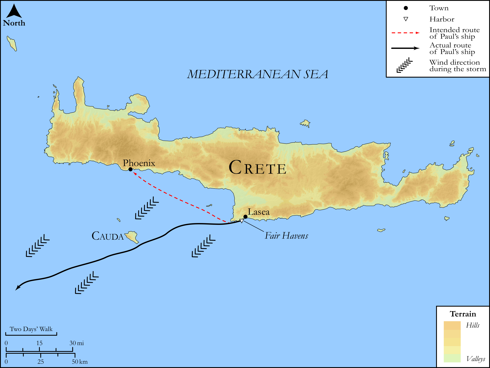

# Biblica Open Bible Maps

## License Information

Biblica Open Bible Maps, © 2023–2025 Biblica, Inc. This work is licensed under Creative Commons Attribution-ShareAlike 4.0 International (<a href="https://creativecommons.org/licenses/by-sa/4.0/">https://creativecommons.org/licenses/by-sa/4.0/</a>). More Information: <a href="https://docs.google.com/document/d/1Pp44yZ0Zdnd59vJHTrt2rPYq0SppfX5rZbPBt6mz37U/edit?tab=t.0#heading=h.oev9aj1ksvk2">https://docs.google.com/document/d/1Pp44yZ0Zdnd59vJHTrt2rPYq0SppfX5rZbPBt6mz37U/edit?tab=t.0#heading=h.oev9aj1ksvk2</a>

--------------------------------

## SRV Acts: Acts 27:9–25 (id: NT362)

### Image Content

[link](images/NT362.png)

Original: [SRV Acts: Acts 27:9\-25](https://drive.google.com/open?id=1SzMyPZ-Zl75-RcBkn689L_X0fL5Zoi5s&usp=drive_copy)

* **Associated Passages:** Acts 27:1-44

* **Associated ACAI Concepts:** Ship (ID: `realia:Ship`); Paul (ID: `person:Paul`); Salvation (ID: `keyterm:Salvation`); Crete (ID: `place:Crete`); LORD (ID: `deity:Lord`); Fear (ID: `keyterm:Fear`); Anchor (ID: `realia:Anchor`); Julius (ID: `person:Julius`); Italy (ID: `place:Italy`); Ask for (ID: `keyterm:AskFor`); Life (ID: `keyterm:Life`); Fair Havens (ID: `place:FairHavens`); Myra (ID: `place:Myra`); Pamphylia (ID: `place:Pamphylia`); Alexandria (ID: `place:Alexandria`); Aristarchus (ID: `person:Aristarchus`); Sidon (ID: `place:Sidon`); Adriatic Sea (ID: `place:AdriaticSea`); Cnidus (ID: `place:Cnidus`); Asia (ID: `place:Asia`); Lasea (ID: `place:Lasea`); Salmone (ID: `place:Salmone`); the Syrtis (ID: `place:Syrtis`); Cilicia (ID: `place:Cilicia`); Phoenix (ID: `place:Phoenix`); Cauda (ID: `place:Cauda`); Adramyttium (ID: `place:Adramyttium`); Lycia (ID: `place:Lycia`); Augustus (ID: `person:Augustus`); Rope (ID: `realia:Rope`); Believe (ID: `keyterm:Believe`); Priesthood (ID: `keyterm:Priesthood`); Pray (ID: `keyterm:Pray`); Claudius (ID: `person:Claudius`); Abstain from Food (ID: `keyterm:Fast`); Decided (ID: `keyterm:Decided`); Thessalonica (ID: `place:Thessalonica`); Serve (ID: `keyterm:Serve`); Hope (ID: `keyterm:Hope`); Name (ID: `keyterm:Name`); Forgive (ID: `keyterm:Forgive`); Thessalonians (ID: `group:Thessalonica`); An Angel (ID: `deity:Angel`); Cyprus (ID: `place:Cyprus`); Persuade (ID: `keyterm:Persuade`); Macedonia (ID: `place:Macedonia`); Sail (ID: `realia:Sail`); Fathom (ID: `realia:Fathom`); Rudder (ID: `realia:Rudder`); Wheat (ID: `flora:Wheat`)
