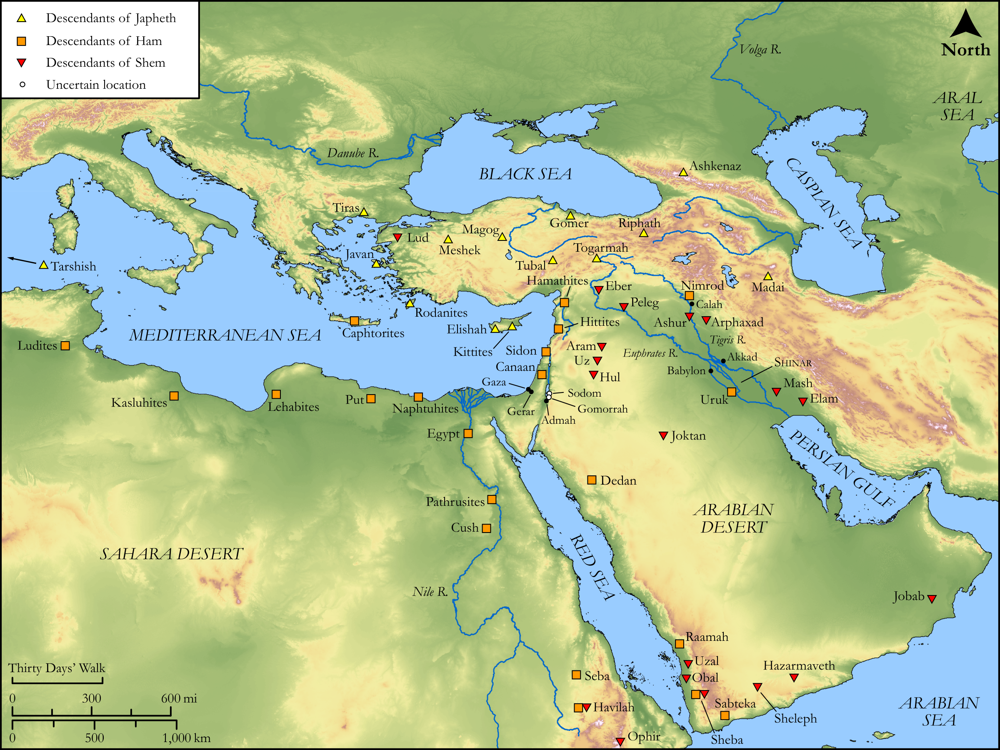

# Biblica Open Bible Maps

## License Information

Biblica Open Bible Maps, © 2023–2025 Biblica, Inc. This work is licensed under Creative Commons Attribution-ShareAlike 4.0 International (<a href="https://creativecommons.org/licenses/by-sa/4.0/">https://creativecommons.org/licenses/by-sa/4.0/</a>). More Information: <a href="https://docs.google.com/document/d/1Pp44yZ0Zdnd59vJHTrt2rPYq0SppfX5rZbPBt6mz37U/edit?tab=t.0#heading=h.oev9aj1ksvk2">https://docs.google.com/document/d/1Pp44yZ0Zdnd59vJHTrt2rPYq0SppfX5rZbPBt6mz37U/edit?tab=t.0#heading=h.oev9aj1ksvk2</a>

--------------------------------

## Pentateuch: The Table of Nations (id: OT011)

### Image Content

[link](images/OT011.png)

Original: [Pentateuch: The Table of Nations](https://drive.google.com/open?id=1L7pStKBzBhSxKDtqHv6zBkkVEIjdVSH6&usp=drive_copy)

* **Associated Passages:** Genesis 10:1-32

* **Associated ACAI Concepts:** Shem (ID: `person:Shem`); Cush (ID: `person:Cush.2`); Eber (ID: `person:Eber`); Joktan (ID: `person:Joktan`); Japheth (ID: `person:Japheth`); Ham (ID: `person:Ham`); Javan (ID: `person:Javan`); Aram (ID: `person:Aram`); Calah (ID: `place:Calah`); Nimrod (ID: `person:Nimrod`); Egypt (ID: `person:Egypt`); Canaanites (ID: `group:Canaan`); Lud (ID: `person:Lud`); Nineveh (ID: `place:Nineveh`); Gomer (ID: `person:Gomer`); Canaan (ID: `person:Canaan`); Canaan (ID: `place:Canaan`); Arpachshad (ID: `person:Arpachshad`); Noah (ID: `person:Noah`); Heth (ID: `person:Heth`); Hul (ID: `person:Hul`); Hamathites (ID: `group:Hamathites`); Ludim (ID: `group:Ludim`); Abimael (ID: `person:Abimael`); Anamim (ID: `group:Anamim`); Sodom (ID: `place:Sodom`); Arvadites (ID: `group:Arvadites`); Admah (ID: `place:Admah`); Sheleph (ID: `person:Sheleph`); Caphtorim (ID: `group:Caphtorim`); Lasha (ID: `place:Lasha`); Arkites (ID: `group:Arkites`); Sabteca (ID: `person:Sabteca`); Zemarites (ID: `group:Zemarites`); Ashkenaz (ID: `person:Ashkenaz`); Lehabim (ID: `group:Lehabim`); Sephar (ID: `place:Sephar`); Madai (ID: `person:Madai`); Uz (ID: `person:Uz`); Elishah (ID: `person:Elishah`); Magog (ID: `person:Magog`); Casluhim (ID: `group:Casluhim`); Hazarmaveth (ID: `person:Hazarmaveth`); Gether (ID: `person:Gether`); Asshur (ID: `person:Asshur`); Meshech (ID: `person:Meshech.2`); Dodanim (ID: `group:Dodanim`); Resen (ID: `place:Resen`); Tiras (ID: `person:Tiras`); Sabtah (ID: `person:Sabtah`); Seba (ID: `person:Seba`); Girgashites (ID: `group:Girgashites`); Sidon (ID: `person:Sidon`); Togarmah (ID: `person:Togarmah`); Havilah (ID: `person:Havilah.2`); Sheba (ID: `person:Sheba.2`); Peleg (ID: `person:Peleg`); Dedan (ID: `person:Dedan`); Obal (ID: `person:Obal`); Elam (ID: `person:Elam.2`); Almodad (ID: `person:Almodad`); Zeboiim (ID: `place:Zeboiim`); Accad (ID: `place:Accad`); Erech (ID: `place:Erech`); Pathrusim (ID: `group:Pathrusim`); Gomorrah (ID: `place:Gomorrah`); Havilah (ID: `person:Havilah`); Uzal (ID: `person:Uzal`); Naphtuhim (ID: `group:Naphtuhim`); Jebusites (ID: `group:Jebusites`); Diklah (ID: `person:Diklah`); Jobab (ID: `person:Jobab`); Calneh (ID: `place:Calneh`); Hivites (ID: `group:Hivites`); Ophir (ID: `person:Ophir`); Tubal (ID: `person:Tubal`); Gaza (ID: `place:Gaza`); Shelah (ID: `person:Shelah.2`); Riphath (ID: `person:Riphath`); Amorites (ID: `group:Amorites`); Mash (ID: `person:Mash`); Sinites (ID: `group:Sinites`); Sidon (ID: `place:Sidon`); Hadoram (ID: `person:Hadoram.2`); Jerah (ID: `person:Jerah`); Tarshish (ID: `person:Tarshish`); Raamah (ID: `person:Raamah`); Sheba (ID: `person:Sheba`); Philistine (ID: `person:Philistine`); Kittim (ID: `group:Kittim`); Mesha (ID: `place:Mesha`); Put (ID: `person:Put`); Assyria (ID: `place:Assyria`); Gentiles (ID: `group:Gentile`); Shinar (ID: `place:Shinar`); Gerar (ID: `place:Gerar`); Babylon (ID: `place:Babylon`); LORD (ID: `deity:Lord`)
