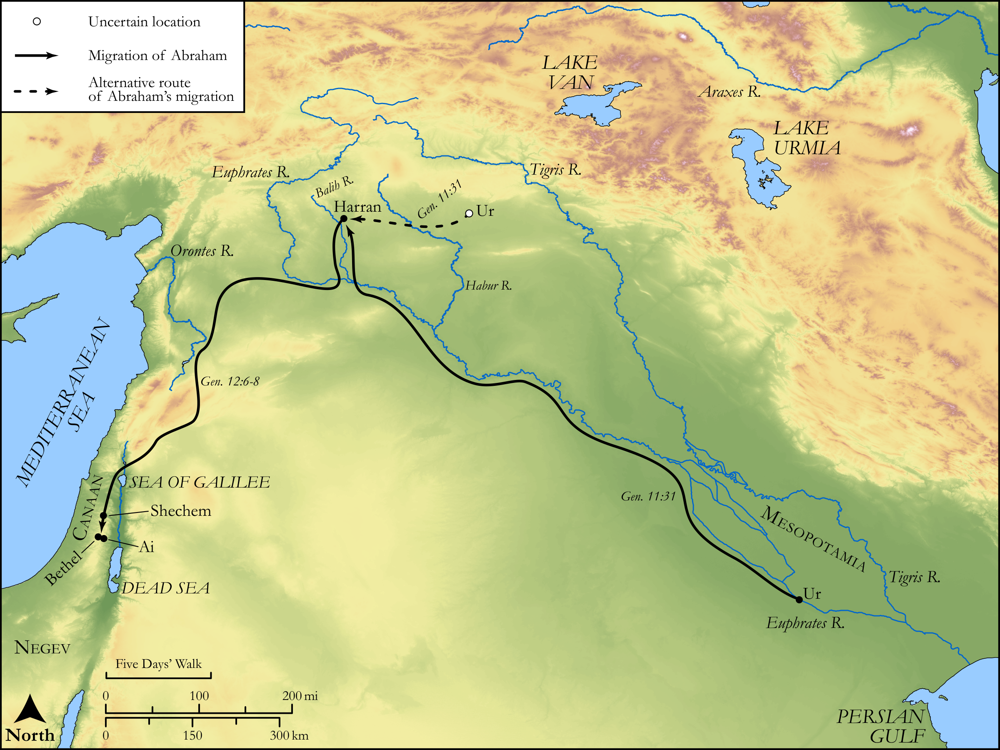

# Biblica Open Bible Maps

## License Information

Biblica Open Bible Maps, © 2023–2025 Biblica, Inc. This work is licensed under Creative Commons Attribution-ShareAlike 4.0 International (<a href="https://creativecommons.org/licenses/by-sa/4.0/">https://creativecommons.org/licenses/by-sa/4.0/</a>). More Information: <a href="https://docs.google.com/document/d/1Pp44yZ0Zdnd59vJHTrt2rPYq0SppfX5rZbPBt6mz37U/edit?tab=t.0#heading=h.oev9aj1ksvk2">https://docs.google.com/document/d/1Pp44yZ0Zdnd59vJHTrt2rPYq0SppfX5rZbPBt6mz37U/edit?tab=t.0#heading=h.oev9aj1ksvk2</a>

--------------------------------

## Pentateuch: Abraham's Journey to Canaan (id: OT012)

### Image Content

[link](images/OT012.png)

Original: [Pentateuch: Abraham's Journey to Canaan](https://drive.google.com/open?id=1y3aCtABg0ZaM7Jp8yn6wCApcYaFsBHdm&usp=drive_copy)

* **Associated Passages:** Genesis 11:1-12:20

* **Associated ACAI Concepts:** Abraham (ID: `person:Abraham`); LORD (ID: `deity:Lord`); Terah (ID: `person:Terah`); Haran (ID: `person:Haran`); Sarah (ID: `person:Sarah`); Pharaoh (ID: `person:Pharaoh.3`); Haran (ID: `place:Haran`); Reu (ID: `person:Reu`); Peleg (ID: `person:Peleg`); Shelah (ID: `person:Shelah.2`); Egypt (ID: `place:Egypt`); Lot (ID: `person:Lot`); Nahor (ID: `person:Nahor`); Serug (ID: `person:Serug`); Arpachshad (ID: `person:Arpachshad`); Eber (ID: `person:Eber`); Canaan (ID: `place:Canaan`); Nahor (ID: `person:Nahor.2`); Ur (ID: `place:Ur`); Chaldea (ID: `place:Chaldea`); Bless (ID: `keyterm:Bless`); Chaldeans (ID: `group:Chaldea`); Shem (ID: `person:Shem`); Egyptians (ID: `group:Egypt`); Ai (ID: `place:Ai`); Milcah (ID: `person:Milcah`); Oak of Moreh (ID: `place:Moreh`); Canaanites (ID: `group:Canaan`); Iscah (ID: `person:Iscah`); Shinar (ID: `place:Shinar`)
