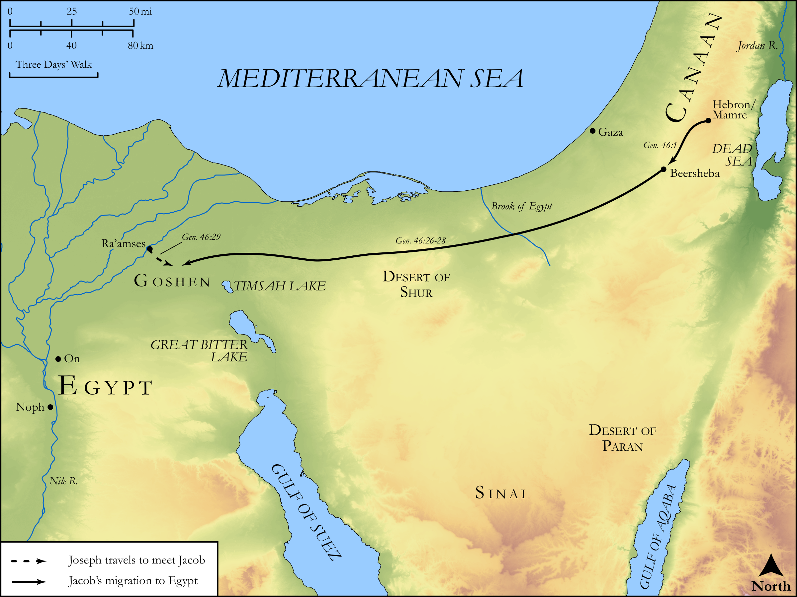

# Biblica Open Bible Maps

## License Information

Biblica Open Bible Maps, © 2023–2025 Biblica, Inc. This work is licensed under Creative Commons Attribution-ShareAlike 4.0 International (<a href="https://creativecommons.org/licenses/by-sa/4.0/">https://creativecommons.org/licenses/by-sa/4.0/</a>). More Information: <a href="https://docs.google.com/document/d/1Pp44yZ0Zdnd59vJHTrt2rPYq0SppfX5rZbPBt6mz37U/edit?tab=t.0#heading=h.oev9aj1ksvk2">https://docs.google.com/document/d/1Pp44yZ0Zdnd59vJHTrt2rPYq0SppfX5rZbPBt6mz37U/edit?tab=t.0#heading=h.oev9aj1ksvk2</a>

--------------------------------

## Pentateuch: Jacob Migrates to Egypt (id: OT026)

### Image Content

[link](images/OT026.png)

Original: [Pentateuch: Jacob Migrates to Egypt](https://drive.google.com/open?id=1aIDRYBJIIcuLrGuVDSil_U5w8Dqrpemg&usp=drive_copy)

* **Associated Passages:** Genesis 46:1-34

* **Associated ACAI Concepts:** Israel (ID: `person:Israel`); Egypt (ID: `place:Egypt`); Joseph (ID: `person:Joseph.10`); Canaan (ID: `place:Canaan`); Goshen (ID: `place:Goshen`); Pharaoh (ID: `person:Pharaoh.4`); LORD (ID: `deity:Lord`); Rachel (ID: `person:Rachel`); Beersheba (ID: `place:Beersheba`); Leah (ID: `person:Leah`); Benjamin (ID: `person:Benjamin`); Laban (ID: `person:Laban`); Reuben (ID: `person:Reuben`); Judah (ID: `person:Judah.4`); Dan (ID: `person:Dan`); Ard (ID: `person:Ard`); Ehi (ID: `person:Ehi`); Ishvah (ID: `person:Ishvah`); Shimron (ID: `person:Shimron`); Malchiel (ID: `person:Malchiel`); Sered (ID: `person:Sered`); Shillem (ID: `person:Shillem`); Gera (ID: `person:Gera`); Beriah (ID: `person:Beriah`); Jashub (ID: `person:Jashub`); Arod (ID: `person:Arod`); Becher (ID: `person:Becher`); Huppim (ID: `person:Huppim`); Puah (ID: `person:Puah`); Pallu (ID: `person:Pallu`); Bela (ID: `person:Bela`); Zilpah (ID: `person:Zilpah`); Hanoch (ID: `person:Hanoch.2`); Hezron (ID: `person:Hezron.2`); Ohad (ID: `person:Ohad`); Jamin (ID: `person:Jamin`); Carmi (ID: `person:Carmi.2`); Naaman (ID: `person:Naaman`); Tola (ID: `person:Tola`); Merari (ID: `person:Merari`); Shaul (ID: `person:Shaul.2`); Serah (ID: `person:Serah`); Jahleel (ID: `person:Jahleel`); Shuni (ID: `person:Shuni`); Asher (ID: `person:Asher`); Hamul (ID: `person:Hamul`); Haggi (ID: `person:Haggi`); On (ID: `place:On`); Muppim (ID: `person:Muppim`); Areli (ID: `person:Areli`); Guni (ID: `person:Guni`); Ziphion (ID: `person:Ziphion`); Potiphera (ID: `person:Potiphera`); Hezron (ID: `person:Hezron`); Heber (ID: `person:Heber`); Imnah (ID: `person:Imnah`); Elon (ID: `person:Elon.2`); Kohath (ID: `person:Kohath`); Asenath (ID: `person:Asenath`); Zerah (ID: `person:Zerah.6`); Canaanite Woman (ID: `person:CanaaniteWoman`); Ashbel (ID: `person:Ashbel`); Eri (ID: `person:Eri`); Ishvi (ID: `person:Ishvi.2`); Dinah (ID: `person:Dinah`); Jachin (ID: `person:Jachin`); Gad (ID: `person:Gad`); Rosh (ID: `person:Rosh`); Jemuel (ID: `person:Jemuel`); Hushim (ID: `person:Hushim.2`); Jahzeel (ID: `person:Jahzeel`); Ezbon (ID: `person:Ezbon`); Jezer (ID: `person:Jezer`); Gershon (ID: `person:Gershon`); Flock (ID: `fauna:Flock`); Sheep (ID: `fauna:Lamb`); Goat (ID: `fauna:Goat`); Manasseh (ID: `person:Manasseh`); Simeon (ID: `person:Simeon.5`); Onan (ID: `person:Onan`); Canaanites (ID: `group:Canaan`); Egyptians (ID: `group:Egypt`); Isaac (ID: `person:Isaac`); Slaughtering (ID: `keyterm:Slaughtering`); Naphtali (ID: `person:Naphtali`); Issachar (ID: `person:Issachar`); Zerah (ID: `person:Zerah.3`); Levi (ID: `person:Levi.3`); Paddan-aram (ID: `place:Paddan-aram`); Fear (ID: `keyterm:Fear`); Er (ID: `person:Er.2`); Perez (ID: `person:Perez`); Zebulun (ID: `person:Zebulun`); Ephraim (ID: `person:Ephraim`); Vision (ID: `keyterm:Vision`); Shelah (ID: `person:Shelah`); Bilhah (ID: `person:Bilhah`); Cattle (ID: `fauna:Bull`); Chariot (ID: `realia:Chariot`); Wagon (ID: `realia:Wagon`); Image (ID: `realia:Image`)
