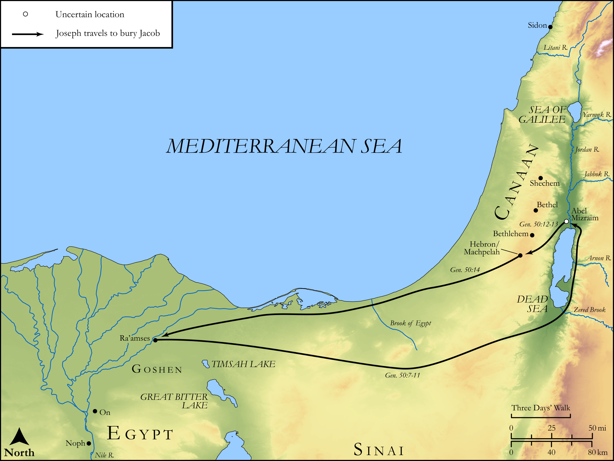

# Biblica Open Bible Maps

## License Information

Biblica Open Bible Maps, © 2023–2025 Biblica, Inc. This work is licensed under Creative Commons Attribution-ShareAlike 4.0 International (<a href="https://creativecommons.org/licenses/by-sa/4.0/">https://creativecommons.org/licenses/by-sa/4.0/</a>). More Information: <a href="https://docs.google.com/document/d/1Pp44yZ0Zdnd59vJHTrt2rPYq0SppfX5rZbPBt6mz37U/edit?tab=t.0#heading=h.oev9aj1ksvk2">https://docs.google.com/document/d/1Pp44yZ0Zdnd59vJHTrt2rPYq0SppfX5rZbPBt6mz37U/edit?tab=t.0#heading=h.oev9aj1ksvk2</a>

--------------------------------

## Pentateuch: The Deaths of Jacob and Joseph (id: OT027)

### Image Content

[link](images/OT027.png)

Original: [Pentateuch: The Deaths of Jacob and Joseph](https://drive.google.com/open?id=138PZP_mX2K5ehrXEhB_sBmMdh2t0o72C&usp=drive_copy)

* **Associated Passages:** Genesis 48:1-50:26

* **Associated ACAI Concepts:** Joseph (ID: `person:Joseph.10`); Israel (ID: `person:Israel`); LORD (ID: `deity:Lord`); Bless (ID: `keyterm:Bless`); Manasseh (ID: `person:Manasseh`); Ephraim (ID: `person:Ephraim`); Egypt (ID: `place:Egypt`); Abraham (ID: `person:Abraham`); Canaan (ID: `place:Canaan`); Isaac (ID: `person:Isaac`); Heth (ID: `person:Heth`); Swear (ID: `keyterm:Swear`); Judah (ID: `person:Judah.4`); Hittites (ID: `group:Hittite`); Pharaoh (ID: `person:Pharaoh.4`); Ephron (ID: `person:Ephron.2`); Dan (ID: `person:Dan`); Machpelah (ID: `place:Machpelah`); Simeon (ID: `person:Simeon.5`); Atad (ID: `place:Atad`); Mamre (ID: `place:Mamre`); Reuben (ID: `person:Reuben`); Jordan River (ID: `place:Jordan`); Fear (ID: `keyterm:Fear`); Appoint (ID: `keyterm:Appoint`); Bed (ID: `realia:Bed`); Flock (ID: `fauna:Flock`); Goat (ID: `fauna:Goat`); Shiloh (ID: `person:Shiloh`); Leah (ID: `person:Leah`)
