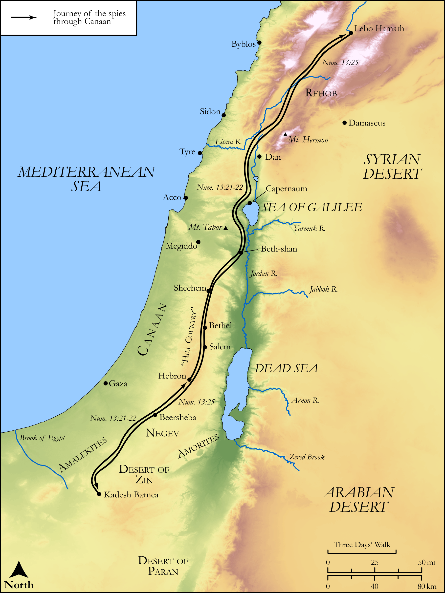

# Biblica Open Bible Maps

## License Information

Biblica Open Bible Maps, © 2023–2025 Biblica, Inc. This work is licensed under Creative Commons Attribution-ShareAlike 4.0 International (<a href="https://creativecommons.org/licenses/by-sa/4.0/">https://creativecommons.org/licenses/by-sa/4.0/</a>). More Information: <a href="https://docs.google.com/document/d/1Pp44yZ0Zdnd59vJHTrt2rPYq0SppfX5rZbPBt6mz37U/edit?tab=t.0#heading=h.oev9aj1ksvk2">https://docs.google.com/document/d/1Pp44yZ0Zdnd59vJHTrt2rPYq0SppfX5rZbPBt6mz37U/edit?tab=t.0#heading=h.oev9aj1ksvk2</a>

--------------------------------

## Pentateuch: Journey of the Spies to Canaan (id: OT034)

### Image Content

[link](images/OT034.png)

Original: [Pentateuch: Journey of the Spies to Canaan](https://drive.google.com/open?id=1-WkeLoPuiaiZuLgjrA18BfOgXD3K0JJB&usp=drive_copy)

* **Associated Passages:** Numbers 13:1-33

* **Associated ACAI Concepts:** Moses (ID: `person:Moses`); Israel (ID: `person:Israel`); Anak (ID: `person:Anak`); Negev (ID: `place:Negeb`); Canaan (ID: `place:Canaan`); Caleb (ID: `person:Caleb`); Valley of Eshcol (ID: `place:EshcolValley`); Paran (ID: `place:Paran`); Nun (ID: `person:Nun`); Sorghum (ID: `flora:Sorghum`); Wheat (ID: `flora:Wheat`); Vine (ID: `flora:Vine`); Joshua (ID: `person:Joshua.2`); LORD (ID: `deity:Lord`); Gemalli (ID: `person:Gemalli`); Zaccur (ID: `person:Zaccur`); Palti (ID: `person:Palti`); Igal (ID: `person:Igal`); Vophsi (ID: `person:Vophsi`); Talmai (ID: `person:Talmai`); Zoan (ID: `place:Zoan`); Sethur (ID: `person:Sethur`); Jephunneh (ID: `person:Jephunneh`); Gaddiel (ID: `person:Gaddiel`); Sodi (ID: `person:Sodi`); Ammiel (ID: `person:Ammiel`); Michael (ID: `person:Michael`); Nahbi (ID: `person:Nahbi`); Geuel (ID: `person:Geuel`); Shaphat (ID: `person:Shaphat`); Raphu (ID: `person:Raphu`); Nephilim (ID: `group:Nephilim`); Hori (ID: `person:Hori.2`); Kadesh-barnea (ID: `place:Kadesh-barnea`); Shammua (ID: `person:Shammua`); Gaddi (ID: `person:Gaddi`); Machi (ID: `person:Machi`); Beth-rehob (ID: `place:Beth-rehob`); Ahiman (ID: `person:Ahiman`); Land Flowing of Milk and Honey (ID: `keyterm:LandFlowingOfMilkAndHoney`); Joseph (ID: `person:Joseph.11`); Sheshai (ID: `person:Sheshai`); Heth (ID: `person:Heth`); Amalek (ID: `place:Amalek`); Susi (ID: `person:Susi`); Hamath (ID: `place:Hamath`); Tribe of Asher (ID: `group:Asher`); Dispossess (ID: `keyterm:Dispossess`); Tribe of Zebulun (ID: `group:Zebulun`); Manasseh (ID: `person:Manasseh`); Hittites (ID: `group:Hittite`); Simeon (ID: `person:Simeon.5`); Canaanites (ID: `group:Canaan`); Tribe of Simeon (ID: `group:Simeon`); Tribe of Reuben (ID: `group:Reuben`); Tribe of Dan (ID: `group:Dan`); Wilderness of Zin (ID: `place:Zin`); Tribe of Issachar (ID: `group:Issachar`); Tribe of Judah (ID: `group:Judah`); Benjamin (ID: `person:Benjamin`); Naphtali (ID: `person:Naphtali`); Issachar (ID: `person:Issachar`); Hebron (ID: `place:Hebron`); Reuben (ID: `person:Reuben`); Jordan River (ID: `place:Jordan`); Aaron (ID: `person:Aaron`); Egypt (ID: `place:Egypt`); Asher (ID: `person:Asher`); A Group of People (ID: `group:GenericGroup`); Judah (ID: `person:Judah.4`); Tribe of Ephraim (ID: `group:Ephraim`); Joseph (ID: `person:Joseph.10`); Tribe of Benjamin (ID: `group:Benjamin`); Jebusites (ID: `group:Jebusites`); Dan (ID: `place:Dan`); Zebulun (ID: `person:Zebulun`); Amorites (ID: `group:Amorites`); Tribe of Manasseh (ID: `group:Manasseh`); Ephraim (ID: `person:Ephraim`); Gad (ID: `person:Gad`); Amalekites (ID: `group:Amalek`); Tribe of Naphtali (ID: `group:Naphtali`); Pomegranate (ID: `flora:Pomegranate`); Fig (ID: `flora:Fig`); Locust (ID: `fauna:Locust`)
