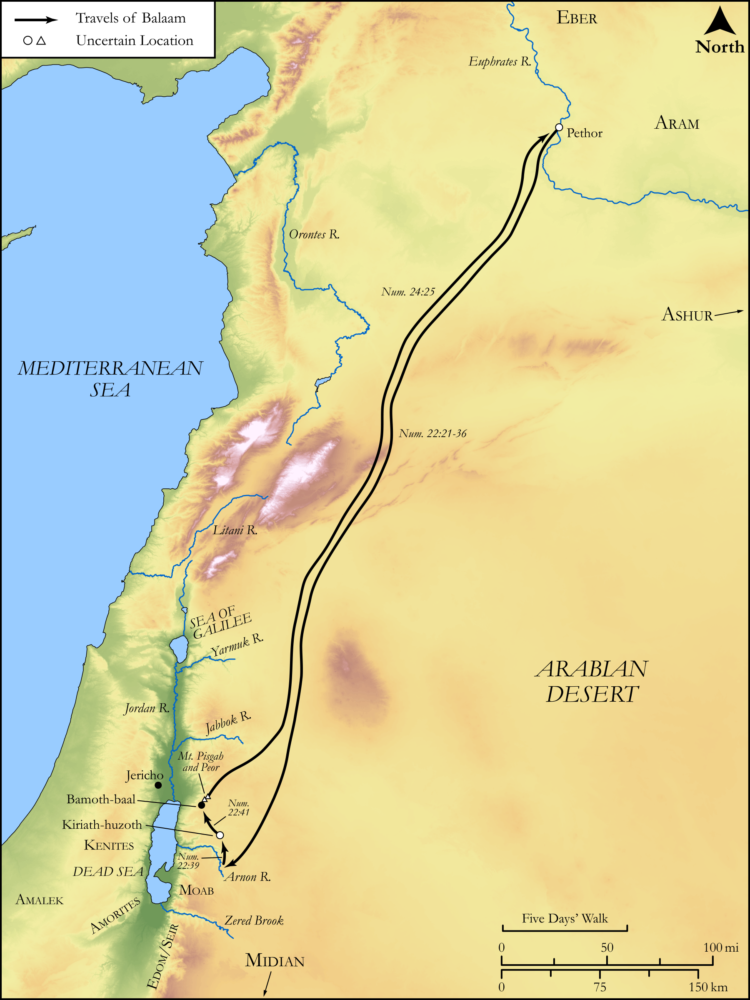

# Biblica Open Bible Maps

## License Information

Biblica Open Bible Maps, © 2023–2025 Biblica, Inc. This work is licensed under Creative Commons Attribution-ShareAlike 4.0 International (<a href="https://creativecommons.org/licenses/by-sa/4.0/">https://creativecommons.org/licenses/by-sa/4.0/</a>). More Information: <a href="https://docs.google.com/document/d/1Pp44yZ0Zdnd59vJHTrt2rPYq0SppfX5rZbPBt6mz37U/edit?tab=t.0#heading=h.oev9aj1ksvk2">https://docs.google.com/document/d/1Pp44yZ0Zdnd59vJHTrt2rPYq0SppfX5rZbPBt6mz37U/edit?tab=t.0#heading=h.oev9aj1ksvk2</a>

--------------------------------

## Pentateuch: Balak and Balaam (id: OT038)

### Image Content

[link](images/OT038.png)

Original: [Pentateuch: Balak and Balaam](https://drive.google.com/open?id=1NAX2Vvr_MtFc-4tjh-ZBfdJoUu32xdxm&usp=drive_copy)

* **Associated Passages:** Numbers 22:1-24:25

* **Associated ACAI Concepts:** Balaam (ID: `person:Balaam`); LORD (ID: `deity:Lord`); Balak (ID: `person:Balak`); Israel (ID: `person:Israel`); To Curse (ID: `keyterm:Curse`); Moab (ID: `place:Moab`); An Angel (ID: `deity:Angel`); Bless (ID: `keyterm:Bless`); Proverb (ID: `keyterm:Saying`); Zippor (ID: `person:Zippor`); Donkey (ID: `fauna:Donkey`); Cattle (ID: `fauna:Bull`); Egypt (ID: `place:Egypt`); Offering (ID: `keyterm:Offering`); Bring Honor and Glory on Oneself (ID: `keyterm:BringHonorAndGloryOnOneself`); Sheep (ID: `fauna:Lamb`); Stone Altar (ID: `realia:StoneAltar`); Temple Altar (ID: `realia:TempleAltar`); Altar (ID: `realia:Altar`); Tabernacle Altar (ID: `realia:TabernacleAltar`); Beor (ID: `person:Beor.2`); Have a Vision (ID: `keyterm:HaveAVision`); Midian (ID: `place:Midian`); Assyria (ID: `place:Assyria`); Fee for Divination (ID: `keyterm:FeeForDivination`); Sword (ID: `realia:Sword`); Kiriath-huzoth (ID: `place:Kiriath-huzoth`); Jericho (ID: `place:Jericho`); Pisgah (ID: `place:Pisgah`); Plains of Moab (ID: `place:MoabPlains`)
