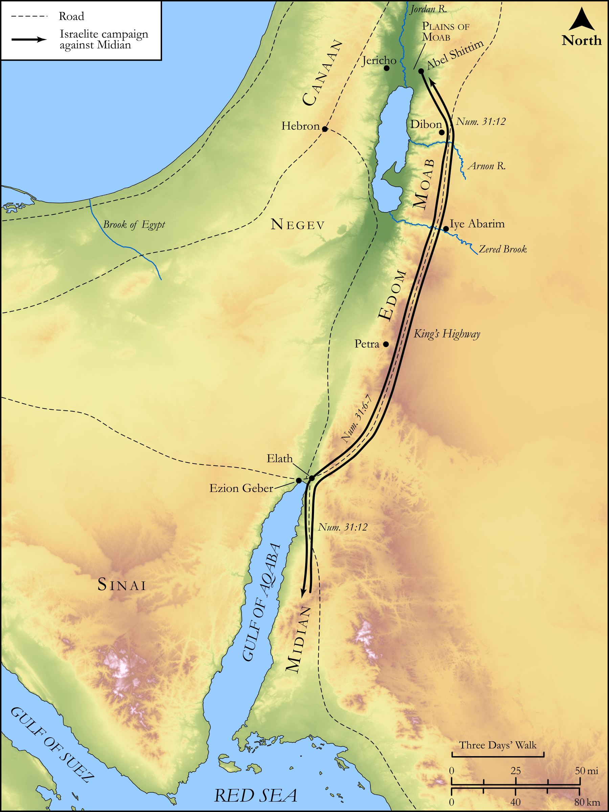

# Biblica Open Bible Maps

## License Information

Biblica Open Bible Maps, © 2023–2025 Biblica, Inc. This work is licensed under Creative Commons Attribution-ShareAlike 4.0 International (<a href="https://creativecommons.org/licenses/by-sa/4.0/">https://creativecommons.org/licenses/by-sa/4.0/</a>). More Information: <a href="https://docs.google.com/document/d/1Pp44yZ0Zdnd59vJHTrt2rPYq0SppfX5rZbPBt6mz37U/edit?tab=t.0#heading=h.oev9aj1ksvk2">https://docs.google.com/document/d/1Pp44yZ0Zdnd59vJHTrt2rPYq0SppfX5rZbPBt6mz37U/edit?tab=t.0#heading=h.oev9aj1ksvk2</a>

--------------------------------

## Pentateuch: Destruction of the Midianites (id: OT039)

### Image Content

[link](images/OT039.png)

Original: [Pentateuch: Destruction of the Midianites](https://drive.google.com/open?id=1pptcN4MIQtCxbluT2LjMlcMm18TGnnfJ&usp=drive_copy)

* **Associated Passages:** Numbers 31:1-54

* **Associated ACAI Concepts:** LORD (ID: `deity:Lord`); Moses (ID: `person:Moses`); Israel (ID: `person:Israel`); Eleazar (ID: `person:Eleazar.2`); Midian (ID: `place:Midian`); Cattle (ID: `fauna:Bull`); Flock (ID: `fauna:Flock`); Goat (ID: `fauna:Goat`); Offering (ID: `keyterm:Offering`); Donkey (ID: `fauna:Donkey`); To Cleanse (ID: `keyterm:Cleanse.2`); Balaam (ID: `person:Balaam`); Tribe of Levi (ID: `group:Levi`); Pure (ID: `keyterm:Pure`); Levi (ID: `person:Levi.3`); Appoint (ID: `keyterm:Appoint`); Rekem (ID: `person:Rekem`); Reba (ID: `person:Reba`); Zur (ID: `person:Zur.2`); Evi (ID: `person:Evi`); Hur (ID: `person:Hur.3`); Beor (ID: `person:Beor.2`); Plains of Moab (ID: `place:MoabPlains`); Appease (ID: `keyterm:Appease`); Jericho (ID: `place:Jericho`); Midianites (ID: `group:Midian`); Instruction (ID: `keyterm:Instruction`); Plague (ID: `keyterm:Blow`); Phinehas (ID: `person:Phinehas`); Baal-peor (ID: `place:Peor`)
