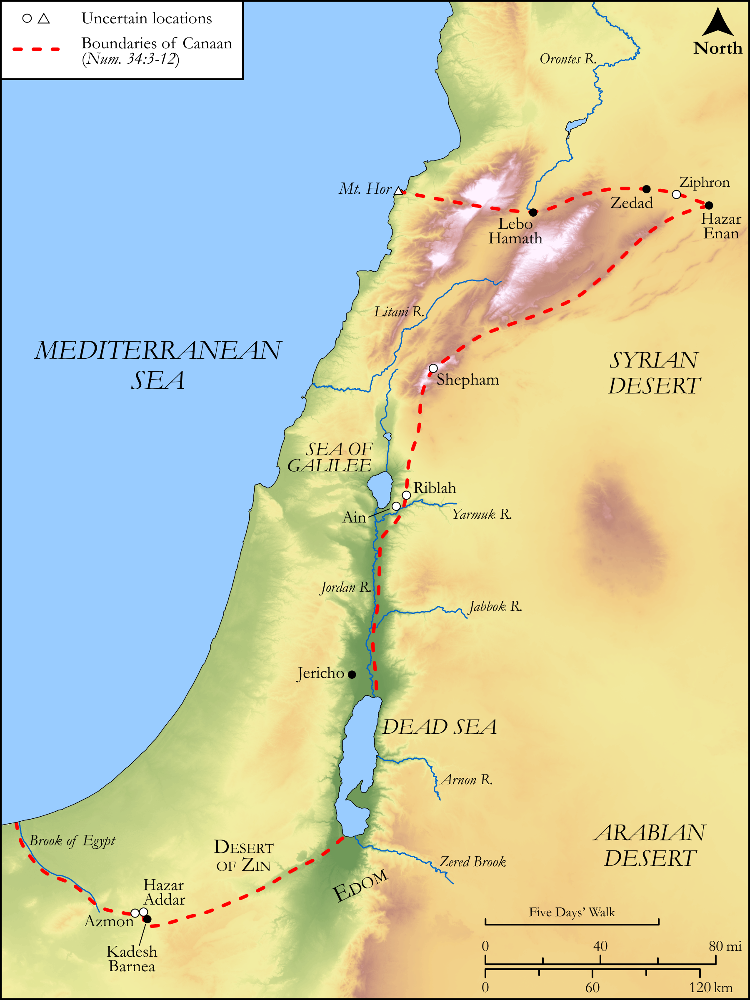

# Biblica Open Bible Maps

## License Information

Biblica Open Bible Maps, © 2023–2025 Biblica, Inc. This work is licensed under Creative Commons Attribution-ShareAlike 4.0 International (<a href="https://creativecommons.org/licenses/by-sa/4.0/">https://creativecommons.org/licenses/by-sa/4.0/</a>). More Information: <a href="https://docs.google.com/document/d/1Pp44yZ0Zdnd59vJHTrt2rPYq0SppfX5rZbPBt6mz37U/edit?tab=t.0#heading=h.oev9aj1ksvk2">https://docs.google.com/document/d/1Pp44yZ0Zdnd59vJHTrt2rPYq0SppfX5rZbPBt6mz37U/edit?tab=t.0#heading=h.oev9aj1ksvk2</a>

--------------------------------

## Pentateuch: Boundaries of Canaan (id: OT041)

### Image Content

[link](images/OT041.png)

Original: [Pentateuch: Boundaries of Canaan](https://drive.google.com/open?id=12yB7R4jspahr5VzUudPIMA33l2UcjMEI&usp=drive_copy)

* **Associated Passages:** Numbers 34:1-29

* **Associated ACAI Concepts:** LORD (ID: `deity:Lord`); Israel (ID: `person:Israel`); Moses (ID: `person:Moses`); To Cause to Possess (ID: `keyterm:Possess`); Hazar-enan (ID: `place:Hazar-enan`); Azmon (ID: `place:Azmon`); Shepham (ID: `place:Shepham`); Mount Hor (ID: `place:HorMount.2`); Mediterranean Sea (ID: `place:GreatSea`); Canaan (ID: `place:Canaan`); Manasseh (ID: `person:Manasseh`); Tribe of Manasseh (ID: `group:Manasseh`); Dead Sea (ID: `place:SaltSea`); Wilderness of Zin (ID: `place:Zin`); Jordan River (ID: `place:Jordan`); Zedad (ID: `place:Zedad`); Parnach (ID: `person:Parnach`); Elizaphan (ID: `person:Elizaphan.2`); Ain (ID: `place:Ain`); Shelomi (ID: `person:Shelomi`); Ziphron (ID: `place:Ziphron`); Shemuel (ID: `person:Shemuel`); Kemuel (ID: `person:Kemuel.2`); Ahihud (ID: `person:Ahihud`); Riblah (ID: `place:Riblah`); Ephod (ID: `person:Ephod`); Brook of Egypt (ID: `place:BrookOfEgypt`); Azzan (ID: `person:Azzan`); Shiphtan (ID: `person:Shiphtan`); Bukki (ID: `person:Bukki`); Hanniel (ID: `person:Hanniel`); Elidad (ID: `person:Elidad`); Paltiel (ID: `person:Paltiel.2`); Hazar-addar (ID: `place:Hazar-addar`); Ammihud (ID: `person:Ammihud.2`); Ammihud (ID: `person:Ammihud.3`); Pedahel (ID: `person:Pedahel`); Jogli (ID: `person:Jogli`); Sea of Galilee (ID: `place:GalileeSea`); Akrabbim (ID: `place:Akrabbim`); Chislon (ID: `person:Chislon`); Hamath (ID: `place:Hamath`); Kadesh-barnea (ID: `place:Kadesh-barnea`); Joshua (ID: `person:Joshua.2`); Asher (ID: `person:Asher`); Tribe of Issachar (ID: `group:Issachar`); Eleazar (ID: `person:Eleazar.2`); Tribe of Asher (ID: `group:Asher`); Lot (ID: `keyterm:Lot`); Tribe of Zebulun (ID: `group:Zebulun`); Judah (ID: `person:Judah.4`); Edom (ID: `place:Edom`); Jericho (ID: `place:Jericho`); Tribe of Judah (ID: `group:Judah`); Benjamin (ID: `person:Benjamin`); Ephraim (ID: `person:Ephraim`); Gad (ID: `person:Gad`); Tribe of Ephraim (ID: `group:Ephraim`); Joseph (ID: `person:Joseph.10`); Simeon (ID: `person:Simeon.5`); Naphtali (ID: `person:Naphtali`); Issachar (ID: `person:Issachar`); Tribe of Benjamin (ID: `group:Benjamin`); Tribe of Simeon (ID: `group:Simeon`); Reuben (ID: `person:Reuben`); Caleb (ID: `person:Caleb`); Nun (ID: `person:Nun`); Tribe of Reuben (ID: `group:Reuben`); Tribe of Naphtali (ID: `group:Naphtali`); Tribe of Dan (ID: `group:Dan`); Dan (ID: `place:Dan`); Zebulun (ID: `person:Zebulun`); Jephunneh (ID: `person:Jephunneh`); Scorpion (ID: `fauna:Scorpion`)
