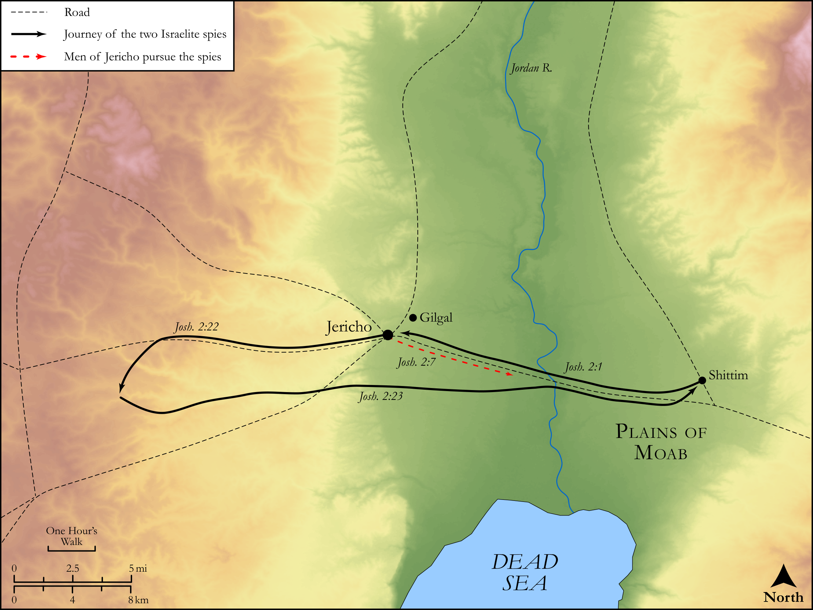

# Biblica Open Bible Maps

## License Information

Biblica Open Bible Maps, © 2023–2025 Biblica, Inc. This work is licensed under Creative Commons Attribution-ShareAlike 4.0 International (<a href="https://creativecommons.org/licenses/by-sa/4.0/">https://creativecommons.org/licenses/by-sa/4.0/</a>). More Information: <a href="https://docs.google.com/document/d/1Pp44yZ0Zdnd59vJHTrt2rPYq0SppfX5rZbPBt6mz37U/edit?tab=t.0#heading=h.oev9aj1ksvk2">https://docs.google.com/document/d/1Pp44yZ0Zdnd59vJHTrt2rPYq0SppfX5rZbPBt6mz37U/edit?tab=t.0#heading=h.oev9aj1ksvk2</a>

--------------------------------

## Historical: Rahab and the Spies (id: OT043)

### Image Content

[link](images/OT043.png)

Original: [Historical: Rahab and the Spies](https://drive.google.com/open?id=1663K9oEY_ydWrgihUQ5RanzUleLbBf7s&usp=drive_copy)

* **Associated Passages:** Joshua 2:1-24

* **Associated ACAI Concepts:** LORD (ID: `deity:Lord`); House (ID: `realia:House`); Exempt (ID: `keyterm:Exempt`); Joshua (ID: `person:Joshua.2`); Jericho (ID: `place:Jericho`); Swear (ID: `keyterm:Swear`); Window (ID: `realia:Window`); Spies (ID: `group:Spies`); Rahab (ID: `person:Rahab`); Truth (ID: `keyterm:Truth`); Oath (ID: `keyterm:Oath`); Nun (ID: `person:Nun`); Kindness (ID: `keyterm:Kindness`); Jordan River (ID: `place:Jordan`); Terror (ID: `keyterm:Terror`); Shittim (ID: `place:Shittim`); Egypt (ID: `place:Egypt`); Amorites (ID: `group:Amorites`); Israel (ID: `person:Israel`); Set Apart for Destruction (ID: `keyterm:Proscribe.2`); Og (ID: `person:Og`); Sihon (ID: `person:Sihon`); Red Sea (ID: `place:RedSea`); Thread (ID: `realia:Thread`); Rope (ID: `realia:Rope`); Cattails (ID: `flora:Cattails`); Flax (ID: `flora:Flax`)
