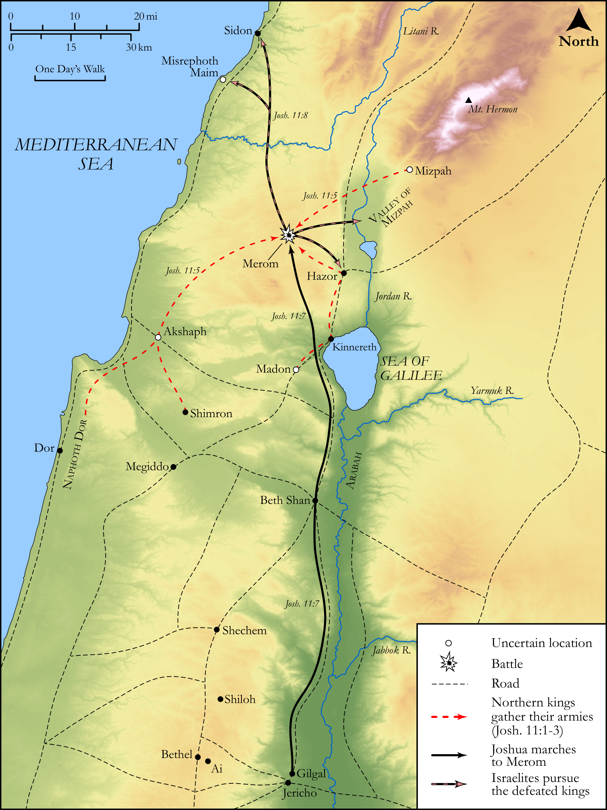

# Biblica Open Bible Maps

## License Information

Biblica Open Bible Maps, © 2023–2025 Biblica, Inc. This work is licensed under Creative Commons Attribution-ShareAlike 4.0 International (<a href="https://creativecommons.org/licenses/by-sa/4.0/">https://creativecommons.org/licenses/by-sa/4.0/</a>). More Information: <a href="https://docs.google.com/document/d/1Pp44yZ0Zdnd59vJHTrt2rPYq0SppfX5rZbPBt6mz37U/edit?tab=t.0#heading=h.oev9aj1ksvk2">https://docs.google.com/document/d/1Pp44yZ0Zdnd59vJHTrt2rPYq0SppfX5rZbPBt6mz37U/edit?tab=t.0#heading=h.oev9aj1ksvk2</a>

--------------------------------

## Historical: Joshua's Conquests in the North (id: OT050)

### Image Content

[link](images/OT050.png)

Original: [Historical: Joshua's Conquests in the North](https://drive.google.com/open?id=1dE7PuUz_YStTP9gYkFkCsYHfAcLAgoJV&usp=drive_copy)

* **Associated Passages:** Joshua 11:1-23

* **Associated ACAI Concepts:** Joshua (ID: `person:Joshua.2`); Israel (ID: `person:Israel`); LORD (ID: `deity:Lord`); Hazor (ID: `place:Hazor`); Set Apart for Destruction (ID: `keyterm:Proscribe.2`); Moses (ID: `person:Moses`); Sword (ID: `realia:Sword`); Valley of Mizpeh (ID: `place:MizpehValley`); Waters of Merom (ID: `place:Merom`); Chariot (ID: `realia:Chariot`); Horse (ID: `fauna:Horse`); Mount Hermon (ID: `place:HermonMount`); Anak (ID: `person:Anak`); Anakim (ID: `group:Anak`); Shephelah (ID: `place:Shephelah`); Arabah (ID: `place:Arabah`); Hivites (ID: `group:Hivites`); Misrephoth-maim (ID: `place:Misrephoth-maim`); Valley of Lebanon (ID: `place:LebanonValley`); Jobab (ID: `person:Jobab.3`); Jabin (ID: `person:Jabin`); Shimron (ID: `place:Shimron`); Dor (ID: `place:Dor`); Achshaph (ID: `place:Achshaph`); To Cause to Possess (ID: `keyterm:Possess`); Anab (ID: `place:Anab`); Mount Halak (ID: `place:HalakMount`); Madon (ID: `place:Madon`); Gaza (ID: `place:Gaza`); Debir (ID: `place:Debir`); Amorites (ID: `group:Amorites`); Sidon (ID: `place:Sidon`); Goshen (ID: `place:Goshen.2`); Judah (ID: `person:Judah.4`); Hittites (ID: `group:Hittite`); Tribe of Judah (ID: `group:Judah`); Ashdod (ID: `place:Ashdod`); Chinnereth (ID: `place:Chinnereth`); Hebron (ID: `place:Hebron`); Gibeon (ID: `place:Gibeon`); Canaanites (ID: `group:Canaan`); Negev (ID: `place:Negeb`); Jebusites (ID: `group:Jebusites`); Gath (ID: `place:Gath`); Fear (ID: `keyterm:Fear`); Perizzites (ID: `group:Perizzites`); Plea for Mercy (ID: `keyterm:Supplication`); Heth (ID: `person:Heth`); Canaan (ID: `place:Canaan`); Seir (ID: `place:Seir`); Cattle (ID: `fauna:Bull`)
