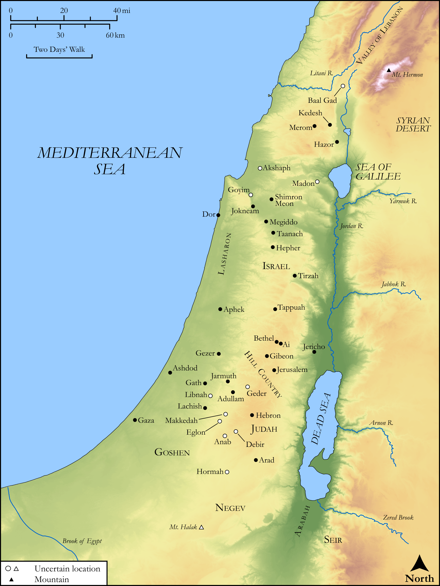

# Biblica Open Bible Maps

## License Information

Biblica Open Bible Maps, © 2023–2025 Biblica, Inc. This work is licensed under Creative Commons Attribution-ShareAlike 4.0 International (<a href="https://creativecommons.org/licenses/by-sa/4.0/">https://creativecommons.org/licenses/by-sa/4.0/</a>). More Information: <a href="https://docs.google.com/document/d/1Pp44yZ0Zdnd59vJHTrt2rPYq0SppfX5rZbPBt6mz37U/edit?tab=t.0#heading=h.oev9aj1ksvk2">https://docs.google.com/document/d/1Pp44yZ0Zdnd59vJHTrt2rPYq0SppfX5rZbPBt6mz37U/edit?tab=t.0#heading=h.oev9aj1ksvk2</a>

--------------------------------

## Historical: Overview of Joshua’s Conquests (id: OT051)

### Image Content

[link](images/OT051.png)

Original: [Historical: Overview of Joshua’s Conquests](https://drive.google.com/open?id=1lEBzYdTaRQ71si67VS-1Yb7Ka4Lw6-3D&usp=drive_copy)

* **Associated Passages:** Joshua 11:1-12:24

* **Associated ACAI Concepts:** Israel (ID: `person:Israel`); Joshua (ID: `person:Joshua.2`); LORD (ID: `deity:Lord`); Hazor (ID: `place:Hazor`); Moses (ID: `person:Moses`); Arabah (ID: `place:Arabah`); Mount Hermon (ID: `place:HermonMount`); Set Apart for Destruction (ID: `keyterm:Proscribe.2`); To Cause to Possess (ID: `keyterm:Possess`); Hivites (ID: `group:Hivites`); Amorites (ID: `group:Amorites`); Shephelah (ID: `place:Shephelah`); Sword (ID: `realia:Sword`); Mount Halak (ID: `place:HalakMount`); Dor (ID: `place:Dor`); Valley of Lebanon (ID: `place:LebanonValley`); Valley of Mizpeh (ID: `place:MizpehValley`); Waters of Merom (ID: `place:Merom`); Madon (ID: `place:Madon`); Shimron (ID: `place:Shimron`); Achshaph (ID: `place:Achshaph`); Negev (ID: `place:Negeb`); Hittites (ID: `group:Hittite`); Sihon (ID: `person:Sihon`); Canaanites (ID: `group:Canaan`); Gilead (ID: `place:Gilead`); Hebron (ID: `place:Hebron`); Heshbon (ID: `place:Heshbon`); Jordan River (ID: `place:Jordan`); Bashan (ID: `place:Bashan`); Anak (ID: `person:Anak`); Arnon (ID: `place:Arnon`); Jebusites (ID: `group:Jebusites`); Anakim (ID: `group:Anak`); Debir (ID: `place:Debir`); Perizzites (ID: `group:Perizzites`); Heth (ID: `person:Heth`); Canaan (ID: `place:Canaan`); Seir (ID: `place:Seir`); Chariot (ID: `realia:Chariot`); Horse (ID: `fauna:Horse`); Salecah (ID: `place:Salecah`); Misrephoth-maim (ID: `place:Misrephoth-maim`); Goiim (ID: `group:Goiim`); Aroer (ID: `place:Aroer.2`); Maacathites (ID: `group:Maacah`); Anab (ID: `place:Anab`); Taanach (ID: `place:Taanach`); Lasharon (ID: `place:Lasharon`); Tappuah (ID: `place:Tappuah`); Jobab (ID: `person:Jobab.3`); Jabin (ID: `person:Jabin`); Hepher (ID: `place:Hepher`); Ashtaroth (ID: `place:Ashtaroth`); Beth-jeshimoth (ID: `place:Beth-jeshimoth`); Jokneam (ID: `place:Jokneam`); Pisgah (ID: `place:Pisgah`); Dispossess (ID: `keyterm:Dispossess`); Manasseh (ID: `person:Manasseh`); Ai (ID: `place:Ai`); Ammonites (ID: `group:Ammon`); Tribe of Reuben (ID: `group:Reuben`); Plea for Mercy (ID: `keyterm:Supplication`); Ammon (ID: `place:Ammon`); Libnah (ID: `place:Libnah.2`); Sea of Galilee (ID: `place:GalileeSea`); Gedor (ID: `place:Gedor`); Kedesh (ID: `place:Kedesh`); Makkedah (ID: `place:Makkedah`); Geshur (ID: `place:Geshur`); Tribe of Judah (ID: `group:Judah`); Carmel (ID: `place:Carmel`); Arad (ID: `place:Arad`); Dead Sea (ID: `place:SaltSea`); Gibeon (ID: `place:Gibeon`); Megiddo (ID: `place:Megiddo`); Bethel (ID: `place:Bethel.2`); Reuben (ID: `person:Reuben`); Gezer (ID: `place:Gezer`); Bethel (ID: `place:Bethel`); Maacah (ID: `place:Maacah`); Lachish (ID: `place:Lachish`); Galilee (ID: `place:Galilee`); Adullam (ID: `place:Adullam`); Goshen (ID: `place:Goshen.2`); Judah (ID: `person:Judah.4`); Zephath (ID: `place:Zephath`); Ashdod (ID: `place:Ashdod`); Chinnereth (ID: `place:Chinnereth`); Jarmuth (ID: `place:Jarmuth`); Fear (ID: `keyterm:Fear`); Jabbok (ID: `place:Jabbok`); Rephaim (ID: `group:Rephaim`); Jerusalem (ID: `place:Jerusalem`); Gaza (ID: `place:Gaza`); Aphek (ID: `place:Aphek`); Sidon (ID: `place:Sidon`); Og (ID: `person:Og`); Tribe of Manasseh (ID: `group:Manasseh`); Jericho (ID: `place:Jericho`); Tirzah (ID: `place:Tirzah`); Gad (ID: `person:Gad`); Gath (ID: `place:Gath`); Edrei (ID: `place:Edrei`); Geshurites (ID: `group:Geshur`); Eglon (ID: `place:Eglon`); Cattle (ID: `fauna:Bull`)
