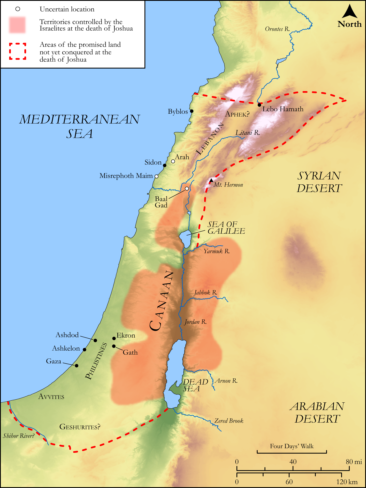

# Biblica Open Bible Maps

## License Information

Biblica Open Bible Maps, © 2023–2025 Biblica, Inc. This work is licensed under Creative Commons Attribution-ShareAlike 4.0 International (<a href="https://creativecommons.org/licenses/by-sa/4.0/">https://creativecommons.org/licenses/by-sa/4.0/</a>). More Information: <a href="https://docs.google.com/document/d/1Pp44yZ0Zdnd59vJHTrt2rPYq0SppfX5rZbPBt6mz37U/edit?tab=t.0#heading=h.oev9aj1ksvk2">https://docs.google.com/document/d/1Pp44yZ0Zdnd59vJHTrt2rPYq0SppfX5rZbPBt6mz37U/edit?tab=t.0#heading=h.oev9aj1ksvk2</a>

--------------------------------

## Historical: Lands Still to Be Conquered (id: OT052)

### Image Content

[link](images/OT052.png)

Original: [Historical: Lands Still to Be Conquered](https://drive.google.com/open?id=1rgTkh-2lzZFB_U9POyO6qfBtIc_v9La3&usp=drive_copy)

* **Associated Passages:** Joshua 13:1-33

* **Associated ACAI Concepts:** Moses (ID: `person:Moses`); To Cause to Possess (ID: `keyterm:Possess`); Israel (ID: `person:Israel`); Heshbon (ID: `place:Heshbon`); Dispossess (ID: `keyterm:Dispossess`); Jordan River (ID: `place:Jordan`); Bashan (ID: `place:Bashan`); LORD (ID: `deity:Lord`); Og (ID: `person:Og`); Geshurites (ID: `group:Geshur`); Manasseh (ID: `person:Manasseh`); Sihon (ID: `person:Sihon`); Tribe of Reuben (ID: `group:Reuben`); Gilead (ID: `place:Gilead`); Geshur (ID: `place:Geshur`); Reuben (ID: `person:Reuben`); Amorites (ID: `group:Amorites`); Tribe of Manasseh (ID: `group:Manasseh`); Gad (ID: `person:Gad`); Lebanon (ID: `place:Lebanon`); Medeba (ID: `place:Medeba`); Maacathites (ID: `group:Maacah`); Edrei (ID: `place:Edrei`); Canaanites (ID: `group:Canaan`); Dibon (ID: `place:Dibon`); Ammonites (ID: `group:Ammon`); Ammon (ID: `place:Ammon`); Aroer (ID: `place:Aroer.2`); Philistines (ID: `group:Philistine`); Philistia (ID: `place:Philistine`); Mahanaim (ID: `place:Mahanaim`); Maacah (ID: `place:Maacah`); Tribe of Levi (ID: `group:Levi`); Arnon (ID: `place:Arnon`); Sidonians (ID: `group:Sidon`); Levi (ID: `person:Levi.3`); Mount Hermon (ID: `place:HermonMount`); Sidon (ID: `place:Sidon`); Ashtaroth (ID: `place:Ashtaroth`); Canaan (ID: `place:Canaan`); Betonim (ID: `place:Betonim`); Rekem (ID: `person:Rekem`); Misrephoth-maim (ID: `place:Misrephoth-maim`); Zur (ID: `person:Zur.2`); Aroer (ID: `place:Aroer`); Ramath-mizpeh (ID: `place:Ramath-mizpeh`); Bamoth-baal (ID: `place:Bamoth-baal`); Havvoth-jair (ID: `place:Havvoth-jair`); Beth-peor (ID: `place:Beth-peor`); Reba (ID: `person:Reba`); Succoth (ID: `place:Succoth`); Jazer (ID: `place:Jazer`); Evi (ID: `person:Evi`); Hur (ID: `person:Hur.3`); Beth-haram (ID: `place:Beth-haram`); Avvim (ID: `group:Avvim`); Gebal (ID: `place:Gebal`); Mearah (ID: `place:Mearah`); Ashdod (ID: `place:Ashdod`); Gebalites (ID: `group:Gebal`); Zaphon (ID: `place:Zaphon`); Zereth-shahar (ID: `place:Zereth-shahar`); Beor (ID: `person:Beor.2`); Beth-nimrah (ID: `place:Beth-nimrah`); Salecah (ID: `place:Salecah`); Hamath (ID: `place:Hamath`); Practice Divination (ID: `keyterm:PracticeDivination`); Pisgah (ID: `place:Pisgah`); Aphek (ID: `place:Aphek.2`); Brook of Egypt (ID: `place:BrookOfEgypt`); Midian (ID: `place:Midian`); Sibmah (ID: `place:Sibmah`); Mephaath (ID: `place:Mephaath`); Sea of Galilee (ID: `place:GalileeSea`); Baal-meon (ID: `place:Baal-meon`); Jahaz (ID: `place:Jahaz`); Balaam (ID: `person:Balaam`); Ashkelon (ID: `place:Ashkelon`); Plains of Moab (ID: `place:MoabPlains`); Egypt (ID: `place:Egypt`); Ekron (ID: `place:Ekron`); Offering (ID: `keyterm:Offering`); Rephaim (ID: `group:Rephaim`); Gaza (ID: `place:Gaza`); Joshua (ID: `person:Joshua.2`); Kedemoth (ID: `place:Kedemoth`); Kiriathaim (ID: `place:Kiriathaim`); Jericho (ID: `place:Jericho`); Lo-debar (ID: `place:Lo-debar`); Machir (ID: `person:Machir`); Gath (ID: `place:Gath`); Beth-jeshimoth (ID: `place:Beth-jeshimoth`); Sword (ID: `realia:Sword`)
