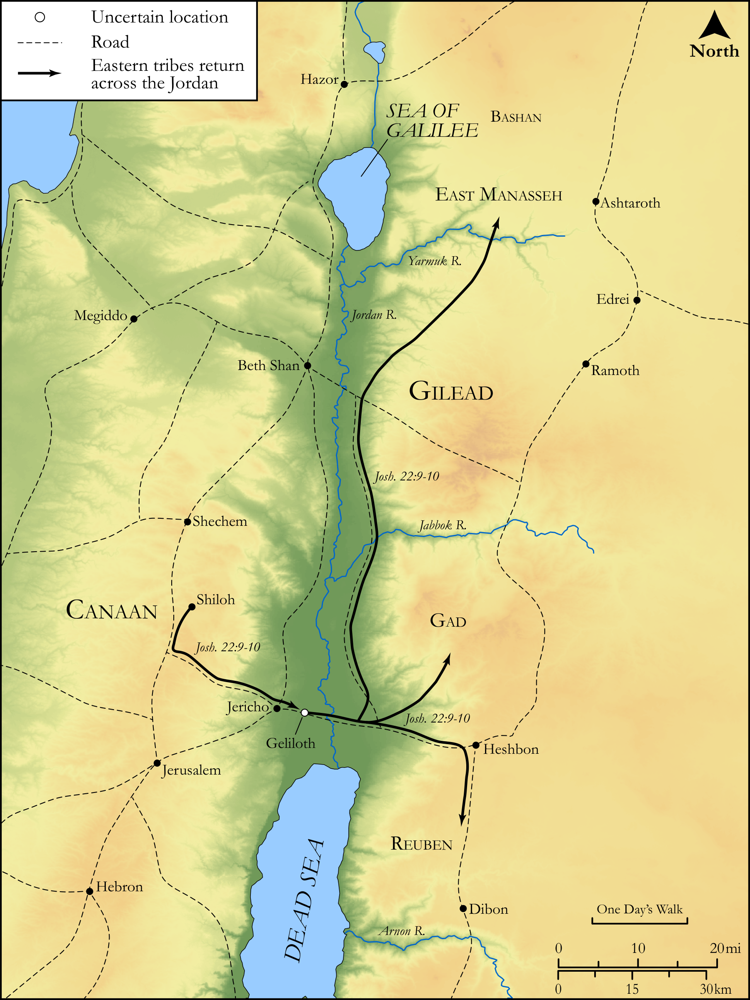

# Biblica Open Bible Maps

## License Information

Biblica Open Bible Maps, © 2023–2025 Biblica, Inc. This work is licensed under Creative Commons Attribution-ShareAlike 4.0 International (<a href="https://creativecommons.org/licenses/by-sa/4.0/">https://creativecommons.org/licenses/by-sa/4.0/</a>). More Information: <a href="https://docs.google.com/document/d/1Pp44yZ0Zdnd59vJHTrt2rPYq0SppfX5rZbPBt6mz37U/edit?tab=t.0#heading=h.oev9aj1ksvk2">https://docs.google.com/document/d/1Pp44yZ0Zdnd59vJHTrt2rPYq0SppfX5rZbPBt6mz37U/edit?tab=t.0#heading=h.oev9aj1ksvk2</a>

--------------------------------

## Historical: Tensions with the Eastern Tribes (id: OT059)

### Image Content

[link](images/OT059.png)

Original: [Historical: Tensions with the Eastern Tribes](https://drive.google.com/open?id=1tKExybTrFJkD0ilHfijN4SJBodNkGw46&usp=drive_copy)

* **Associated Passages:** Joshua 22:1-34

* **Associated ACAI Concepts:** LORD (ID: `deity:Lord`); Israel (ID: `person:Israel`); Gad (ID: `person:Gad`); Reuben (ID: `person:Reuben`); Tribe of Reuben (ID: `group:Reuben`); Manasseh (ID: `person:Manasseh`); Tribe of Manasseh (ID: `group:Manasseh`); Offering (ID: `keyterm:Offering`); Slaughtering (ID: `keyterm:Slaughtering`); Rebel (ID: `keyterm:Rebel`); Moses (ID: `person:Moses`); Jordan River (ID: `place:Jordan`); Stone Altar (ID: `realia:StoneAltar`); Temple Altar (ID: `realia:TempleAltar`); Altar (ID: `realia:Altar`); Tabernacle Altar (ID: `realia:TabernacleAltar`); Phinehas (ID: `person:Phinehas`); Gilead (ID: `place:Gilead`); Canaan (ID: `place:Canaan`); Be Unfaithful (ID: `keyterm:Unfaithful`); Joshua (ID: `person:Joshua.2`); Eleazar (ID: `person:Eleazar.2`); Bless (ID: `keyterm:Bless`); Passion (ID: `keyterm:Ardour`); Force to Serve (ID: `keyterm:EnticedToServe`); Shiloh (ID: `place:Shiloh`); The Way (ID: `keyterm:TheWay`); Bashan (ID: `place:Bashan`); Achan (ID: `person:Achan`); Something Devoted to God (ID: `keyterm:SomethingDevotedToGod`); Zerah (ID: `person:Zerah.3`); Defilement (ID: `keyterm:Defilement`); Instruction (ID: `keyterm:Instruction`); Love (ID: `keyterm:Love`); Pure (ID: `keyterm:Pure`); Fear (ID: `keyterm:Fear`); Work (ID: `keyterm:Work`); Baal-peor (ID: `place:Peor`); Money (ID: `realia:Money`); Cloak (ID: `realia:Cloak`)
