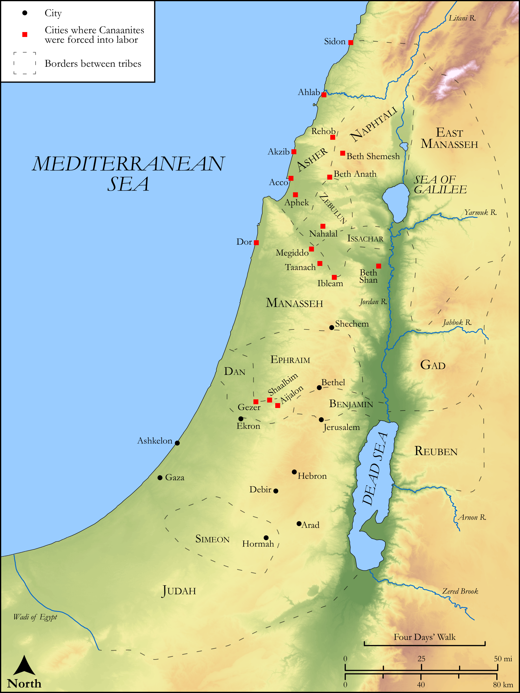

# Biblica Open Bible Maps

## License Information

Biblica Open Bible Maps, © 2023–2025 Biblica, Inc. This work is licensed under Creative Commons Attribution-ShareAlike 4.0 International (<a href="https://creativecommons.org/licenses/by-sa/4.0/">https://creativecommons.org/licenses/by-sa/4.0/</a>). More Information: <a href="https://docs.google.com/document/d/1Pp44yZ0Zdnd59vJHTrt2rPYq0SppfX5rZbPBt6mz37U/edit?tab=t.0#heading=h.oev9aj1ksvk2">https://docs.google.com/document/d/1Pp44yZ0Zdnd59vJHTrt2rPYq0SppfX5rZbPBt6mz37U/edit?tab=t.0#heading=h.oev9aj1ksvk2</a>

--------------------------------

## Historical: Israel Fights the Remaining Canaanites (id: OT061)

### Image Content

[link](images/OT061.png)

Original: [Historical: Israel Fights the Remaining Canaanites](https://drive.google.com/open?id=1u1OtUxqqgsL_Jq8H_XTweO5oct1Y4GNz&usp=drive_copy)

* **Associated Passages:** Judges 1:1-36

* **Associated ACAI Concepts:** Canaanites (ID: `group:Canaan`); Canaan (ID: `place:Canaan`); Dispossess (ID: `keyterm:Dispossess`); Tribe of Judah (ID: `group:Judah`); Judah (ID: `person:Judah.4`); LORD (ID: `deity:Lord`); Caleb (ID: `person:Caleb`); Adoni-bezek (ID: `person:Adoni-bezek`); Joseph (ID: `person:Joseph.10`); Negev (ID: `place:Negeb`); Jerusalem (ID: `place:Jerusalem`); Amorites (ID: `group:Amorites`); Bezek (ID: `place:Bezek`); Achsah (ID: `person:Achsah`); Tribe of Asher (ID: `group:Asher`); Simeon (ID: `person:Simeon.5`); Tribe of Simeon (ID: `group:Simeon`); Israel (ID: `person:Israel`); Hebron (ID: `place:Hebron`); Moses (ID: `person:Moses`); Bethel (ID: `place:Bethel`); Asher (ID: `person:Asher`); Debir (ID: `place:Debir`); Perizzites (ID: `group:Perizzites`); Shaalbim (ID: `place:Shaalbim`); Aphek (ID: `place:Aphek.2`); Nahalal (ID: `place:Nahalal`); Beth-shemesh (ID: `place:Beth-shemesh.3`); Achzib (ID: `place:Achzib.2`); Kitron (ID: `place:Kitron`); Ashkelon (ID: `place:Ashkelon`); Arad (ID: `place:Arad`); Beth-anath (ID: `place:Beth-anath`); Megiddo (ID: `place:Megiddo`); Talmai (ID: `person:Talmai`); Gezer (ID: `place:Gezer`); Kenaz (ID: `person:Kenaz.3`); Helbah (ID: `place:Helbah`); Beth-shan (ID: `place:Beth-shan`); Kenites (ID: `group:Kenite`); Taanach (ID: `place:Taanach`); Ekron (ID: `place:Ekron`); Ahlab (ID: `place:Ahlab`); Zephath (ID: `place:Zephath`); Ibleam (ID: `place:Ibleam`); Sela (ID: `place:Sela`); Dor (ID: `place:Dor`); Acco (ID: `place:Acco`); Gaza (ID: `place:Gaza`); Ahiman (ID: `person:Ahiman`); Luz (ID: `place:Luz.2`); Sheshai (ID: `person:Sheshai`); Sword (ID: `realia:Sword`); Tribe of Zebulun (ID: `group:Zebulun`); Manasseh (ID: `person:Manasseh`); Hittites (ID: `group:Hittite`); Tribe of Dan (ID: `group:Dan`); Set Apart for Destruction (ID: `keyterm:Proscribe.2`); Benjamin (ID: `person:Benjamin`); Rehob (ID: `place:Rehob.3`); Naphtali (ID: `person:Naphtali`); Beth-shemesh (ID: `place:Beth-shemesh`); Aijalon (ID: `place:Aijalon`); Anak (ID: `person:Anak`); Tribe of Ephraim (ID: `group:Ephraim`); Tribe of Benjamin (ID: `group:Benjamin`); Jebusites (ID: `group:Jebusites`); Bless (ID: `keyterm:Bless`); Kindness (ID: `keyterm:Kindness`); Akrabbim (ID: `place:Akrabbim`); Dan (ID: `place:Dan`); Zebulun (ID: `person:Zebulun`); Joshua (ID: `person:Joshua.2`); Lot (ID: `keyterm:Lot`); Sidon (ID: `place:Sidon`); Othniel (ID: `person:Othniel`); Tribe of Manasseh (ID: `group:Manasseh`); Ephraim (ID: `person:Ephraim`); Shephelah (ID: `place:Shephelah`); Tribe of Naphtali (ID: `group:Naphtali`); Heth (ID: `person:Heth`); Chariot (ID: `realia:Chariot`); Donkey (ID: `fauna:Donkey`); Date Palm (ID: `flora:DatePalm`); Scorpion (ID: `fauna:Scorpion`)
