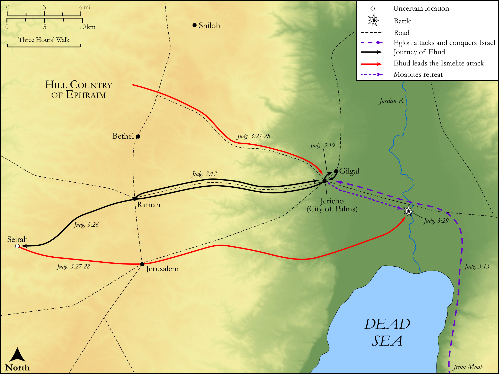

# Biblica Open Bible Maps

## License Information

Biblica Open Bible Maps, © 2023–2025 Biblica, Inc. This work is licensed under Creative Commons Attribution-ShareAlike 4.0 International (<a href="https://creativecommons.org/licenses/by-sa/4.0/">https://creativecommons.org/licenses/by-sa/4.0/</a>). More Information: <a href="https://docs.google.com/document/d/1Pp44yZ0Zdnd59vJHTrt2rPYq0SppfX5rZbPBt6mz37U/edit?tab=t.0#heading=h.oev9aj1ksvk2">https://docs.google.com/document/d/1Pp44yZ0Zdnd59vJHTrt2rPYq0SppfX5rZbPBt6mz37U/edit?tab=t.0#heading=h.oev9aj1ksvk2</a>

--------------------------------

## Historical: Ehud and Moab (id: OT063)

### Image Content

[link](images/OT063.png)

Original: [Historical: Ehud and Moab](https://drive.google.com/open?id=11RsmeeHe_VbdrkJY1pwibWWGanP6mbiw&usp=drive_copy)

* **Associated Passages:** Judges 3:1-31

* **Associated ACAI Concepts:** Israel (ID: `person:Israel`); LORD (ID: `deity:Lord`); Moab (ID: `place:Moab`); Ehud (ID: `person:Ehud`); Eglon (ID: `person:Eglon`); Force to Serve (ID: `keyterm:EnticedToServe`); Offering (ID: `keyterm:Offering`); Canaan (ID: `place:Canaan`); Cushan-rishathaim (ID: `person:Cushan-rishathaim`); Othniel (ID: `person:Othniel`); Sword (ID: `realia:Sword`); Mesopotamia (ID: `place:Mesopotamia`); Canaanites (ID: `group:Canaan`); Philistines (ID: `group:Philistine`); Kenaz (ID: `person:Kenaz.3`); Philistia (ID: `place:Philistine`); Hivites (ID: `group:Hivites`); Shamgar (ID: `person:Shamgar`); Gera (ID: `person:Gera`); Mount Lebanon (ID: `place:LebanonMount`); Asherah (ID: `deity:Asherah`); Anath (ID: `person:Anath`); Seirah (ID: `place:Seirah`); Graven Image (ID: `realia:GravenImage`); Mount Hermon (ID: `place:HermonMount`); Hamath (ID: `place:Hamath`); Amorites (ID: `group:Amorites`); Sidon (ID: `place:Sidon`); Dispossess (ID: `keyterm:Dispossess`); Hittites (ID: `group:Hittite`); Benjamin (ID: `person:Benjamin`); Ephraim (ID: `person:Ephraim`); Tribe of Ephraim (ID: `group:Ephraim`); Sidonians (ID: `group:Sidon`); Tribe of Benjamin (ID: `group:Benjamin`); Jebusites (ID: `group:Jebusites`); Baal (ID: `deity:Baal`); Ammonites (ID: `group:Ammon`); Amalekites (ID: `group:Amalek`); Moses (ID: `person:Moses`); Caleb (ID: `person:Caleb`); Perizzites (ID: `group:Perizzites`); Ammon (ID: `place:Ammon`); Heth (ID: `person:Heth`); Amalek (ID: `place:Amalek`); Jordan River (ID: `place:Jordan`); Gilgal (ID: `place:Gilgal.2`); Goad (ID: `realia:Goad`); Gomed (ID: `realia:Gomed`); Throne (ID: `realia:Throne`); Rams Horn (ID: `realia:RamsHorn`); Cattle (ID: `fauna:Bull`); Date Palm (ID: `flora:DatePalm`)
