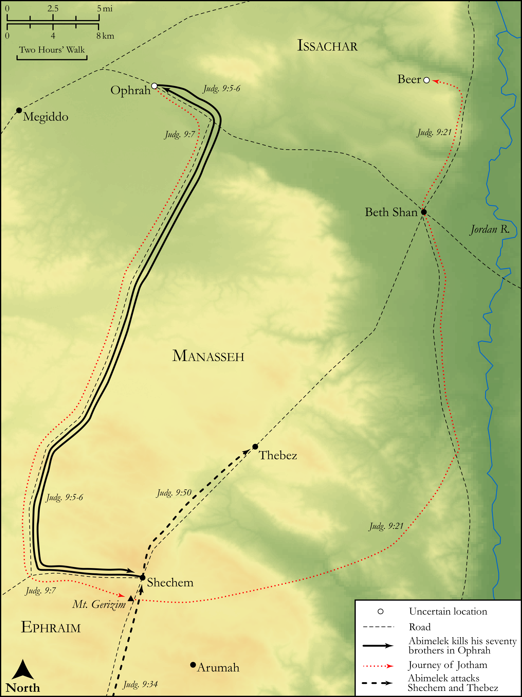

# Biblica Open Bible Maps

## License Information

Biblica Open Bible Maps, © 2023–2025 Biblica, Inc. This work is licensed under Creative Commons Attribution-ShareAlike 4.0 International (<a href="https://creativecommons.org/licenses/by-sa/4.0/">https://creativecommons.org/licenses/by-sa/4.0/</a>). More Information: <a href="https://docs.google.com/document/d/1Pp44yZ0Zdnd59vJHTrt2rPYq0SppfX5rZbPBt6mz37U/edit?tab=t.0#heading=h.oev9aj1ksvk2">https://docs.google.com/document/d/1Pp44yZ0Zdnd59vJHTrt2rPYq0SppfX5rZbPBt6mz37U/edit?tab=t.0#heading=h.oev9aj1ksvk2</a>

--------------------------------

## Historical: Abimelek (id: OT066)

### Image Content

[link](images/OT066.png)

Original: [Historical: Abimelek](https://drive.google.com/open?id=1FrtJpnNn1eylg-nlojZuNBubYRl50Xsb&usp=drive_copy)

* **Associated Passages:** Judges 9:1-57

* **Associated ACAI Concepts:** Abimelech (ID: `person:Abimelech.2`); Shechem (ID: `place:Shechem`); Gaal (ID: `person:Gaal`); Gideon (ID: `person:Gideon`); LORD (ID: `deity:Lord`); Zebul (ID: `person:Zebul`); Ebed (ID: `person:Ebed`); Jotham (ID: `person:Jotham`); Tower (ID: `realia:Tower`); Truth (ID: `keyterm:Truth`); House (ID: `realia:House`); Beth-millo (ID: `place:Beth-millo`); Israel (ID: `person:Israel`); Complete (ID: `keyterm:Complete`); Smear (ID: `keyterm:Smear`); Force to Serve (ID: `keyterm:EnticedToServe`); Vine (ID: `flora:Vine`); Thebez (ID: `place:Thebez`); Arumah (ID: `place:Arumah`); Baal-Berith (ID: `deity:Baal-berith`); Diviners’ Oak (ID: `place:DivinersOak`); El-Berith (ID: `deity:El-berith`); Ophrah (ID: `place:Ophrah.2`); Mount Gerizim (ID: `place:GerizimMount`); Boxthorn (ID: `flora:Boxthorn`); Deceit (ID: `keyterm:Deceit`); Hamor (ID: `person:Hamor`); Beeroth (ID: `place:Beeroth`); Midian (ID: `place:Midian`); Lebanon (ID: `place:Lebanon`)
