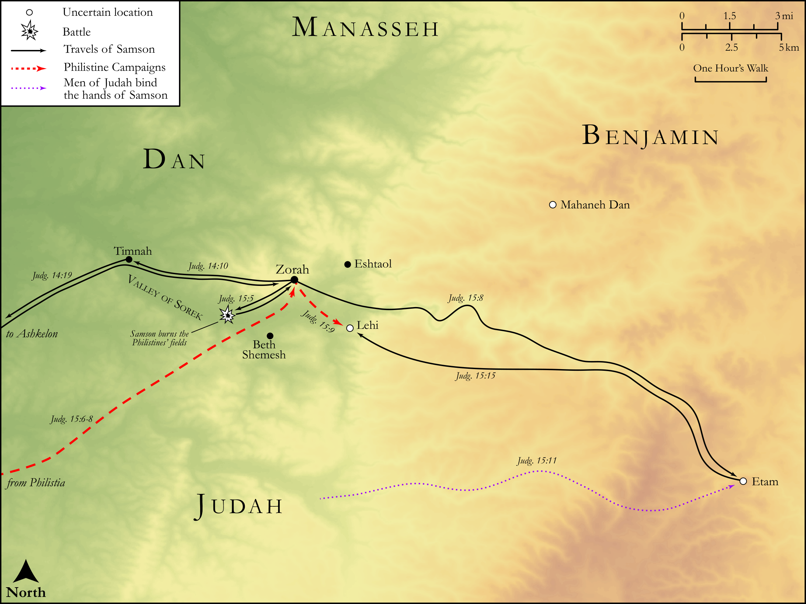

# Biblica Open Bible Maps

## License Information

Biblica Open Bible Maps, © 2023–2025 Biblica, Inc. This work is licensed under Creative Commons Attribution-ShareAlike 4.0 International (<a href="https://creativecommons.org/licenses/by-sa/4.0/">https://creativecommons.org/licenses/by-sa/4.0/</a>). More Information: <a href="https://docs.google.com/document/d/1Pp44yZ0Zdnd59vJHTrt2rPYq0SppfX5rZbPBt6mz37U/edit?tab=t.0#heading=h.oev9aj1ksvk2">https://docs.google.com/document/d/1Pp44yZ0Zdnd59vJHTrt2rPYq0SppfX5rZbPBt6mz37U/edit?tab=t.0#heading=h.oev9aj1ksvk2</a>

--------------------------------

## Historical: Deeds of Samson (id: OT068)

### Image Content

[link](images/OT068.png)

Original: [Historical: Deeds of Samson](https://drive.google.com/open?id=148pbV2HaKEmlImwW3LPHHaa1ISqH0K_w&usp=drive_copy)

* **Associated Passages:** Judges 13:1-15:20

* **Associated ACAI Concepts:** LORD (ID: `deity:Lord`); Samson (ID: `person:Samson`); Philistines (ID: `group:Philistine`); Philistia (ID: `place:Philistine`); Manoah (ID: `person:Manoah`); An Angel (ID: `deity:Angel`); Israel (ID: `person:Israel`); Vine (ID: `flora:Vine`); Lehi (ID: `place:Lehi`); Defilement (ID: `keyterm:Defilement`); Offering (ID: `keyterm:Offering`); Judah (ID: `person:Judah.4`); Tribe of Judah (ID: `group:Judah`); Timnah (ID: `place:Timnah`); Kid (ID: `fauna:Kid`); Lion (ID: `fauna:Lion`); Goat (ID: `fauna:Goat`); Etam (ID: `place:Etam`); Zorah (ID: `place:Zorah`); Manoah's Wife (ID: `person:WifeOfManoah`); Uncircumcised Person (ID: `keyterm:UncircumcisedPerson`); Nazirites (ID: `group:Nazirite`); Wine (ID: `realia:Wine`); Flock (ID: `fauna:Flock`); Father-in-Law of Samson (ID: `person:FatherInLawOfSamson`); Timnites (ID: `group:Timnites`); Mahaneh-dan (ID: `place:Mahaneh-dan`); Ramath-lehi (ID: `place:Ramath-lehi`); An Informant (ID: `person:Informant`); En-hakkore (ID: `place:En-hakkore`)
