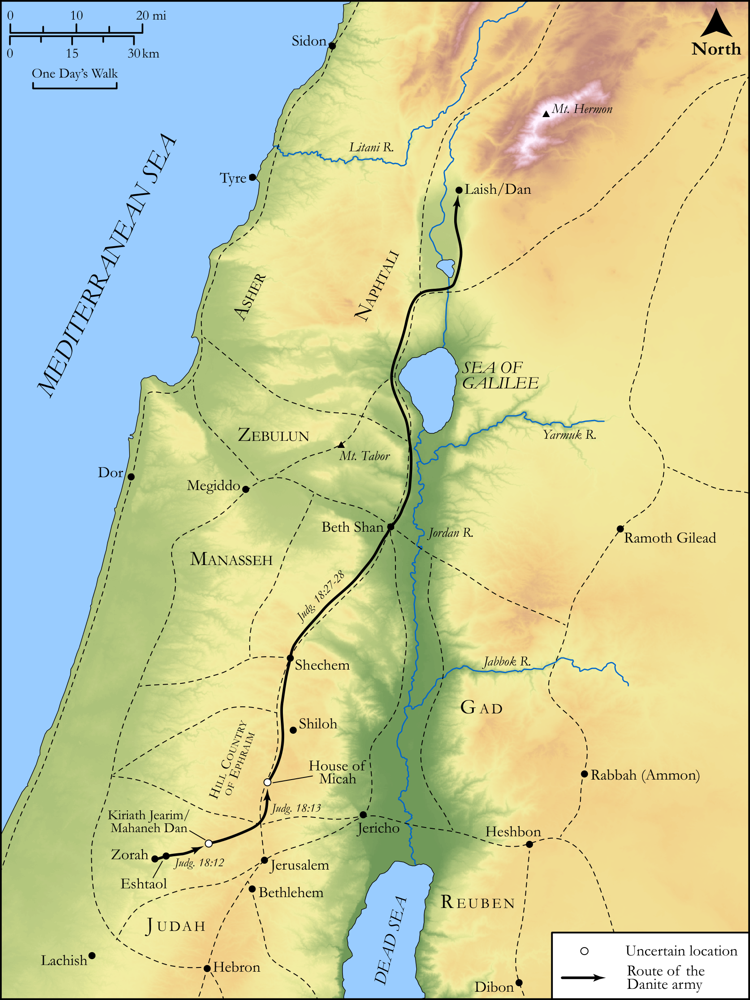

# Biblica Open Bible Maps

## License Information

Biblica Open Bible Maps, © 2023–2025 Biblica, Inc. This work is licensed under Creative Commons Attribution-ShareAlike 4.0 International (<a href="https://creativecommons.org/licenses/by-sa/4.0/">https://creativecommons.org/licenses/by-sa/4.0/</a>). More Information: <a href="https://docs.google.com/document/d/1Pp44yZ0Zdnd59vJHTrt2rPYq0SppfX5rZbPBt6mz37U/edit?tab=t.0#heading=h.oev9aj1ksvk2">https://docs.google.com/document/d/1Pp44yZ0Zdnd59vJHTrt2rPYq0SppfX5rZbPBt6mz37U/edit?tab=t.0#heading=h.oev9aj1ksvk2</a>

--------------------------------

## Historical: Micah (id: OT070)

### Image Content

[link](images/OT070.png)

Original: [Historical: Micah](https://drive.google.com/open?id=1t-rLy3uXyZRFy5dsIop5LKZvP103_k_i&usp=drive_copy)

* **Associated Passages:** Judges 17:1-18:31

* **Associated ACAI Concepts:** Micah (ID: `person:Micah.3`); Dan (ID: `place:Dan`); Tribe of Dan (ID: `group:Dan`); LORD (ID: `deity:Lord`); House (ID: `realia:House`); Tribe of Levi (ID: `group:Levi`); Levi (ID: `person:Levi.3`); Teraphim (ID: `deity:Teraphim`); Graven Image (ID: `realia:GravenImage`); Molten Image (ID: `realia:MoltenImage`); Household Idols (ID: `realia:HouseholdIdols`); Ephod (ID: `realia:Ephod`); Israel (ID: `person:Israel`); Judah (ID: `person:Judah.4`); Tribe of Judah (ID: `group:Judah`); Ephraim (ID: `person:Ephraim`); Tribe of Ephraim (ID: `group:Ephraim`); Eshtaol (ID: `place:Eshtaol`); Money (ID: `realia:Money`); A Person (ID: `person:GenericPerson`); Bethlehem (ID: `place:Bethlehem`); Zorah (ID: `place:Zorah`); Trust (ID: `keyterm:LeanOn`); Mother of Micah (ID: `person:MotherOfMicah.3`); Peace (ID: `keyterm:IntactState`); Sidon (ID: `place:Sidon`); Dispossess (ID: `keyterm:Dispossess`); Military Members (ID: `group:MilitaryMembers`); Jonathan (ID: `person:Jonathan.2`); Mahaneh-dan (ID: `place:Mahaneh-dan`); Beth-rehob (ID: `place:Beth-rehob`); Gershom (ID: `person:Gershom`); Safety (ID: `keyterm:Safety`); Sidonians (ID: `group:Sidon`); Moses (ID: `person:Moses`); Bless (ID: `keyterm:Bless`); To Cause to Possess (ID: `keyterm:Possess`); Shiloh (ID: `place:Shiloh`); To Curse (ID: `keyterm:Curse`); Kiriath-jearim (ID: `place:Kiriath-jearim`); Holy (ID: `keyterm:Holy`); Sword (ID: `realia:Sword`)
