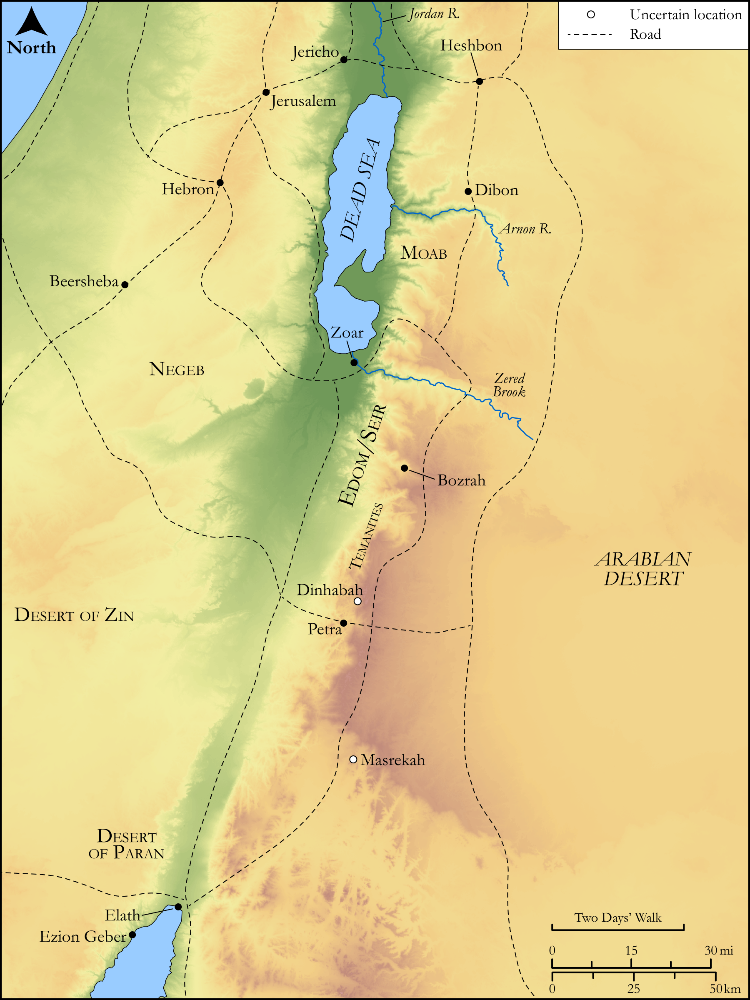

# Biblica Open Bible Maps

## License Information

Biblica Open Bible Maps, © 2023–2025 Biblica, Inc. This work is licensed under Creative Commons Attribution-ShareAlike 4.0 International (<a href="https://creativecommons.org/licenses/by-sa/4.0/">https://creativecommons.org/licenses/by-sa/4.0/</a>). More Information: <a href="https://docs.google.com/document/d/1Pp44yZ0Zdnd59vJHTrt2rPYq0SppfX5rZbPBt6mz37U/edit?tab=t.0#heading=h.oev9aj1ksvk2">https://docs.google.com/document/d/1Pp44yZ0Zdnd59vJHTrt2rPYq0SppfX5rZbPBt6mz37U/edit?tab=t.0#heading=h.oev9aj1ksvk2</a>

--------------------------------

## Historical: The Kings of Edom (id: OT073)

### Image Content

[link](images/OT073.png)

Original: [Historical: The Kings of Edom](https://drive.google.com/open?id=10I_naI_JLRReEMtZ9ORU1re6VwGaSCdJ&usp=drive_copy)

* **Associated Passages:** 1 Chronicles 1:1-54

* **Associated ACAI Concepts:** Abraham (ID: `person:Abraham`); Esau (ID: `person:Esau`); Arpachshad (ID: `person:Arpachshad`); Ishmael (ID: `person:Ishmael`); Cush (ID: `person:Cush.2`); Joktan (ID: `person:Joktan`); Shem (ID: `person:Shem`); Eber (ID: `person:Eber`); Hadad (ID: `person:Hadad.2`); Bela (ID: `person:Bela.2`); Eliphaz (ID: `person:Eliphaz`); Midian (ID: `person:Midian`); Shaul (ID: `person:Shaul`); Hadad (ID: `person:Hadad`); Anah (ID: `person:Anah.2`); Javan (ID: `person:Javan`); Baal-hanan (ID: `person:Baal-hanan`); Dishan (ID: `person:Dishan`); Samlah (ID: `person:Samlah`); Dishon (ID: `person:Dishon`); Peleg (ID: `person:Peleg`); Jobab (ID: `person:Jobab.2`); Keturah (ID: `person:Keturah`); Shobal (ID: `person:Shobal`); Teman (ID: `person:Teman`); Ezer (ID: `person:Ezer`); Zibeon (ID: `person:Zibeon.2`); Lotan (ID: `person:Lotan`); Egypt (ID: `person:Egypt`); Gomer (ID: `person:Gomer`)
