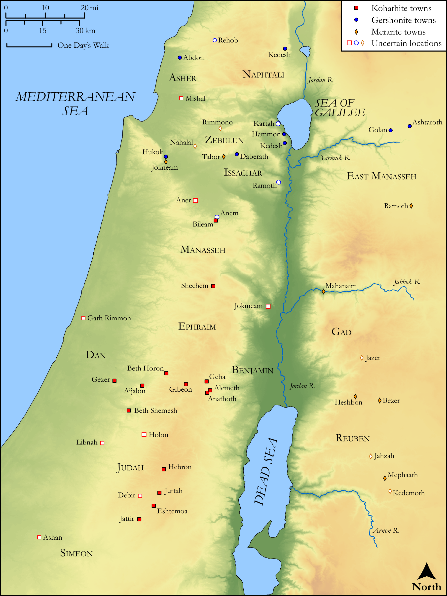

# Biblica Open Bible Maps

## License Information

Biblica Open Bible Maps, © 2023–2025 Biblica, Inc. This work is licensed under Creative Commons Attribution-ShareAlike 4.0 International (<a href="https://creativecommons.org/licenses/by-sa/4.0/">https://creativecommons.org/licenses/by-sa/4.0/</a>). More Information: <a href="https://docs.google.com/document/d/1Pp44yZ0Zdnd59vJHTrt2rPYq0SppfX5rZbPBt6mz37U/edit?tab=t.0#heading=h.oev9aj1ksvk2">https://docs.google.com/document/d/1Pp44yZ0Zdnd59vJHTrt2rPYq0SppfX5rZbPBt6mz37U/edit?tab=t.0#heading=h.oev9aj1ksvk2</a>

--------------------------------

## Historical: Levitical Towns (id: OT074)

### Image Content

[link](images/OT074.png)

Original: [Historical: Levitical Towns](https://drive.google.com/open?id=1z3Qo45KI5r_Wte8dOOPgoy9JzXfHJ2qR&usp=drive_copy)

* **Associated Passages:** 1 Chronicles 6:1-66

* **Associated ACAI Concepts:** Kohath (ID: `person:Kohath`); Merari (ID: `person:Merari`); Tribe of Levi (ID: `group:Levi`); Levi (ID: `person:Levi.3`); Gershon (ID: `person:Gershon`); Aaron (ID: `person:Aaron`); LORD (ID: `deity:Lord`); Izhar (ID: `person:Izhar`); Lot (ID: `keyterm:Lot`); Ahitub (ID: `person:Ahitub.2`); Uzzi (ID: `person:Uzzi`); Amram (ID: `person:Amram`); Meraioth (ID: `person:Meraioth`); Libni (ID: `person:Libni`); Abishua (ID: `person:Abishua`); Israel (ID: `person:Israel`); Tribe of Judah (ID: `group:Judah`); Judah (ID: `person:Judah.4`); Ahimaaz (ID: `person:Ahimaaz.2`); Jerusalem (ID: `place:Jerusalem`); Eleazar (ID: `person:Eleazar.2`); House (ID: `realia:House`); Bukki (ID: `person:Bukki.2`); Iddo (ID: `person:Iddo.4`); Johanan (ID: `person:Johanan.7`); Elkanah (ID: `person:Elkanah.4`); Zimmah (ID: `person:Zimmah`); Uriel (ID: `person:Uriel`); Assir (ID: `person:Assir.2`); Azariah (ID: `person:Azariah.6`)
