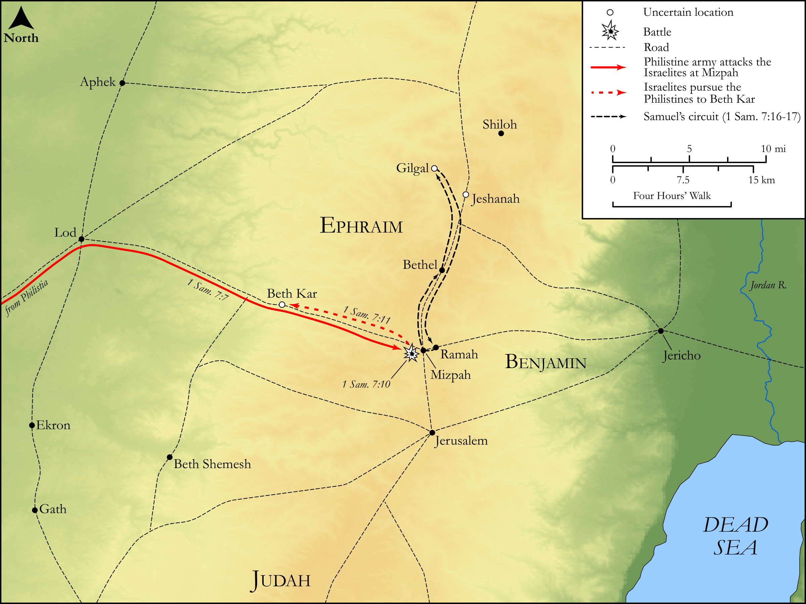

# Biblica Open Bible Maps

## License Information

Biblica Open Bible Maps, © 2023–2025 Biblica, Inc. This work is licensed under Creative Commons Attribution-ShareAlike 4.0 International (<a href="https://creativecommons.org/licenses/by-sa/4.0/">https://creativecommons.org/licenses/by-sa/4.0/</a>). More Information: <a href="https://docs.google.com/document/d/1Pp44yZ0Zdnd59vJHTrt2rPYq0SppfX5rZbPBt6mz37U/edit?tab=t.0#heading=h.oev9aj1ksvk2">https://docs.google.com/document/d/1Pp44yZ0Zdnd59vJHTrt2rPYq0SppfX5rZbPBt6mz37U/edit?tab=t.0#heading=h.oev9aj1ksvk2</a>

--------------------------------

## Historical: The Victory at Mizpah and Samuel as Judge (id: OT077)

### Image Content

[link](images/OT077.png)

Original: [Historical: The Victory at Mizpah and Samuel as Judge](https://drive.google.com/open?id=1QE2abloh38E8J2ehdgNlWdowHjQpWWSg&usp=drive_copy)

* **Associated Passages:** 1 Samuel 7:1-17

* **Associated ACAI Concepts:** Israel (ID: `person:Israel`); LORD (ID: `deity:Lord`); Samuel (ID: `person:Samuel`); Philistines (ID: `group:Philistine`); Philistia (ID: `place:Philistine`); Mizpah (ID: `place:Mizpah`); Covenant Box (ID: `keyterm:CovenantBox`); Offering (ID: `keyterm:Offering`); Ashtoreth (ID: `deity:Ashtoreth`); Force to Serve (ID: `keyterm:EnticedToServe`); Kiriath-jearim (ID: `place:Kiriath-jearim`); Ark of the Covenant (ID: `realia:ArkOfTheCovenant`); House (ID: `realia:House`); Beth-car (ID: `place:Beth-car`); Abinadab (ID: `person:Abinadab`); Eleazar (ID: `person:Eleazar.3`); Shen (ID: `place:Shen`); Amorites (ID: `group:Amorites`); Ekron (ID: `place:Ekron`); Peace (ID: `keyterm:IntactState`); Ebenezer (ID: `place:Ebenezer`); Baal (ID: `deity:Baal`); Gath (ID: `place:Gath`); Fear (ID: `keyterm:Fear`); To Sin (ID: `keyterm:Sin`); Ramah (ID: `place:Ramah`); Holy (ID: `keyterm:Holy`); Bethel (ID: `place:Bethel`); Gilgal (ID: `place:Gilgal.2`); Sheep (ID: `fauna:Lamb`); Stone Altar (ID: `realia:StoneAltar`); Temple Altar (ID: `realia:TempleAltar`); Altar (ID: `realia:Altar`); Tabernacle Altar (ID: `realia:TabernacleAltar`)
