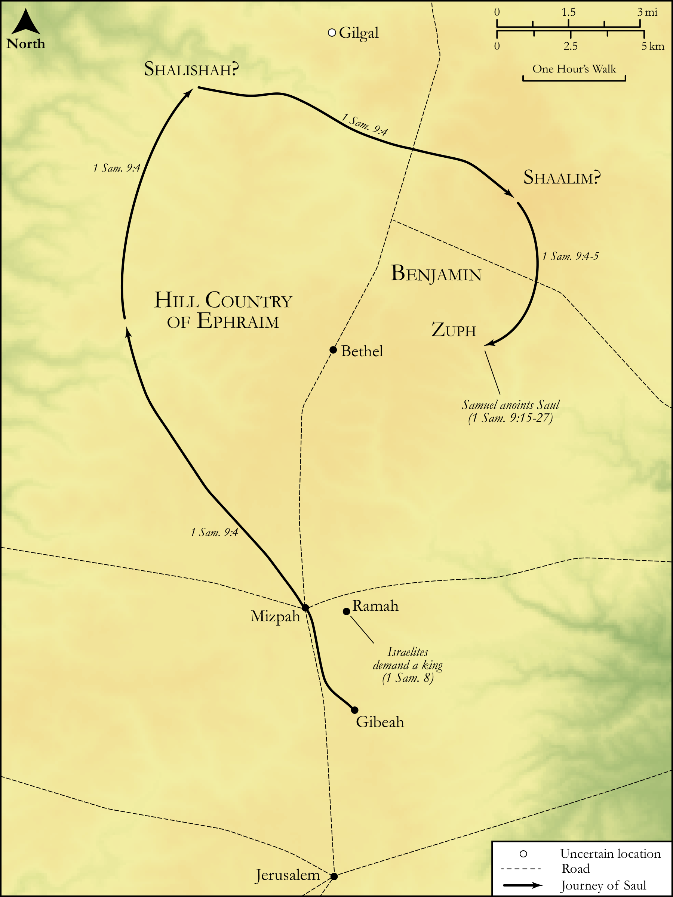

# Biblica Open Bible Maps

## License Information

Biblica Open Bible Maps, © 2023–2025 Biblica, Inc. This work is licensed under Creative Commons Attribution-ShareAlike 4.0 International (<a href="https://creativecommons.org/licenses/by-sa/4.0/">https://creativecommons.org/licenses/by-sa/4.0/</a>). More Information: <a href="https://docs.google.com/document/d/1Pp44yZ0Zdnd59vJHTrt2rPYq0SppfX5rZbPBt6mz37U/edit?tab=t.0#heading=h.oev9aj1ksvk2">https://docs.google.com/document/d/1Pp44yZ0Zdnd59vJHTrt2rPYq0SppfX5rZbPBt6mz37U/edit?tab=t.0#heading=h.oev9aj1ksvk2</a>

--------------------------------

## Historical: Samuel Anoints Saul (id: OT078)

### Image Content

[link](images/OT078.png)

Original: [Historical: Samuel Anoints Saul](https://drive.google.com/open?id=123a28eNpQQDm3jE0I3Uc-JKMF45oL97y&usp=drive_copy)

* **Associated Passages:** 1 Samuel 8:1-9:27

* **Associated ACAI Concepts:** Samuel (ID: `person:Samuel`); Saul (ID: `person:Saul.2`); LORD (ID: `deity:Lord`); Israel (ID: `person:Israel`); Benjamin (ID: `person:Benjamin`); Tribe of Benjamin (ID: `group:Benjamin`); High Place (ID: `realia:HighPlace`); Stone Pine (ID: `flora:Pine`); Donkey (ID: `fauna:Donkey`); Kish (ID: `person:Kish`); Slaughtering (ID: `keyterm:Slaughtering`); Becorath (ID: `person:Becorath`); Shaalim (ID: `place:Shaalim`); Shalishah (ID: `place:Shalishah`); Aphiah (ID: `person:Aphiah`); Joel (ID: `person:Joel`); Abiel (ID: `person:Abiel.2`); Zuph (ID: `place:Zuph`); Abijah (ID: `person:Abijah.2`); Zeror (ID: `person:Zeror`); Egypt (ID: `place:Egypt`); Beersheba (ID: `place:Beersheba`); Ephraim (ID: `person:Ephraim`); Tribe of Ephraim (ID: `group:Ephraim`); Philistines (ID: `group:Philistine`); Smear (ID: `keyterm:Smear`); Force to Serve (ID: `keyterm:EnticedToServe`); Bless (ID: `keyterm:Bless`); Philistia (ID: `place:Philistine`); Ramah (ID: `place:Ramah`); Bring Honor and Glory on Oneself (ID: `keyterm:BringHonorAndGloryOnOneself`); Barley (ID: `flora:Barley`); Chariot (ID: `realia:Chariot`); Vine (ID: `flora:Vine`); Mattock (ID: `realia:Mattock`); House (ID: `realia:House`); Coriander (ID: `flora:Coriander`); Olive Tree (ID: `flora:OliveTree`); Money (ID: `realia:Money`); Flock (ID: `fauna:Flock`); Shekel (ID: `realia:Shekel`); Goat (ID: `fauna:Goat`)
