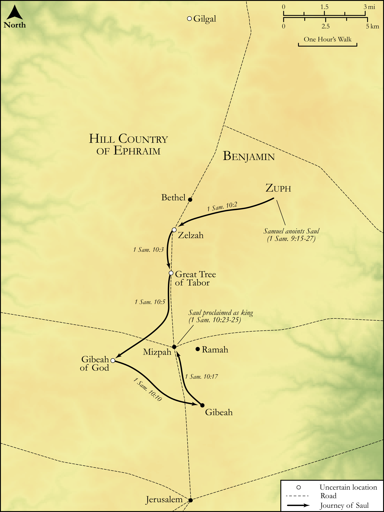

# Biblica Open Bible Maps

## License Information

Biblica Open Bible Maps, © 2023–2025 Biblica, Inc. This work is licensed under Creative Commons Attribution-ShareAlike 4.0 International (<a href="https://creativecommons.org/licenses/by-sa/4.0/">https://creativecommons.org/licenses/by-sa/4.0/</a>). More Information: <a href="https://docs.google.com/document/d/1Pp44yZ0Zdnd59vJHTrt2rPYq0SppfX5rZbPBt6mz37U/edit?tab=t.0#heading=h.oev9aj1ksvk2">https://docs.google.com/document/d/1Pp44yZ0Zdnd59vJHTrt2rPYq0SppfX5rZbPBt6mz37U/edit?tab=t.0#heading=h.oev9aj1ksvk2</a>

--------------------------------

## Historical: Saul Proclaimed as King (id: OT079)

### Image Content

[link](images/OT079.png)

Original: [Historical: Saul Proclaimed as King](https://drive.google.com/open?id=1bX4vH1qyFdd_wiDNKPpNf3mM6mT3cLUC&usp=drive_copy)

* **Associated Passages:** 1 Samuel 10:1-27

* **Associated ACAI Concepts:** LORD (ID: `deity:Lord`); Samuel (ID: `person:Samuel`); Saul (ID: `person:Saul.2`); Speak as a Prophet (ID: `keyterm:Speak`); Gibeah (ID: `place:Gibeah.2`); Benjamin (ID: `person:Benjamin`); Tribe of Benjamin (ID: `group:Benjamin`); Donkey (ID: `fauna:Donkey`); A Group of People (ID: `group:GenericGroup`); Israel (ID: `person:Israel`); Offering (ID: `keyterm:Offering`); Kish (ID: `person:Kish`); Matri (ID: `person:Matri`); Gibeath-elohim (ID: `place:Gibeath-elohim`); Oak of Tabor (ID: `place:Tabor.2`); Zelzah (ID: `place:Zelzah`); Saul's Uncle (ID: `person:UncleOfSaul`); High Place (ID: `realia:HighPlace`); Stone Pine (ID: `flora:Pine`); Egypt (ID: `place:Egypt`); A Person (ID: `person:GenericPerson`); Peace (ID: `keyterm:IntactState`); Rachel (ID: `person:Rachel`); Proverb (ID: `keyterm:Saying`); Slaughtering (ID: `keyterm:Slaughtering`); Mizpah (ID: `place:Mizpah`); Gilgal (ID: `place:Gilgal.2`); Philistines (ID: `group:Philistine`); Smear (ID: `keyterm:Smear`); To Cause to Possess (ID: `keyterm:Possess`); Wickedness (ID: `keyterm:Wickedness`); Philistia (ID: `place:Philistine`); Bethel (ID: `place:Bethel`); Drum (ID: `realia:Drum`); Anointing Flask (ID: `realia:AnointingFlask`); Anointing Oil (ID: `realia:AnointingOil`); Flute (ID: `realia:Flute`); House (ID: `realia:House`); Lute (ID: `realia:Lute`); Skin-Bottle (ID: `realia:Skin-bottle`); Wine (ID: `realia:Wine`); Olive Oil (ID: `realia:OliveOil`); Scroll (ID: `realia:Scroll`); Kid (ID: `fauna:Kid`); Oak (ID: `flora:Oak`); Vine (ID: `flora:Vine`); Goat (ID: `fauna:Goat`); Lyre (ID: `realia:Lyre`)
