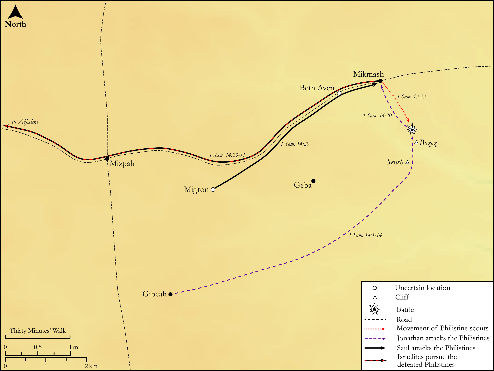

# Biblica Open Bible Maps

## License Information

Biblica Open Bible Maps, © 2023–2025 Biblica, Inc. This work is licensed under Creative Commons Attribution-ShareAlike 4.0 International (<a href="https://creativecommons.org/licenses/by-sa/4.0/">https://creativecommons.org/licenses/by-sa/4.0/</a>). More Information: <a href="https://docs.google.com/document/d/1Pp44yZ0Zdnd59vJHTrt2rPYq0SppfX5rZbPBt6mz37U/edit?tab=t.0#heading=h.oev9aj1ksvk2">https://docs.google.com/document/d/1Pp44yZ0Zdnd59vJHTrt2rPYq0SppfX5rZbPBt6mz37U/edit?tab=t.0#heading=h.oev9aj1ksvk2</a>

--------------------------------

## Historical: The Battle of Mikmash (id: OT082)

### Image Content

[link](images/OT082.png)

Original: [Historical: The Battle of Mikmash](https://drive.google.com/open?id=1f8ahEgU7ZTb6t-UnhKXCnNC0wbAXyfDN&usp=drive_copy)

* **Associated Passages:** 1 Samuel 14:1-52

* **Associated ACAI Concepts:** Saul (ID: `person:Saul.2`); Jonathan (ID: `person:Jonathan.3`); LORD (ID: `deity:Lord`); Israel (ID: `person:Israel`); Philistines (ID: `group:Philistine`); Philistia (ID: `place:Philistine`); To Sin (ID: `keyterm:Sin`); Ner (ID: `person:Ner.2`); Michmash (ID: `place:Michmash`); Abner (ID: `person:Abner`); Gibeah (ID: `place:Gibeah.2`); Hebrews (ID: `group:Hebrews`); Ahimelech (ID: `person:Ahimelech`); To Curse (ID: `keyterm:Curse`); Swear (ID: `keyterm:Swear`); Bozez (ID: `place:Bozez`); Ichabod (ID: `person:Ichabod`); Ahitub (ID: `person:Ahitub`); Abiel (ID: `person:Abiel.2`); Migron (ID: `place:Migron`); Ahinoam (ID: `person:Ahinoam`); Zobah (ID: `place:Zobah`); Kish (ID: `person:Kish`); Ahimaaz (ID: `person:Ahimaaz`); Malchi-shua (ID: `person:Malchi-shua`); Phinehas (ID: `person:Phinehas.2`); Merab (ID: `person:Merab`); Seneh (ID: `place:Seneh`); Aijalon (ID: `place:Aijalon`); Israelites (ID: `group:Israel`)
