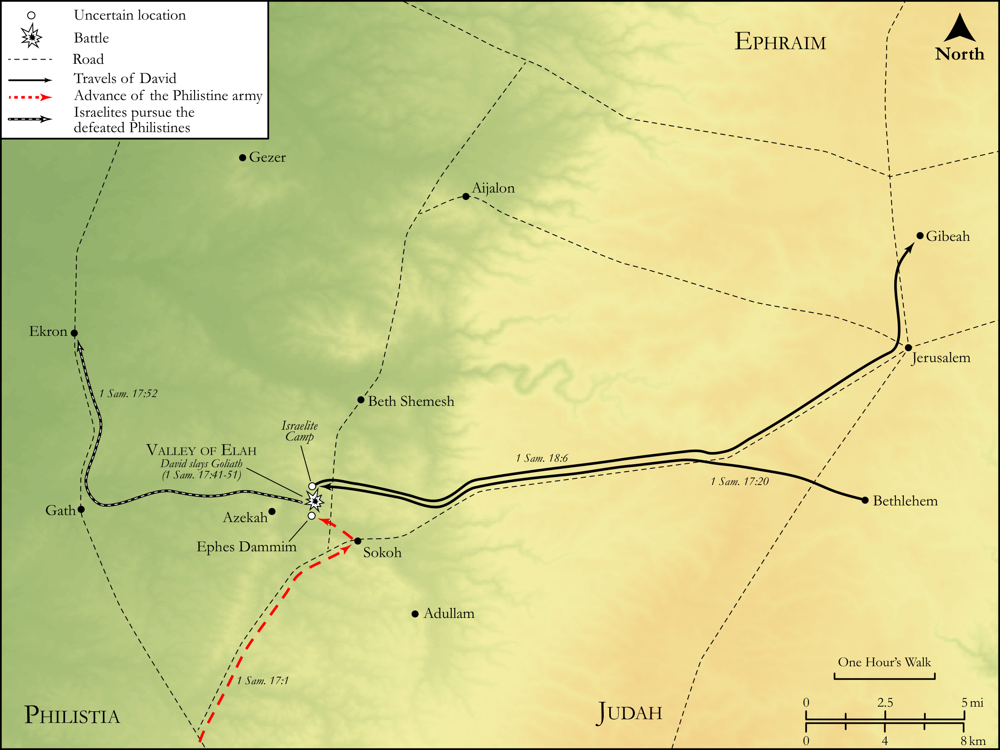

# Biblica Open Bible Maps

## License Information

Biblica Open Bible Maps, © 2023–2025 Biblica, Inc. This work is licensed under Creative Commons Attribution-ShareAlike 4.0 International (<a href="https://creativecommons.org/licenses/by-sa/4.0/">https://creativecommons.org/licenses/by-sa/4.0/</a>). More Information: <a href="https://docs.google.com/document/d/1Pp44yZ0Zdnd59vJHTrt2rPYq0SppfX5rZbPBt6mz37U/edit?tab=t.0#heading=h.oev9aj1ksvk2">https://docs.google.com/document/d/1Pp44yZ0Zdnd59vJHTrt2rPYq0SppfX5rZbPBt6mz37U/edit?tab=t.0#heading=h.oev9aj1ksvk2</a>

--------------------------------

## Historical: David and Goliath (id: OT085)

### Image Content

[link](images/OT085.png)

Original: [Historical: David and Goliath](https://drive.google.com/open?id=11JfgBinU1np13b4nHOcEiXhNj70RB2At&usp=drive_copy)

* **Associated Passages:** 1 Samuel 17:1-58

* **Associated ACAI Concepts:** Philistines (ID: `group:Philistine`); Philistia (ID: `place:Philistine`); David (ID: `person:David`); Saul (ID: `person:Saul.2`); Israel (ID: `person:Israel`); LORD (ID: `deity:Lord`); Jesse (ID: `person:Jesse`); Sword (ID: `realia:Sword`); Flock (ID: `fauna:Flock`); Goat (ID: `fauna:Goat`); Gath (ID: `place:Gath`); Bethlehem (ID: `place:Bethlehem`); Judah (ID: `person:Judah.4`); Tribe of Judah (ID: `group:Judah`); Goliath (ID: `person:Goliath`); Valley of Elah (ID: `place:ElahValley`); Eliab (ID: `person:Eliab.3`); Sling (ID: `realia:Sling`); Spear (ID: `realia:Spear`); Bear (ID: `fauna:Bear`); Peace (ID: `keyterm:IntactState`); Abner (ID: `person:Abner`); Fear (ID: `keyterm:Fear`); Uncircumcised Person (ID: `keyterm:UncircumcisedPerson`); Sheep (ID: `fauna:Lamb`); Lion (ID: `fauna:Lion`); Coat of Mail (ID: `realia:CoatOfMail`); Socoh (ID: `place:Socoh`); Abinadab (ID: `person:Abinadab.3`); Ephrathah (ID: `person:Ephrathah`)
