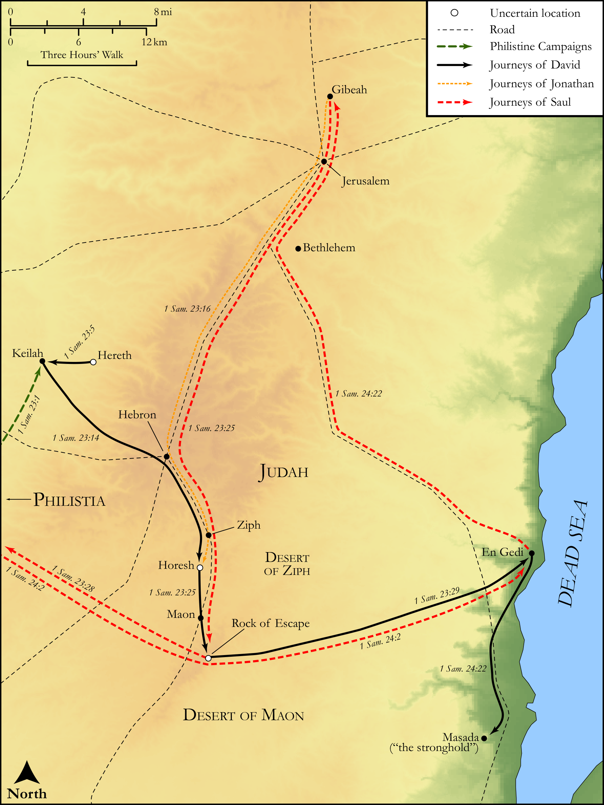

# Biblica Open Bible Maps

## License Information

Biblica Open Bible Maps, © 2023–2025 Biblica, Inc. This work is licensed under Creative Commons Attribution-ShareAlike 4.0 International (<a href="https://creativecommons.org/licenses/by-sa/4.0/">https://creativecommons.org/licenses/by-sa/4.0/</a>). More Information: <a href="https://docs.google.com/document/d/1Pp44yZ0Zdnd59vJHTrt2rPYq0SppfX5rZbPBt6mz37U/edit?tab=t.0#heading=h.oev9aj1ksvk2">https://docs.google.com/document/d/1Pp44yZ0Zdnd59vJHTrt2rPYq0SppfX5rZbPBt6mz37U/edit?tab=t.0#heading=h.oev9aj1ksvk2</a>

--------------------------------

## Historical: David on the Run (Part 3) (id: OT088)

### Image Content

[link](images/OT088.png)

Original: [Historical: David on the Run (Part 3\)](https://drive.google.com/open?id=122cFDSLtBQFphu6v_k_oMH-kM2i_kSiS&usp=drive_copy)

* **Associated Passages:** 1 Samuel 23:1-24:23

* **Associated ACAI Concepts:** David (ID: `person:David`); Saul (ID: `person:Saul.2`); LORD (ID: `deity:Lord`); Keilah (ID: `place:Keilah`); Philistines (ID: `group:Philistine`); Philistia (ID: `place:Philistine`); Israel (ID: `person:Israel`); Wilderness of Ziph (ID: `place:Ziph.2`); Horesh (ID: `place:Horesh`); Fortress (ID: `realia:Fortress`); Jeshimon (ID: `place:Jeshimon`); En-gedi (ID: `place:Engedi`); Abiathar (ID: `person:Abiathar`); A Group of People (ID: `group:GenericGroup`); Judah (ID: `person:Judah.4`); Tribe of Judah (ID: `group:Judah`); Jonathan (ID: `person:Jonathan.3`); Anointed (ID: `keyterm:Anointed`); Fear (ID: `keyterm:Fear`); Maon (ID: `place:Maon`); Swear (ID: `keyterm:Swear`); Ziphites (ID: `group:Ziph`); Hachilah (ID: `place:Hachilah`); Sela-hammahlekoth (ID: `place:RockOfEscape`); Wildgoats' Rocks (ID: `place:WildgoatsRocks`); Crafty (ID: `keyterm:Crafty`); Robe (ID: `realia:Robe`); Ephod (ID: `realia:Ephod`); Gibeah (ID: `place:Gibeah.2`); Proverb (ID: `keyterm:Saying`)
