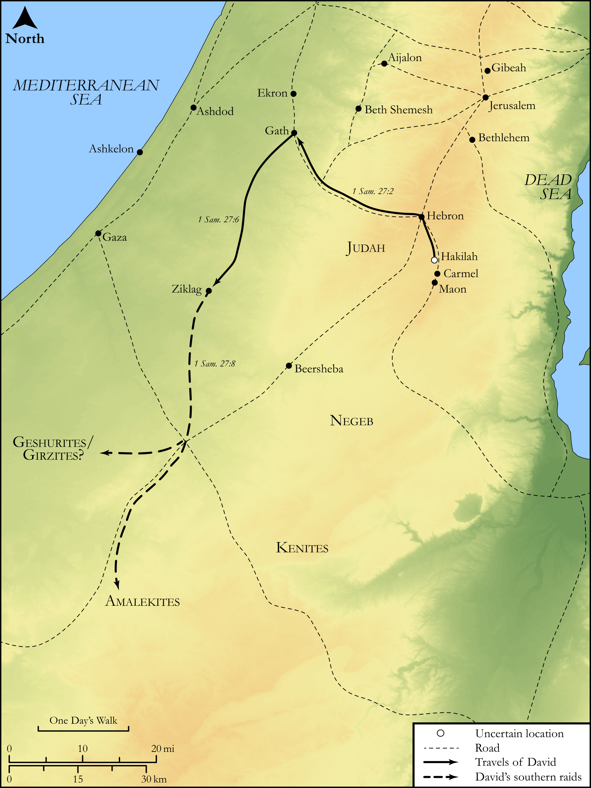

# Biblica Open Bible Maps

## License Information

Biblica Open Bible Maps, © 2023–2025 Biblica, Inc. This work is licensed under Creative Commons Attribution-ShareAlike 4.0 International (<a href="https://creativecommons.org/licenses/by-sa/4.0/">https://creativecommons.org/licenses/by-sa/4.0/</a>). More Information: <a href="https://docs.google.com/document/d/1Pp44yZ0Zdnd59vJHTrt2rPYq0SppfX5rZbPBt6mz37U/edit?tab=t.0#heading=h.oev9aj1ksvk2">https://docs.google.com/document/d/1Pp44yZ0Zdnd59vJHTrt2rPYq0SppfX5rZbPBt6mz37U/edit?tab=t.0#heading=h.oev9aj1ksvk2</a>

--------------------------------

## Historical: David Among the Philistines (id: OT090)

### Image Content

[link](images/OT090.png)

Original: [Historical: David Among the Philistines](https://drive.google.com/open?id=11wx0tlMkK98x68cqyv1AWz-qMTj-0hTW&usp=drive_copy)

* **Associated Passages:** 1 Samuel 27:1-12

* **Associated ACAI Concepts:** David (ID: `person:David`); Achish (ID: `person:Achish`); Gath (ID: `place:Gath`); Philistines (ID: `group:Philistine`); Philistia (ID: `place:Philistine`); Israel (ID: `person:Israel`); Saul (ID: `person:Saul.2`); Judah (ID: `person:Judah.4`); Tribe of Judah (ID: `group:Judah`); Jerahmeel (ID: `person:Jerahmeel`); Ziklag (ID: `place:Ziklag`); Jezreel (ID: `place:Jezreel`); Jerahmeelites (ID: `group:Jerahmeel`); Maoch (ID: `person:Maoch`); Girzites (ID: `group:Girzites`); Nabal (ID: `person:Nabal`); Egypt (ID: `place:Egypt`); Geshur (ID: `place:Geshur`); Favor (ID: `keyterm:Favor`); Ahinoam (ID: `person:Ahinoam.2`); Carmelites (ID: `group:Carmel`); Carmel (ID: `place:Carmel`); Negev (ID: `place:Negeb`); Amalekites (ID: `group:Amalek`); Abigail (ID: `person:Abigail`); Geshurites (ID: `group:Geshur`); Jezreel (ID: `group:Jezreel`); Amalek (ID: `place:Amalek`); Shur (ID: `place:Shur`); Believe In (ID: `keyterm:BelieveIn`); Jezreel (ID: `place:Jezreel.2`); Kenites (ID: `group:Kenite`); Donkey (ID: `fauna:Donkey`); Cattle (ID: `fauna:Bull`); Camel (ID: `fauna:Camel`); Flock (ID: `fauna:Flock`); Goat (ID: `fauna:Goat`)
