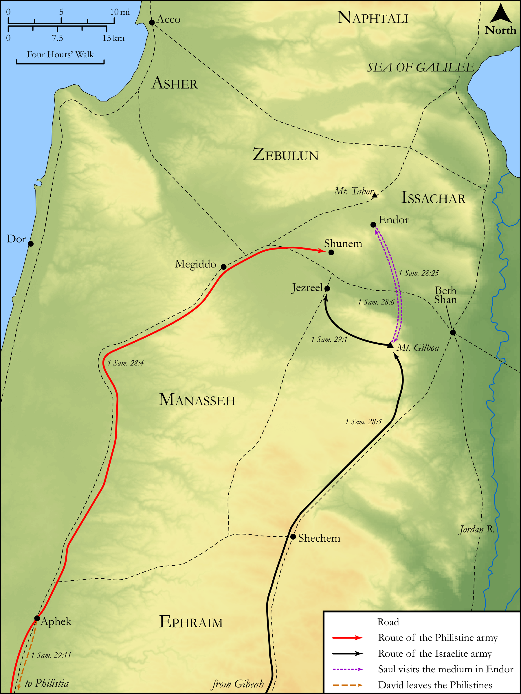

# Biblica Open Bible Maps

## License Information

Biblica Open Bible Maps, © 2023–2025 Biblica, Inc. This work is licensed under Creative Commons Attribution-ShareAlike 4.0 International (<a href="https://creativecommons.org/licenses/by-sa/4.0/">https://creativecommons.org/licenses/by-sa/4.0/</a>). More Information: <a href="https://docs.google.com/document/d/1Pp44yZ0Zdnd59vJHTrt2rPYq0SppfX5rZbPBt6mz37U/edit?tab=t.0#heading=h.oev9aj1ksvk2">https://docs.google.com/document/d/1Pp44yZ0Zdnd59vJHTrt2rPYq0SppfX5rZbPBt6mz37U/edit?tab=t.0#heading=h.oev9aj1ksvk2</a>

--------------------------------

## Historical: Achish’s Campaign against the Israelites (id: OT091)

### Image Content

[link](images/OT091.png)

Original: [Historical: Achish’s Campaign against the Israelites](https://drive.google.com/open?id=1eveth7DVUJQaAsXAf4OXsCbYkDKNW72V&usp=drive_copy)

* **Associated Passages:** 1 Samuel 28:1-29:11

* **Associated ACAI Concepts:** Saul (ID: `person:Saul.2`); Philistines (ID: `group:Philistine`); Philistia (ID: `place:Philistine`); LORD (ID: `deity:Lord`); David (ID: `person:David`); Achish (ID: `person:Achish`); Samuel (ID: `person:Samuel`); Israel (ID: `person:Israel`); Necromancer (ID: `keyterm:Spirit`); Fear (ID: `keyterm:Fear`); Jezreel (ID: `place:Jezreel`); Strength (ID: `keyterm:Strength`); A Woman (ID: `person:GenericFemale`); Practice Divination (ID: `keyterm:PracticeDivination`); Endor (ID: `place:En-dor`); Amalek (ID: `place:Amalek`); Shunem (ID: `place:Shunem`); Deceit (ID: `keyterm:Deceit`); Aphek (ID: `place:Aphek`); Mount Gilboa (ID: `place:GilboaMount`); Israelites (ID: `group:Israel`); Passion (ID: `keyterm:Ardour`); Peace (ID: `keyterm:IntactState`); Servants (ID: `group:GenericServants`); Hebrews (ID: `group:Hebrews`); Ramah (ID: `place:Ramah`); Swear (ID: `keyterm:Swear`); An Angel (ID: `deity:Angel`); Molten Image (ID: `realia:MoltenImage`); Animal Pen (ID: `realia:AnimalPen`); Robe (ID: `realia:Robe`); Cattle (ID: `fauna:Bull`); Unleavened Bread (ID: `realia:UnleavenedBread`); House (ID: `realia:House`); Bed (ID: `realia:Bed`); Trap (ID: `realia:Trap`)
