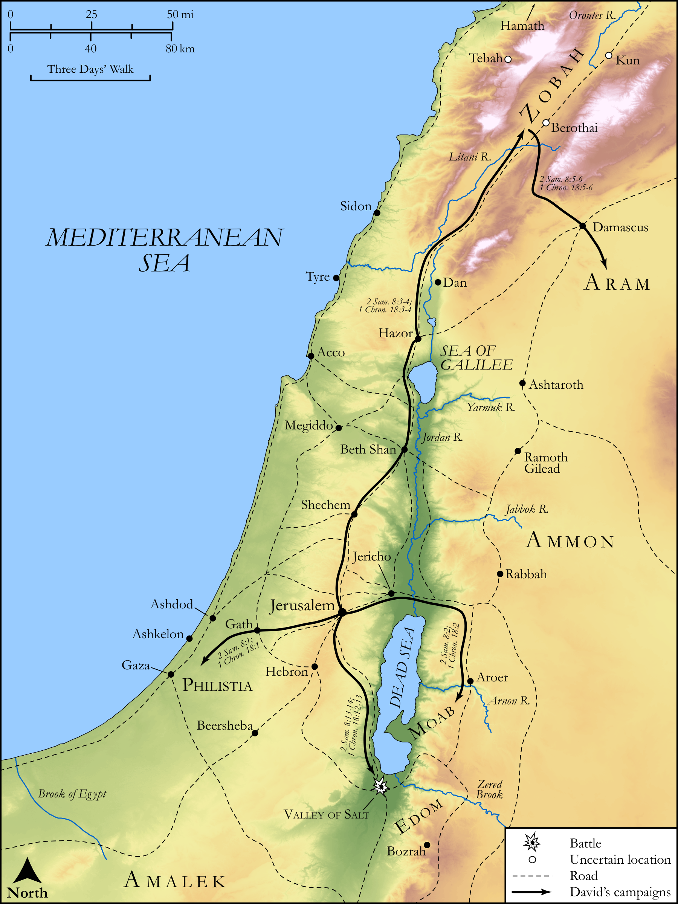

# Biblica Open Bible Maps

## License Information

Biblica Open Bible Maps, © 2023–2025 Biblica, Inc. This work is licensed under Creative Commons Attribution-ShareAlike 4.0 International (<a href="https://creativecommons.org/licenses/by-sa/4.0/">https://creativecommons.org/licenses/by-sa/4.0/</a>). More Information: <a href="https://docs.google.com/document/d/1Pp44yZ0Zdnd59vJHTrt2rPYq0SppfX5rZbPBt6mz37U/edit?tab=t.0#heading=h.oev9aj1ksvk2">https://docs.google.com/document/d/1Pp44yZ0Zdnd59vJHTrt2rPYq0SppfX5rZbPBt6mz37U/edit?tab=t.0#heading=h.oev9aj1ksvk2</a>

--------------------------------

## Historical: David’s Wars (id: OT101)

### Image Content

[link](images/OT101.png)

Original: [Historical: David’s Wars](https://drive.google.com/open?id=1hgvppo3Prm0dCX6xyjJVL-mnOQ9XZytD&usp=drive_copy)

* **Associated Passages:** 2 Samuel 8:1-18; 1 Chronicles 18:1-17

* **Associated ACAI Concepts:** David (ID: `person:David`); Hadadezer (ID: `person:Hadadezer`); Zobah (ID: `place:Zobah`); LORD (ID: `deity:Lord`); Edom (ID: `place:Edom`); Toi (ID: `person:Toi`); Damascus (ID: `place:Damascus`); Moab (ID: `place:Moab`); Syrians (ID: `group:Syria`); Offering (ID: `keyterm:Offering`); Philistines (ID: `group:Philistine`); Philistia (ID: `place:Philistine`); Money (ID: `realia:Money`); Edomites (ID: `group:Edom`); Zeruiah (ID: `person:Zeruiah`); Ahimelech (ID: `person:Ahimelech.3`); Ahilud (ID: `person:Ahilud`); Rehob (ID: `person:Rehob`); Hamath (ID: `place:Hamath`); Valley of Salt (ID: `place:SaltValley`); Seraiah (ID: `person:Seraiah`); Betah (ID: `place:Betah`); Joram (ID: `person:Joram.2`); Cherethites (ID: `group:Cherethite`); Joab (ID: `person:Joab`); Ahitub (ID: `person:Ahitub.2`); Gath (ID: `place:Gath`); Zadok (ID: `person:Zadok.2`); Amalek (ID: `place:Amalek`); Jehoshaphat (ID: `person:Jehoshaphat`); Pelethites (ID: `group:Pelethites`); Jerusalem (ID: `place:Jerusalem`); Israel (ID: `person:Israel`); Peace (ID: `keyterm:IntactState`); Euphrates River (ID: `place:Euphrates`); Berothah (ID: `place:Berothah`); Ammonites (ID: `group:Ammon`); Bless (ID: `keyterm:Bless`); Jehoiada (ID: `person:Jehoiada`); Abiathar (ID: `person:Abiathar`); Ammon (ID: `place:Ammon`); Benaiah (ID: `person:Benaiah`); Holy (ID: `keyterm:Holy`); Small Shield (ID: `realia:SmallShield`); Chariot (ID: `realia:Chariot`); Solomon (ID: `person:Solomon`); Abishai (ID: `person:Abishai`); Rope (ID: `realia:Rope`)
