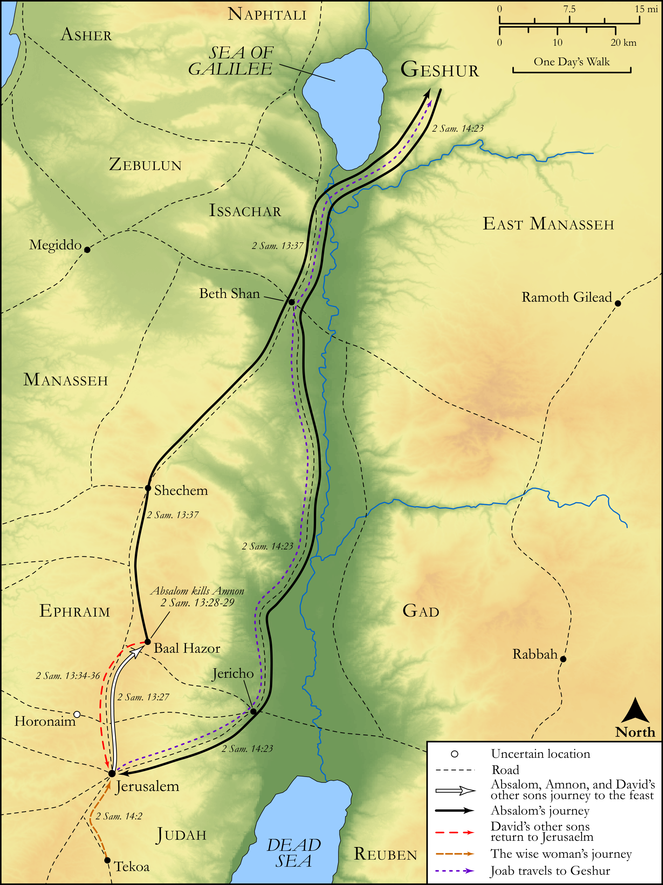

# Biblica Open Bible Maps

## License Information

Biblica Open Bible Maps, © 2023–2025 Biblica, Inc. This work is licensed under Creative Commons Attribution-ShareAlike 4.0 International (<a href="https://creativecommons.org/licenses/by-sa/4.0/">https://creativecommons.org/licenses/by-sa/4.0/</a>). More Information: <a href="https://docs.google.com/document/d/1Pp44yZ0Zdnd59vJHTrt2rPYq0SppfX5rZbPBt6mz37U/edit?tab=t.0#heading=h.oev9aj1ksvk2">https://docs.google.com/document/d/1Pp44yZ0Zdnd59vJHTrt2rPYq0SppfX5rZbPBt6mz37U/edit?tab=t.0#heading=h.oev9aj1ksvk2</a>

--------------------------------

## Historical: Banishment and Return of Absalom (id: OT105)

### Image Content

[link](images/OT105.png)

Original: [Historical: Banishment and Return of Absalom](https://drive.google.com/open?id=1IW60DP5AOWF3-lRep_edh8zeVj-E8lnK&usp=drive_copy)

* **Associated Passages:** 2 Samuel 13:1-14:33

* **Associated ACAI Concepts:** Absalom (ID: `person:Absalom`); Amnon (ID: `person:Amnon`); Tamar (ID: `person:Tamar.2`); Joab (ID: `person:Joab`); David (ID: `person:David`); LORD (ID: `deity:Lord`); Jonadab (ID: `person:Jonadab.2`); Geshur (ID: `place:Geshur`); House (ID: `realia:House`); Israel (ID: `person:Israel`); Love (ID: `keyterm:Love`); Tekoa (ID: `place:Tekoa`); A Woman (ID: `person:GenericFemale`); Shimeah (ID: `person:Shimeah.2`); Jerusalem (ID: `place:Jerusalem`); Passion (ID: `keyterm:Ardour`); Fear (ID: `keyterm:Fear`); Bless (ID: `keyterm:Bless`); An Angel (ID: `deity:Angel`); Cake (ID: `realia:Cake`); Tamar (ID: `person:Tamar.3`); Ammihud (ID: `person:Ammihud.4`); Ephraim (ID: `place:Ephraim`); Baal-hazor (ID: `place:Baal-hazor`); Talmai (ID: `person:Talmai.2`); Foolish (ID: `keyterm:Foolish`); Favor (ID: `keyterm:Favor`); To Cause to Possess (ID: `keyterm:Possess`); Exempt (ID: `keyterm:Exempt`); Zeruiah (ID: `person:Zeruiah`)
