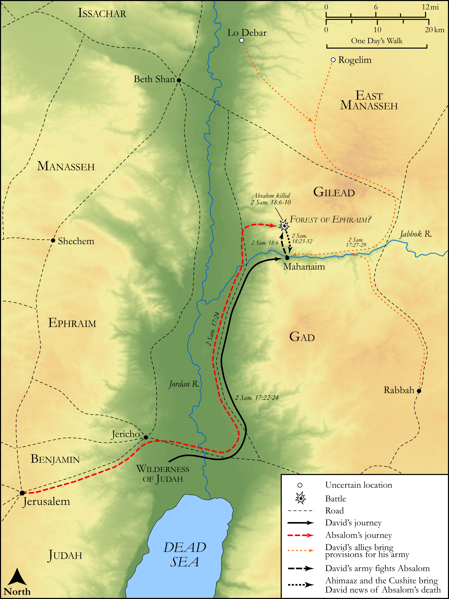

# Biblica Open Bible Maps

## License Information

Biblica Open Bible Maps, © 2023–2025 Biblica, Inc. This work is licensed under Creative Commons Attribution-ShareAlike 4.0 International (<a href="https://creativecommons.org/licenses/by-sa/4.0/">https://creativecommons.org/licenses/by-sa/4.0/</a>). More Information: <a href="https://docs.google.com/document/d/1Pp44yZ0Zdnd59vJHTrt2rPYq0SppfX5rZbPBt6mz37U/edit?tab=t.0#heading=h.oev9aj1ksvk2">https://docs.google.com/document/d/1Pp44yZ0Zdnd59vJHTrt2rPYq0SppfX5rZbPBt6mz37U/edit?tab=t.0#heading=h.oev9aj1ksvk2</a>

--------------------------------

## Historical: The Defeat of Absalom (id: OT107)

### Image Content

[link](images/OT107.png)

Original: [Historical: The Defeat of Absalom](https://drive.google.com/open?id=1QDshCluiGnJfGep4hvq9Nw0Cq6pFaUoZ&usp=drive_copy)

* **Associated Passages:** 2 Samuel 17:1-29

* **Associated ACAI Concepts:** Absalom (ID: `person:Absalom`); Israel (ID: `person:Israel`); David (ID: `person:David`); Ahithophel (ID: `person:Ahithophel`); Hushai (ID: `person:Hushai`); Counsel (ID: `keyterm:Counsel`); Ahimaaz (ID: `person:Ahimaaz.2`); House (ID: `realia:House`); Gilead (ID: `place:Gilead`); Archites (ID: `group:Archites`); Mahanaim (ID: `place:Mahanaim`); Jonathan (ID: `person:Jonathan.4`); Jordan River (ID: `place:Jordan`); Amasa (ID: `person:Amasa`); Abigail (ID: `person:Abigail.2`); Machir (ID: `person:Machir.2`); Barzillai (ID: `person:Barzillai`); Lo-debar (ID: `place:Lo-debar`); Rogelim (ID: `place:Rogelim`); Nahash (ID: `person:Nahash.4`); Shobi (ID: `person:Shobi`); Nahash (ID: `person:Nahash.3`); Jether (ID: `person:Jether.3`); En-rogel (ID: `place:En-rogel`); Ammiel (ID: `person:Ammiel.2`); Gileadites (ID: `group:Gilead`); Jerusalem (ID: `place:Jerusalem`); Ishmael (ID: `person:Ishmael`); Bahurim (ID: `place:Bahurim`); Joab (ID: `person:Joab`); LORD (ID: `deity:Lord`); Ishmaelites (ID: `group:Ishmael`); Peace (ID: `keyterm:IntactState`); Beersheba (ID: `place:Beersheba`); Plague (ID: `keyterm:Blow`); Ammonites (ID: `group:Ammon`); A Woman (ID: `person:GenericFemale`); Abiathar (ID: `person:Abiathar`); Ammon (ID: `place:Ammon`); Tribe of Dan (ID: `group:Dan`); Zeruiah (ID: `person:Zeruiah`); Zadok (ID: `person:Zadok.2`); Dan (ID: `place:Dan`); Bean (ID: `flora:Bean`); Rope (ID: `realia:Rope`); Lentil (ID: `flora:Lentil`); Wheat (ID: `flora:Wheat`); Donkey (ID: `fauna:Donkey`); Cattle (ID: `fauna:Bull`); Bowl (ID: `realia:Bowl`); To Saddle (ID: `realia:ToSaddle`); Bed (ID: `realia:Bed`); Bear (ID: `fauna:Bear`); Flock (ID: `fauna:Flock`); Lion (ID: `fauna:Lion`); Goat (ID: `fauna:Goat`); Screen (ID: `realia:Screen`); Barley (ID: `flora:Barley`)
