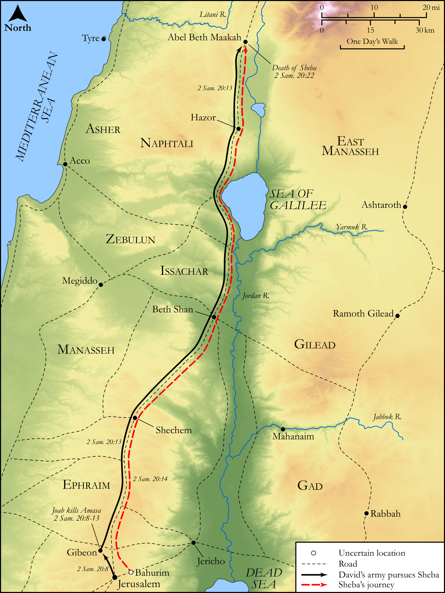

# Biblica Open Bible Maps

## License Information

Biblica Open Bible Maps, © 2023–2025 Biblica, Inc. This work is licensed under Creative Commons Attribution-ShareAlike 4.0 International (<a href="https://creativecommons.org/licenses/by-sa/4.0/">https://creativecommons.org/licenses/by-sa/4.0/</a>). More Information: <a href="https://docs.google.com/document/d/1Pp44yZ0Zdnd59vJHTrt2rPYq0SppfX5rZbPBt6mz37U/edit?tab=t.0#heading=h.oev9aj1ksvk2">https://docs.google.com/document/d/1Pp44yZ0Zdnd59vJHTrt2rPYq0SppfX5rZbPBt6mz37U/edit?tab=t.0#heading=h.oev9aj1ksvk2</a>

--------------------------------

## Historical: Sheba’s Revolt (id: OT109)

### Image Content

[link](images/OT109.png)

Original: [Historical: Sheba’s Revolt](https://drive.google.com/open?id=1kwU3b9zrmgoU627fO5ZggKcmco0axhcX&usp=drive_copy)

* **Associated Passages:** 2 Samuel 20:1-26

* **Associated ACAI Concepts:** Joab (ID: `person:Joab`); Bichri (ID: `person:Bichri`); Sheba (ID: `person:Sheba.4`); David (ID: `person:David`); Amasa (ID: `person:Amasa`); Israel (ID: `person:Israel`); Jerusalem (ID: `place:Jerusalem`); Abel-beth-maacah (ID: `place:Abel-beth-maacah`); Judah (ID: `person:Judah.4`); Tribe of Judah (ID: `group:Judah`); Cherethites (ID: `group:Cherethite`); Pelethites (ID: `group:Pelethites`); To Cause to Possess (ID: `keyterm:Possess`); Abishai (ID: `person:Abishai`); Adoram (ID: `person:Adoram`); Ahilud (ID: `person:Ahilud`); Seraiah (ID: `person:Seraiah`); Bichrites (ID: `group:Bichri`); Ira (ID: `person:Ira`); Jair (ID: `person:Jair.2`); Jairites (ID: `group:Jair`); Jehoshaphat (ID: `person:Jehoshaphat`); Rams Horn (ID: `realia:RamsHorn`); Sword (ID: `realia:Sword`); LORD (ID: `deity:Lord`); Peace (ID: `keyterm:IntactState`); Faithfulness (ID: `keyterm:Faithfulness`); Complete (ID: `keyterm:Complete`); Benjamin (ID: `person:Benjamin`); Ephraim (ID: `person:Ephraim`); Tribe of Ephraim (ID: `group:Ephraim`); Gibeon (ID: `place:Gibeon`); Tribe of Benjamin (ID: `group:Benjamin`); Jesse (ID: `person:Jesse`); A Woman (ID: `person:GenericFemale`); Absalom (ID: `person:Absalom`); Jehoiada (ID: `person:Jehoiada`); Abiathar (ID: `person:Abiathar`); Wickedness (ID: `keyterm:Wickedness`); Zadok (ID: `person:Zadok.2`); Benaiah (ID: `person:Benaiah`); Ability (ID: `keyterm:Ability`); Jordan River (ID: `place:Jordan`); Siege Ramp (ID: `realia:SiegeRamp`); Sheath (ID: `realia:Sheath`); House (ID: `realia:House`)
