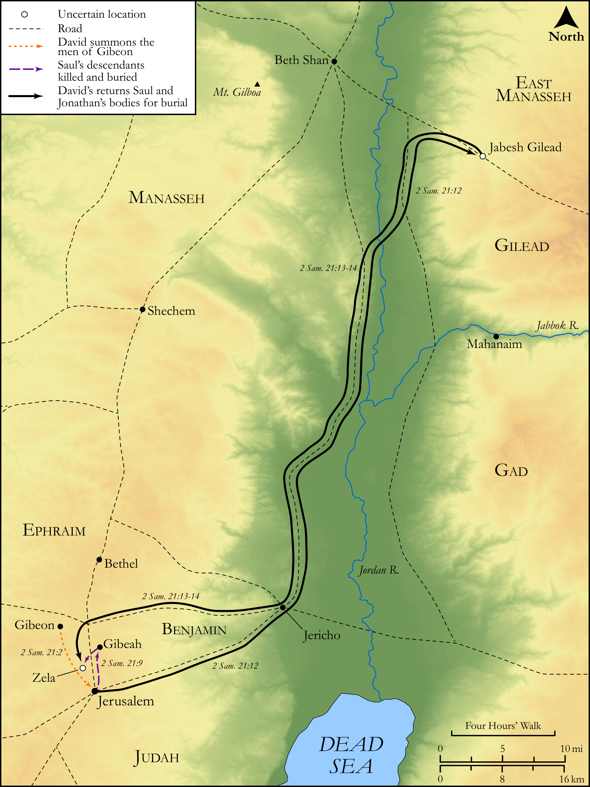

# Biblica Open Bible Maps

## License Information

Biblica Open Bible Maps, © 2023–2025 Biblica, Inc. This work is licensed under Creative Commons Attribution-ShareAlike 4.0 International (<a href="https://creativecommons.org/licenses/by-sa/4.0/">https://creativecommons.org/licenses/by-sa/4.0/</a>). More Information: <a href="https://docs.google.com/document/d/1Pp44yZ0Zdnd59vJHTrt2rPYq0SppfX5rZbPBt6mz37U/edit?tab=t.0#heading=h.oev9aj1ksvk2">https://docs.google.com/document/d/1Pp44yZ0Zdnd59vJHTrt2rPYq0SppfX5rZbPBt6mz37U/edit?tab=t.0#heading=h.oev9aj1ksvk2</a>

--------------------------------

## Historical: The Three-Year Famine (id: OT110)

### Image Content

[link](images/OT110.png)

Original: [Historical: The Three\-Year Famine](https://drive.google.com/open?id=1bUlPUt2nTZUmYMmak3SzHeEKYA3u5Kmi&usp=drive_copy)

* **Associated Passages:** 2 Samuel 21:1-22

* **Associated ACAI Concepts:** Saul (ID: `person:Saul.2`); David (ID: `person:David`); Israel (ID: `person:Israel`); LORD (ID: `deity:Lord`); Gibeon (ID: `place:Gibeon`); Philistines (ID: `group:Philistine`); Gibeonites (ID: `group:Gibeon`); Philistia (ID: `place:Philistine`); Rapha (ID: `person:Rapha`); Jonathan (ID: `person:Jonathan.3`); Aiah (ID: `person:Aiah.2`); Rizpah (ID: `person:Rizpah`); Gath (ID: `place:Gath`); Gezer (ID: `place:Gezer`); Swear (ID: `keyterm:Swear`); Mephibosheth (ID: `person:Mephibosheth.2`); Ishbi-benob (ID: `person:Ishbi-benob`); Armoni (ID: `person:Armoni`); Hushathites (ID: `group:Hushathites`); Adriel (ID: `person:Adriel`); Meholathites (ID: `group:Meholathites`); Barzillai (ID: `person:Barzillai.2`); Jaare-oregim (ID: `person:Jaare-oregim`); Elhanan (ID: `person:Elhanan`); Saph (ID: `person:Saph`); Zela (ID: `place:Zela`); Mephibosheth (ID: `person:Mephibosheth`); Huge Man (ID: `person:HugeMan`); Sibbecai (ID: `person:Sibbecai`); Bethlehemites (ID: `group:Bethlehem`); Be Zealous (ID: `keyterm:Zealous`); Amorites (ID: `group:Amorites`); Mount Gilboa (ID: `place:GilboaMount`); Jabesh-gilead (ID: `place:Jabesh-gilead`); Jonadab (ID: `person:Jonadab.2`); Gibeah (ID: `place:Gibeah.2`); Appease (ID: `keyterm:Appease`); Bethlehem (ID: `place:Bethlehem`); Judah (ID: `person:Judah.4`); Benjamin (ID: `person:Benjamin`); Tribe of Judah (ID: `group:Judah`); Tribe of Benjamin (ID: `group:Benjamin`); Goliath (ID: `person:Goliath`); Kish (ID: `person:Kish`); Shimeah (ID: `person:Shimeah.2`); Oath (ID: `keyterm:Oath`); Bless (ID: `keyterm:Bless`); To Cause to Possess (ID: `keyterm:Possess`); Beth-shan (ID: `place:Beth-shan`); Zeruiah (ID: `person:Zeruiah`); Merab (ID: `person:Merab`); Abishai (ID: `person:Abishai`); Point of Spear (ID: `realia:PointOfSpear`); Weavers Beam (ID: `realia:WeaversBeam`); Spear (ID: `realia:Spear`); Lamp (ID: `realia:Lamp`); Money (ID: `realia:Money`); Sackcloth (ID: `realia:Sackcloth`); Barley (ID: `flora:Barley`)
