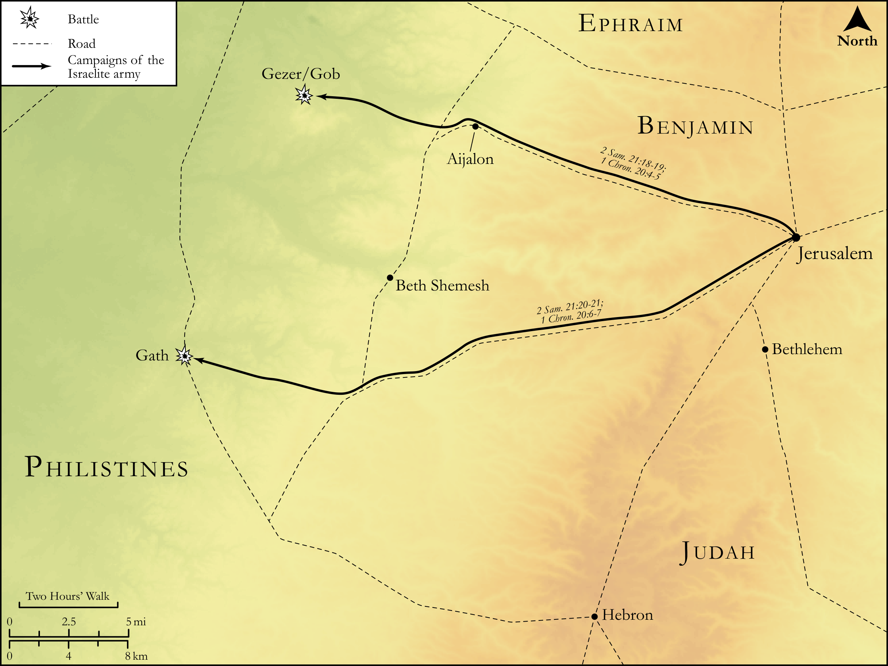

# Biblica Open Bible Maps

## License Information

Biblica Open Bible Maps, © 2023–2025 Biblica, Inc. This work is licensed under Creative Commons Attribution-ShareAlike 4.0 International (<a href="https://creativecommons.org/licenses/by-sa/4.0/">https://creativecommons.org/licenses/by-sa/4.0/</a>). More Information: <a href="https://docs.google.com/document/d/1Pp44yZ0Zdnd59vJHTrt2rPYq0SppfX5rZbPBt6mz37U/edit?tab=t.0#heading=h.oev9aj1ksvk2">https://docs.google.com/document/d/1Pp44yZ0Zdnd59vJHTrt2rPYq0SppfX5rZbPBt6mz37U/edit?tab=t.0#heading=h.oev9aj1ksvk2</a>

--------------------------------

## Historical: Wars with the Philistines (id: OT111)

### Image Content

[link](images/OT111.png)

Original: [Historical: Wars with the Philistines](https://drive.google.com/open?id=1f2z3lXaApx5PXBj6G-6GcmJ6dd_JqPMd&usp=drive_copy)

* **Associated Passages:** 2 Samuel 21:1-22; 1 Chronicles 20:1-8

* **Associated ACAI Concepts:** David (ID: `person:David`); Saul (ID: `person:Saul.2`); Rapha (ID: `person:Rapha`); Israel (ID: `person:Israel`); Philistines (ID: `group:Philistine`); Philistia (ID: `place:Philistine`); LORD (ID: `deity:Lord`); Gath (ID: `place:Gath`); Gibeon (ID: `place:Gibeon`); Gibeonites (ID: `group:Gibeon`); Jonathan (ID: `person:Jonathan.3`); Aiah (ID: `person:Aiah.2`); Rizpah (ID: `person:Rizpah`); Gezer (ID: `place:Gezer`); Hushathites (ID: `group:Hushathites`); Jaare-oregim (ID: `person:Jaare-oregim`); Elhanan (ID: `person:Elhanan`); Saph (ID: `person:Saph`); Huge Man (ID: `person:HugeMan`); Sibbecai (ID: `person:Sibbecai`); Shimeah (ID: `person:Shimeah.2`); Jerusalem (ID: `place:Jerusalem`); Jonadab (ID: `person:Jonadab.2`); Goliath (ID: `person:Goliath`); Ammonites (ID: `group:Ammon`); Ammon (ID: `place:Ammon`); Swear (ID: `keyterm:Swear`); Lahmi (ID: `person:Lahmi`); Weavers Beam (ID: `realia:WeaversBeam`); Mephibosheth (ID: `person:Mephibosheth.2`); Armoni (ID: `person:Armoni`); Ishbi-benob (ID: `person:Ishbi-benob`); Adriel (ID: `person:Adriel`); Meholathites (ID: `group:Meholathites`); Barzillai (ID: `person:Barzillai.2`); Zela (ID: `place:Zela`); Mephibosheth (ID: `person:Mephibosheth`); Spear (ID: `realia:Spear`); Bethlehemites (ID: `group:Bethlehem`); Be Zealous (ID: `keyterm:Zealous`); Amorites (ID: `group:Amorites`); Mount Gilboa (ID: `place:GilboaMount`); Jabesh-gilead (ID: `place:Jabesh-gilead`); Joab (ID: `person:Joab`); Gibeah (ID: `place:Gibeah.2`); Appease (ID: `keyterm:Appease`); Bethlehem (ID: `place:Bethlehem`); Judah (ID: `person:Judah.4`); Benjamin (ID: `person:Benjamin`); Tribe of Judah (ID: `group:Judah`); Tribe of Benjamin (ID: `group:Benjamin`); Kish (ID: `person:Kish`); Oath (ID: `keyterm:Oath`); Bless (ID: `keyterm:Bless`); To Cause to Possess (ID: `keyterm:Possess`); Beth-shan (ID: `place:Beth-shan`); Zeruiah (ID: `person:Zeruiah`); Merab (ID: `person:Merab`); Abishai (ID: `person:Abishai`); Rephaim (ID: `group:Rephaim`); Point of Spear (ID: `realia:PointOfSpear`); Stone Plane (ID: `realia:StonePlane`); Talent (ID: `realia:Talent`); Lamp (ID: `realia:Lamp`); Crown (ID: `realia:Crown`); Money (ID: `realia:Money`); Sackcloth (ID: `realia:Sackcloth`); Barley (ID: `flora:Barley`)
