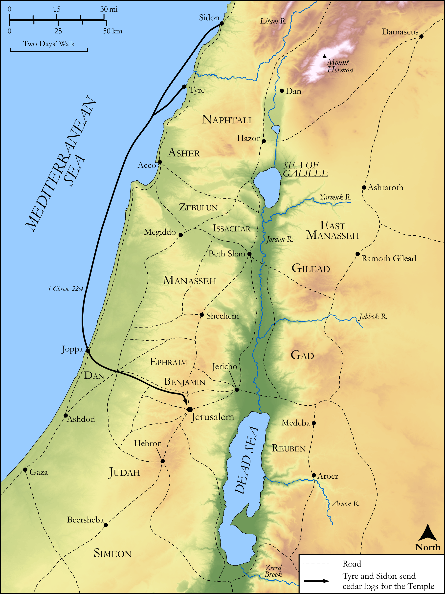

# Biblica Open Bible Maps

## License Information

Biblica Open Bible Maps, © 2023–2025 Biblica, Inc. This work is licensed under Creative Commons Attribution-ShareAlike 4.0 International (<a href="https://creativecommons.org/licenses/by-sa/4.0/">https://creativecommons.org/licenses/by-sa/4.0/</a>). More Information: <a href="https://docs.google.com/document/d/1Pp44yZ0Zdnd59vJHTrt2rPYq0SppfX5rZbPBt6mz37U/edit?tab=t.0#heading=h.oev9aj1ksvk2">https://docs.google.com/document/d/1Pp44yZ0Zdnd59vJHTrt2rPYq0SppfX5rZbPBt6mz37U/edit?tab=t.0#heading=h.oev9aj1ksvk2</a>

--------------------------------

## Historical: Cedar for the Temple (id: OT114)

### Image Content

[link](images/OT114.png)

Original: [Historical: Cedar for the Temple](https://drive.google.com/open?id=1HoctwriilQrKn8_4wcAGzmIv2iA1Us-S&usp=drive_copy)

* **Associated Passages:** 1 Chronicles 22:1-19

* **Associated ACAI Concepts:** LORD (ID: `deity:Lord`); Israel (ID: `person:Israel`); House (ID: `realia:House`); David (ID: `person:David`); Solomon (ID: `person:Solomon`); Money (ID: `realia:Money`); Covenant Box (ID: `keyterm:CovenantBox`); Peace (ID: `keyterm:IntactState`); Tyre (ID: `place:Tyre`); Sidon (ID: `place:Sidon`); Offering (ID: `keyterm:Offering`); Tyrians (ID: `group:Tyre`); Instruction (ID: `keyterm:Instruction`); Sidonians (ID: `group:Sidon`); Covenant (ID: `keyterm:Covenant`); Understanding (ID: `keyterm:Understanding`); Word of the Lord (ID: `keyterm:WordOfTheLord`); Fear (ID: `keyterm:Fear`); Moses (ID: `person:Moses`); Insight (ID: `keyterm:Insight`); Decree (ID: `keyterm:Decree`); Nail (ID: `realia:Nail`); Ark of the Covenant (ID: `realia:ArkOfTheCovenant`); Talent (ID: `realia:Talent`); Temple Altar (ID: `realia:TempleAltar`); Stone Altar (ID: `realia:StoneAltar`); Altar (ID: `realia:Altar`); Craftsman (ID: `realia:Craftsman`); Hewn Stone (ID: `realia:HewnStone`); Tabernacle Altar (ID: `realia:TabernacleAltar`); Cedar (ID: `flora:Cedar`)
