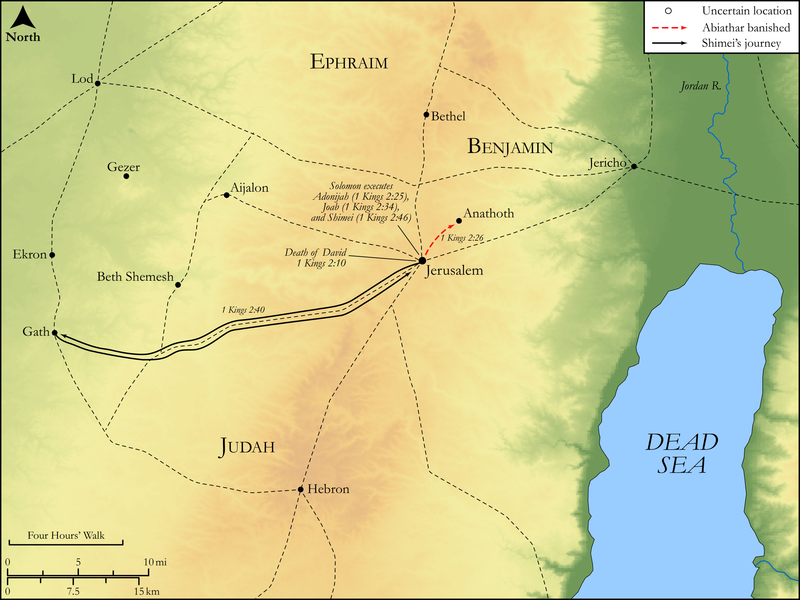

# Biblica Open Bible Maps

## License Information

Biblica Open Bible Maps, © 2023–2025 Biblica, Inc. This work is licensed under Creative Commons Attribution-ShareAlike 4.0 International (<a href="https://creativecommons.org/licenses/by-sa/4.0/">https://creativecommons.org/licenses/by-sa/4.0/</a>). More Information: <a href="https://docs.google.com/document/d/1Pp44yZ0Zdnd59vJHTrt2rPYq0SppfX5rZbPBt6mz37U/edit?tab=t.0#heading=h.oev9aj1ksvk2">https://docs.google.com/document/d/1Pp44yZ0Zdnd59vJHTrt2rPYq0SppfX5rZbPBt6mz37U/edit?tab=t.0#heading=h.oev9aj1ksvk2</a>

--------------------------------

## Historical: Solomon Consolidates Power (id: OT116)

### Image Content

[link](images/OT116.png)

Original: [Historical: Solomon Consolidates Power](https://drive.google.com/open?id=1QalHGWUhTWCzNQedH5z6pAvC--7euodP&usp=drive_copy)

* **Associated Passages:** 1 Kings 2:1-46

* **Associated ACAI Concepts:** LORD (ID: `deity:Lord`); Solomon (ID: `person:Solomon`); David (ID: `person:David`); Shimei (ID: `person:Shimei.5`); Joab (ID: `person:Joab`); Adonijah (ID: `person:Adonijah`); Benaiah (ID: `person:Benaiah`); Jehoiada (ID: `person:Jehoiada`); Israel (ID: `person:Israel`); Abiathar (ID: `person:Abiathar`); Jerusalem (ID: `place:Jerusalem`); Peace (ID: `keyterm:IntactState`); Abishag (ID: `person:Abishag`); Gath (ID: `place:Gath`); Bathsheba (ID: `person:Bathsheba`); Swear (ID: `keyterm:Swear`); Shunammites (ID: `group:Shunammites`); Jether (ID: `person:Jether.3`); Amasa (ID: `person:Amasa`); Ner (ID: `person:Ner.2`); Abner (ID: `person:Abner`); Absalom (ID: `person:Absalom`); Zeruiah (ID: `person:Zeruiah`); Achish (ID: `person:Achish`); Hell (ID: `place:Hell`); Tent (ID: `realia:Tent`); Bahurim (ID: `place:Bahurim`); Anathoth (ID: `place:Anathoth`); Maoch (ID: `person:Maoch`); Barzillai (ID: `person:Barzillai`); Gera (ID: `person:Gera.2`); Gileadites (ID: `group:Gilead`); Gilead (ID: `place:Gilead`); Covenant Box (ID: `keyterm:CovenantBox`); Judah (ID: `person:Judah.4`); Have Insight (ID: `keyterm:HaveInsight`); Tribe of Judah (ID: `group:Judah`); Kidron (ID: `place:Kidron`); Benjamin (ID: `person:Benjamin`); Instruction (ID: `keyterm:Instruction`); Hebron (ID: `place:Hebron`); Eli (ID: `person:Eli`); Tribe of Benjamin (ID: `group:Benjamin`); Testimony (ID: `keyterm:Witness.2`); Pronounce Innocent (ID: `keyterm:PronounceInnocent`); Truth (ID: `keyterm:Truth`); Haggith (ID: `person:Haggith`); Word of the Lord (ID: `keyterm:WordOfTheLord`); Moses (ID: `person:Moses`); Oath (ID: `keyterm:Oath`); Bless (ID: `keyterm:Bless`); Kindness (ID: `keyterm:Kindness`); Shiloh (ID: `place:Shiloh`); Ability (ID: `keyterm:Ability`); Zadok (ID: `person:Zadok.2`); Mahanaim (ID: `place:Mahanaim`); The Way (ID: `keyterm:TheWay`); Jordan River (ID: `place:Jordan`); Sword (ID: `realia:Sword`); Temple Altar (ID: `realia:TempleAltar`); Stone Altar (ID: `realia:StoneAltar`); Altar (ID: `realia:Altar`); House (ID: `realia:House`); Tabernacle Altar (ID: `realia:TabernacleAltar`); Horns of Altar (ID: `realia:HornsOfAltar`); Ark of the Covenant (ID: `realia:ArkOfTheCovenant`); Throne (ID: `realia:Throne`); Donkey (ID: `fauna:Donkey`); To Saddle (ID: `realia:ToSaddle`)
